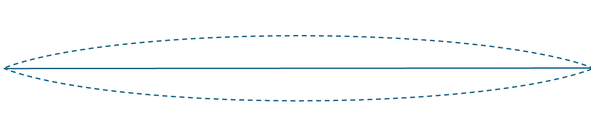
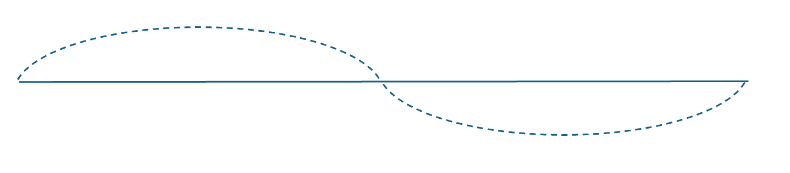
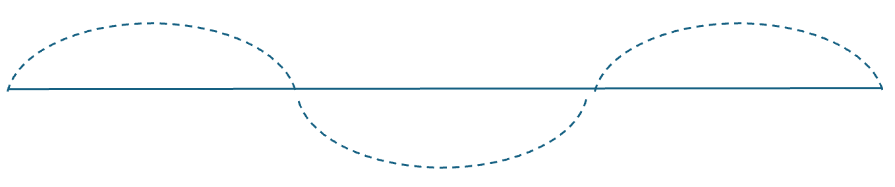

# 泛音列

音乐中最基本的概念之一——音的相对频率，以及多个音之间的关系，即音高和音程——从人类对泛音列的研究中诞生。人类通过对泛音列的研究、理解、选择、抽象，发展了音高的系统：和谐与不和谐，十二音，大小调音阶，和声学，等等。请记住这一切的根本都来源于人类对泛音的认识。

一种说法是，在西方，毕达哥拉斯（Pythagoras）最早探究了音高和律制，而他的探究从弦的振动开始。毕达哥拉斯的律制深刻影响了古希腊音乐的发展，而古希腊音乐的传统被一直传承，直到中世纪的教会音乐培育出了近现代音乐的雏形。

后人利用偏微分方程能够得出波动方程（Wave equation）的通解，这从物理上说明了毕达哥拉斯的研究。我们将简要地，（或者更具体地，）使用这些方法来展开讲解泛音列。
## 弦的振动与泛音列

如果我们有一根弦（string），并且把它绷紧，在拨动它的时候，它会以一定的频率振动。

声音来源于振动，以波的形式传递。振动的频率是声波的频率，而振动的波形则决定了声波的音色。

振动的波可以被拆分成若干个（有限或无限个）不同频率的正弦波之和。而弦的振动产生的是一种“复音”（Complex tone），这样的声音并不单单由一个正弦波组成。为了便于描述，我们把各个正弦波叫做“分音”（Partial）。

上面所展示的、弦振动的频率是基频，即第一分音，设其为$f_1$  。

我们[知道](#但是波动方程到底是怎么回事呢？)，弦的每一种振动模式都会有若干个不动点，这些不动点会均匀地分布在弦上。对于基音来说，有两个不动点：弦的两头。如果我们考虑弦的n等分点，这些点也可以成为某一个分音的不动点。

二等分（第二分音）：$f_2=2f_1$

三等分（第三分音）：$f_3=3f_2$

$n$等分时的振动频率为（第$n$分音）

$$
f_{n}=nf_1.
$$

**评论** 一根弦振动时，会产生多个分振动，每个振动的频率都是基频的正整数倍，由此得到了一个音列。振动空气柱根据两端开放与否会产生不同的结果；但是仍然会产生这样的音列。这适用于大多数非打击乐器，涵盖弦乐（包括钢琴、羽管键琴）和管乐（包括管风琴）。对于其他乐器，泛音列的情况更加复杂，但是基频之上的泛音仍然满足一定的分布。

**定义** 在弦振动时，将基频之上的分音（Partial）称为**泛音**（Overtone）。那么第二分音就是第一泛音，第$n$分音是第$(n-1)$泛音。泛音组成的音列就是泛音列（Harmonic series/overtone series）。

虽然泛音列理论上无限长，但是靠后的泛音的振幅已经极其微弱，人耳几乎完全忽略了它们。对于弦振动的模型，可以计算出，泛音的振幅是以平方的速度衰减的：第n分音的振幅是基音振幅的$1/n^2$量级。

我们能够感知到泛音列。虽然在有基频的情况下，我们的耳朵没办法把它们当作独立的音，但是我们能感知音色的差别：对于每一种乐器或人声，泛音列的振幅分布都不一样。只要你能感知音色的不同，你就感知到了泛音列。

正是因为我们能够感知到泛音列，我们才会对其进行充分的研究、抽象和运用。在下一节当中，我们仍然从泛音列入手，探究

## 但是波动方程到底是怎么回事呢？

这一节涉及到比较严肃的物理；我将其放在最后，熟悉或不感兴趣的读者可以跳过本节。

考虑一根水平沿X轴放置的弦；这根弦的长度是$l$，质量均匀分布，单位长度的质量为$\mu$ 。这根弦被绷直，弦的张力为$T$。不考虑重力、空气阻力、弦的阻尼等等因素。

如果这根弦的振动幅度较小，弦的张力不会发生显著的变化，仍然约为$T$。考虑其中的一小段，其横坐标从$x$到$x+\Delta x$，把它当作一个质点。这一段受其前面部分的拉力为$\mathbf{T}_1$，而后面部分的拉力为$\mathbf{T}_2$ 。两者的大小均为$T$；由于振幅较小，两个拉力大致平行于X轴，且大致反向；但是它们各自与X轴之间有一个很小的夹角，设为$\alpha_1$和$\alpha_2$ 。

（图1：展示一小段斜向下的弦的受力情况；标注$\alpha_1$和$\alpha_2$ ，两者均取小于$\pi/2$的正值）

首先，小角度导致质点受横向的合力大小约为$0$：

$$
\begin{align}
T_{1x}=T_1\cos\alpha_1\approx T,\\
T_{2x}=T_2\cos\alpha_2\approx T.
\end{align}
$$

因此质点并不会产生横向方面的移动。而纵向方面，需要考虑到$\alpha$和$\beta$定义时的方向。如果像图里那样定义，其合力为$T_1\sin(\alpha_1)-T_2\sin(\alpha_2)$ 。利用牛顿第二定律：
$$
T_1\sin(\alpha_1)-T_2\sin(\alpha_2)=ma\approx \mu\Delta x\frac{\partial^2 y}{\partial t^2}.
$$
如果在左右同时除以$T$，注意到$T$可以近似为各个拉力的水平分量；所以
$$
\tan{\alpha_1}-\tan{\alpha_2}=\frac{\mu\Delta x}{T}\frac{\partial^2 y}{\partial t^2}.
$$
$-\tan\alpha_1$ 就是弦在这一小段头部的斜率；而$-\tan \alpha_2$ 是尾部的斜率：负号是图中对角度的定义导致的。因此，

$$
\frac{\partial y}{\partial x}\Bigg|_{x+\Delta x}-\frac{\partial y}{\partial x}\Bigg|_{x}=\frac{\mu\Delta x}{T}\frac{\partial^2 y}{\partial t^2}.
$$

左右同除以$\Delta x$，并令$\Delta x \to 0$:

$$
\frac{\partial^2 y}{\partial x^2}=\frac{\mu}{T}\frac{\partial^2 y}{\partial t^2}.
$$
这就是所谓的一维波动方程。

### 方程的通解

考虑函数

$$
y=A\exp(ikx)\exp(i\omega t)=A\exp(i(kx+\omega t)).
$$
> 为什么是这样的形式？这是拉普拉斯变换的思路。简单地说，如果考虑复数，那么任何一个函数都可以被分解为若干个这样的函数；跟傅里叶变换是同样的道理。不了解拉普拉斯变换但对此感兴趣的读者可以参见[3Blue1Brown的讲解](https://www.youtube.com/watch?v=-j8PzkZ70Lg)。

代入波动方程就得到

$$
-Ak^2 \exp(i(kx+\omega t))=-A\omega^2\frac{\mu}{T}\exp(i(kx+\omega t)),
$$
因此
$$
k=\pm\omega \sqrt{\frac{\mu}{T}}.
$$
任何满足该条件的$y$以及这些$y$的线性组合，构成了方程的（复数）通解。

在实数的场合，我们只需要考虑$y+\bar{y}$就可以了。最后我们得到了这样的“线性基”解（从cos变成sin只需要选择适当的A）：

$$
y=y_+\sin\left(\frac{2\pi x}{\lambda}+\omega t\right)+y_-\sin\left(\frac{2\pi x}{\lambda}-\omega t\right).
$$
其中$\lambda=\left|\frac{2\pi}{k}\right|$ 为振动的波长，$\omega>0$为振动的角频率。波动方程的解可以是很多个“线性基“解的线性组合，每个基有不同的$\omega$，而$y_+, y_-,$也不尽相同。（如果两个解的$\omega$相同，那它们的和可以写成上式的形式。）

### 波长、频率、角频率、波速

我们只通过最简单的正弦波

$$
\sin\left(\frac{2\pi x}{\lambda}+\omega t\right)
$$
来讨论这些概念。

波长$\lambda$是指两个波峰之间的（空间）距离。固定一个时刻$t$，弦的振动在空间当中形成了一个y关于x的正弦曲线；波长也就是这个曲线的一个（空间）周期所跨越的长度。

（时间的）周期$T$是达到两个波峰之间相隔的时间。固定一个位置$x$，其振动在时间上形成了一个y关于t的正弦波。而周期则指的是这个波的一个完整（时间）周期所用的时长。一般提到周期都指的是时间的周期。

频率$f$是周期的倒数。它反映振动的“快慢”，也就是说，一秒钟之内，振动发生了多少次。我们听到的声音的音高就是对频率的感知。

角频率$\omega=2\pi f$ 指的是（在考虑复数空间的时候，即含有exp的那个公式时，复数y所代表的向量）每秒钟之内旋转了多少角度。如果振动了一次，那么在复数空间就旋转了$2\pi$。

波速$v$是波传播的速度。波传播的速度可以理解为波峰沿着弦运动的速度。由于每经过一个周期，波峰就会出现一次，所以$v=f\lambda$ 。

现在我们已经可以通过上一节的结果得到波速了：

$$
v=f\lambda=\frac{\omega\lambda}{2\pi}=\sqrt{\frac{T}{\mu}}.
$$

### 弦的振动

回到我们的弦上面。弦的振动当中，两个端点是被封死的。 因此
$$
y(0, t)=y(L,t)=0.
$$
代入到每一个”线性基“方程当中：

#### 弦的振动是驻波

由$y(0, t)=0$, 得出$y_+=y_-$ 。 设其为$\frac{1}{2}y_0$，则固定$\omega$下的波动函数可以简化为
$$
\begin{align}
y&=\frac{1}{2}y_0\left(\sin\left(\frac{2\pi x}{\lambda}+\omega t\right)+\sin\left(\frac{2\pi x}{\lambda}-\omega t\right)\right)\\
&=y_0\sin\left(\frac{2\pi x}{\lambda}\right)\cos(\omega t).
\end{align}
$$
这说明弦的振动方程是驻波（standing wave）。驻波的意思就是，波峰和波谷始终会出现在固定的地方，不会随着时间移动。如上式体现的一样，驻波可以表现为两个等大、同频率、同波长、传递方向相反的波：一个向左的波和一个向右的波。

(驻波动图)

另一个对于驻波来说很重要的性质是，当$\sin\left(\frac{2\pi x}{\lambda}\right)=0$时，这个点的高度 $y(x, t)=0$，也就是说这个点不振动（=不动点）。

#### 弦的等分点是波的不动点

由$y(L, t)=0$：
$$
y_0\sin\left(\frac{2\pi L}{\lambda}\right)\cos(\omega t)=0
$$

可以得到
$$
\sin\left(\frac{2\pi L}{\lambda}\right)=0,
$$
也就是说存在某个正整数$n$使得
$$
\lambda=\frac{2}{n}L.
$$
也即波长必须是弦长两倍的整数等分。

> 注意，波长并不是弦长本身的整数等分，而最大的波长为$2L$。因为波长是一整个完整的正弦周期，而基频（开篇第一张图）的振动在整根弦上面只跨越了半个周期。

在这种情况下，波的不动点满足
$$
\sin\left(\frac{n\pi x}{2L}\right)=0,
$$
即，对于任意的0~n之间的整数$m$，
$$
x_m=mL/n
$$
都是波的不动点。这$n+1$个点$x_m$也是弦的$n$等分点。

（图：等分点、波长）

我们已经知道了频率、波长、波速的关系。对于第$n$个振动模式，也就是第$n$个分音来说，

$$
f_n=v/\lambda_n = \frac{n}{2L}\sqrt{\frac{T}{\mu}}.
$$
基音的频率为
$$
f_1=\frac{1}{2L}\sqrt{\frac{T}{\mu}},
$$

第$n$分音的频率则为$f_n=f_1$ 。