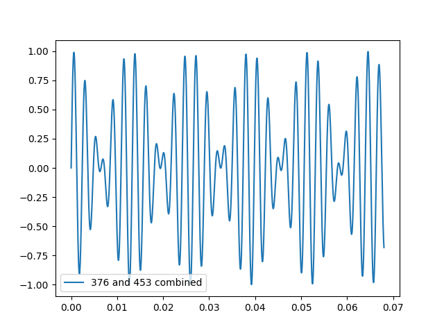

# 和谐与不和谐；八度

和谐（协和，consonance）与不和谐（不协和，dissonance）本是一个人造的、相对的、而且随着时代发展的概念。然而，它却是音乐发展的根本动力之一。

一个音与自己的音程关系是最协和的，但是这称不上两个“不同的”音之间的关系。在不同音的限制下，八度是最和谐的音程，也是最先被讨论和使用的音程。它在音乐理论中的作用类似于数学中的取模运算，具有八度关系的音被认为是等价的；于是，人们集中于分析在这一个八度的距离之内发生的关系。或者说，它确定了对音程，或协和与不协和，的研究范围：两个相距八度的音被认为等价，而我们只需要研究两个音之间其他的音。

> 总述中提到过，音程是我们对于两个音之间的关系的一套描述方法。在这里并没有提及八度的定义，而是说明其对于全部其它音程的意义。

## 音乐：创世纪

1 起初，人类从一个音开始，观察它的泛音列。

2 第一个泛音过于和谐，以至于人们认为这是同一个音；于是人们看向第二泛音，这便产生了第二个不同的音。

3 从第二个音开始，人们使用同样的方法，直到生成了十二个不同的音。

4 当生成第十三个音的时候，人们发现这跟第一个音大致相同；人们觉得这是好的，于是就将十二个音认为是全部。

5 人们根据这十二个音与第一个音的和谐程度，确定了音程和调式的概念。

6 古希腊人在同一时刻只使用一个音，这个音与本身当然是最和谐的；人们在流动的音乐当中使用音阶的不同音，依靠它们在音阶中的位置和彼此的关系来表达内容。

> 5&6注释：古希腊人使用的调式与中世纪教会调式尽管名字相同，但是组成音并不同。

7 发展到中世纪，音乐逐渐开始利用不同的人各异的音域来组成多个声部，在同一时刻，两个声部唱出不同的音；于是多声部音乐成为了西方音乐的特征之一。

8 一开始，仍然只有最和谐的那些关系可以使用；逐渐地，不完全和谐、但仍足够和谐的关系也可以使用。

> 7&8注释：格里高利圣咏从单声部开始，逐渐出现八度、五度、四度、三六度平行的二声部。

9 当人们发现两个声部可以独立地发展之后，人们逐渐认为，如果两个声部一直维持最和谐的音程，它们就不像独立的声部；因此，最和谐音程的使用受到了限制。

> 9注释：八度、五度平行成为通行的禁忌。

10 后来，人们意识到了不和谐音的重要性：它们可以增加音乐的张力，从而在回归和谐的时候达到一种满足感。

11 教会用不和谐音使得咏唱的经文更加易于接受，游吟诗人用其使吟唱的传奇更加引人入胜。

12 在很长一段时间内，这种张力始终是为了释放、回归和谐的那一刻而做的铺垫，因此不和谐音的使用有非常严格的限制。

> 注释：不协和音程出现之前，必须要使用相应协和音程进行“准备”；不协和音程之后必须要导向协和音程，即“解决”。

13 人们的耳朵逐渐适应了不和谐音的音响，因此不和谐音的限制逐渐减少；人们只对特定的不和谐音使用更严格的规则。

14 但是人们尊重不协和音在音乐当中的传统，从文化上感受到它们与协和音的不同，其使用方式也有所不同。

15 当人们的音乐中充满了自由的不协和音，它带来的摩擦感也逐渐消解；相反，人们开始感觉只有和谐音的和声过于和谐。

> 注释：浪漫主义后期调性开始瓦解。

16 后来的一些音乐平等地看待协和音与不协和音，在和声当中，不协和音与协和音都属于基本的成分。

> 注释：以勋伯格的十二音体系开始的无调性音乐多不区分音的地位；从爵士、蓝调发展成的现代流行音乐使用不和谐的七和弦作为基本的和声。

**重要评论** 我们不去对和谐与不和谐的概念下定义。和谐与非和谐是相对的，或许可以说某个音程比另一个更不和谐，但是不能说这个音程就一定不和谐。如果类比成两个实数，你可以相对地比较它们的大小，但是你也不能说某个数绝对地大。如上面所讲述的，音乐史在某种程度上**等同于**将这个不和谐的阈值不断调高的历史。讽刺的是，为了描述的方便，我们必须将某些音程叫做和谐音程，某些叫做不和谐音程；最好的理解方式是，这是历史与风格的选择，也就是这种描述方式是从特定的时期（例如浪漫主义晚期以前）遗留下来的。我们仍然必须强调，没有什么是绝对或者绝对不和谐的。在学习音乐的过程中，一定要将这一点牢记于心。

## 和谐是什么意思

人耳和人脑的行为，有一点类似于实时对声波做傅里叶变换。我们所认知到的音乐，并不是原始的波形，而更像是时间窗+频谱图，也就是我们能认知到在某个时刻，音乐是由哪些频率叠加构成的。

**评论** 和谐与不和谐，描述的是两个音的频率之间的关系。

如果要用一句话来说明最简单的结论，那么：如果两个音的频率比值大约是一个有理数，那么分母越小，人耳就会越感到和谐。

这个结论的特殊情况是，在泛音列越靠后的音（当然这里要排除诸如1/4, 1/6之类的音，只保留2或奇数的分母。这些音被看作跟排除掉多余的2的因子以后的音相同，原因在讲解“八度”之后就明了了）就越不和谐。

### 测不准原理

这里首先注意到上面的“大约”。人耳并不是一个无比精确的机器。如果两个音音高非常相近，例如只相差1 Hz，那么人耳会将这两个音感受为一个音；或者等价地说，人耳没办法精确地判断音高。这个”测不准“现象非常类似于信号处理当中的时间和音高不能同时精确得到的现象（Gabor limit），大概同样与傅里叶变换的不确定原理相关。

这一点有许多实际应用，比如合奏或合唱的基础就来源于此。读者可以在脑中回忆独唱与合唱同一段旋律带来的不同感受，或者独奏与合奏的不同。多名歌者或乐手唱/奏出的音，在音色和音高上面都有些微的差距，由于人会将其听成同一个音，所以不会感觉混乱，反而是感觉到这种细微的差距带来的音响的丰富与厚度，这就形成了音色的不同。

> 当然，这一点在音乐理论的角度会带来更”根本“的不同，它决定了为什么人们选择的不是十一个或十三个，而是恰好十二个音。上文[”音乐：创世纪“:3-4](#音乐：创世纪)简略地描述了这是怎么回事。具体的情况见下一节关于”五度相生律“的内容。这一点也说明为什么尽管有不同的律制（确定音高的方法），但是音之间基本的关系没有改变。

和谐的概念，如果不讨论文化，也至少涉及到生理和心理的领域；我们不作这些方面的讨论，而是试图用一种模型来“解释”和谐。这只是为了方便理解。如果对上面的简要结论感到满意，就无需阅读下面的内容，可直接进入八度的介绍。

### 频率的叠加

我们的和谐模型认为，两个音的互相干涉导致了人们感觉到的不同和谐度。

这里的干涉即波的干涉，指的是两个不同频率的波叠加的情况。它涉及到两个方面：首先是两个基音之间的干涉，这是最基本的。其次，但是不能忽视的一点是，两个泛音列之间的（即A泛音列上的某个音，与B泛音列上的某个音之间的）干涉。

首先讨论两个不同频率正弦波的叠加。假设有两个正弦波，频率是$A$和$B$ （不失一般性地假设$A\le B$）。那么

$$
\sin A + \sin B = 2 \sin \left(\frac{A+B}{2}\right) \cos \left(\frac{A-B}{2}\right).
$$

于是两个频率的叠加产生了另外两个频率，分别为高频的“平均频率”和低频的“频率之差/2”。

下图是376和453Hz的叠加波形：

这个波形可以视作是低频组成的包络线和高频组成的载波。

事实上，我们是可能听到这两个叠加频率的。然而关于低频，有一点需要说明。

对于低频，我们并不直接听到频率为(A-B)/2的音，而是听到一个“拍音”（beating）。在频率为(A-B)/2的一个周期中，cos((A-B)/2)两次达到极值、两次变成0；在低频每一次达到极值的时候，高频都能够既接近1又接近-1（例如上图位于大约0.02到0.033之间的半个周期以及大约0.033至0.046之间的另外半个周期）。因此，拍音的周期是低频周期的一半；故我们听到的“拍音”的频率是低频频率的两倍，即 (A-B) 。这里我省略了绝对值符号。

#### 第一种情况

如果A和B相隔较近，那么(A+B)/2接近A或者B。由于前面所说的测不准原理，在高频我们只听到一个音。此时，低频A-B会非常低（小于或接近20 Hz）。在这种情况下，低音不被听成音，而是一种周期性的音量变化，因此被叫做拍音。

> 严格地说，拍音指的只有这第一种情况；这里我为了方便描述所以把频率之差不管大小都叫做拍音。重申，严格的概念和定义对于音乐的理解来说都不重要。

以下是频率分别为440和443的正弦波叠加的声音。能清楚地听到3 Hz的拍音。

在我们的模型里，拍音是导致两个音不和谐的重要原因。如果听到了这样明显的拍音，那么就会感觉不和谐。

建议使用耳机。

#### 第二种情况

如果A和B相距较远，那么根据测不准原理，A和B会被听成不同的音。感觉（而不是听觉）较灵敏的人将能感知到位于A和B中间的那个音。但是这个音非常微弱。一些人感觉不到这个音，或许他们的大脑并没有单独感知这个载波。

以下是550Hz，以及440与660叠加的音响，可以反复对比：

拍音则比载波更好辨认，此时拍音的频率比较高，已经能被听成一个音（110Hz，以及660与770叠加；注意听660+770例子中最低的部分）：

#### 叠加：总结

当两个音叠加时，我们或许能够感知到高频的“中间音”(A+B)/2。如果A和B很近，那么我们只能把它们听成同一个音，就是这个中间音。如果A和B很远，我们听到的是分开的两个音，从而“听”不到它，但是某些人能“感觉”到。

我们容易听到拍音，即频率之差(A-B)。这意味着，通常在两个音叠加时，我们至少能感知到3个音（其中一个是拍音）。两个音的和谐关系其实同时跟三个音相关。

如果拍音频率较小（约2Hz ~ 20Hz），那么我们听到的是纯的节拍而不是音，不和谐感会很突出。当拍音频率较大的时候，它本身并不会导致不和谐。当拍音频率非常小（<1 Hz），也即节拍的速度变得很慢，那我们也不会觉得特别不和谐。

当两个音都是复音的时候，如果两个音的泛音列不一致，泛音之间也会出现拍音，加剧不和谐感。

### 和谐度的模型

上面已经提到拍音是不和谐感的重要来源：如果是明显能感受到的节拍，那就不协和了。

在这里，可以简单地宣称，我们只需要考虑拍音就可以了，因为对于两个复音来说，我们通过考察它们的泛音之间的拍音，也能够构建出一个足够漂亮的和谐度模型（事实如此）。

但是，我必须诚实地说，即使只是两个正弦波，而且拍音频率较大的情况，**我**也可能感觉到不和谐。而其中的原因是，我听到了其他的、频率不等于拍音的类似节拍的声音。我感到必须要将其也称为拍音，而且既然这个拍音的频率小于我们前面一直在说的拍音（干脆叫作“初级拍音”），那么我应该把它叫做“次级拍音”或者类似的名字。

对于不感兴趣的读者，次级拍音的内容可以跳过。我已经说了，在复音的情况下，同样能构建出足够说明问题的和谐度模型。

#### 次级拍音

从这里开始，我们主要研究载波频率$\frac{A+B}{2}$和包络线频率$\frac{A-B}{2}$ 的关系。上面展示过的两者相乘的函数图像非常助于理解，所以我在这里附上一个网页，它可以调整上述两个频率之间的比值，展示对应的函数图像，并且播放$A$和$B$两个音。这个网页还显示了我针对两个正弦波构建的和谐度模型，可以在听两个音时同步观察模型对应的不和谐度。

我也将基于这个网页进行讲解。在继续前请读者先打开网页。

出于某些后续会提到的原因，我们主要讨论$x\ge 3$的情况，也即$A/2\le B\le A$ （左边等号在$x=+\infty$时取到）。现在可以简略说明的一点是：如果A与B的差距太大（例如比值>3），我们的听觉会觉得两个频率之间的关联变弱了。

>这里并不说明严谨正确的生物理论。但是或许我们可以把测不准原理理解为，相近的听觉神经负责处理相近的频率，因此相近频率激活的是差不多的神经。这样的话，差距非常远的频率激活的是非常不同的神经，它们之间或许没有特别多的连接，从而大脑感觉不到很强的关联性。
>
>需要注意，这只是在说单频率的正弦波。在复音的情况，必须考虑泛音列的影响。这里也忽略了文化的影响：如果两个音在文化上被认为是协和/不协和的，那即使听觉上没有关联，我们仍然会按照文化来解读两个音的关联。

首先，在$A_0=440$的情况下，将$x$调整到3.1左右（可以组合利用左边的滑块和右边的文字框进行输入）。播放音频，观察图像。然后在音频开启的情况下，用滑块拖到$x=3$（有吸附）。观察图像的变化，留意音频协和度的变化。

对比3和在3.1左右的图像，不难发现，x=3的图像更“整齐”（注意包络线好像不存在了），而x=3.1的图像出现了一个周期明显大于前面提到的包络线的“大包络线”，中间像是有一个锯齿状的重叠。

我们来考虑x=3时的载波和包络线频率；包络线的每一个周期包含了三个载波周期。所以包络线的每一个周期都是相同的。

而x=3.1时，包络线的每一个周期包含三个载波周期还多一点点。因此，过了若干个（$n$个）包络线周期以后，这些“一点点”的部分加起来刚好是一个载波周期。这才终于完成了一个循环（即中间那个锯齿状阴影的周期）。$n$等于多少呢？（注意$n$不需要是整数）

$$
0.1n=(x-\lfloor x\rfloor)n=1; \text{therefore}\; n=10.
$$
如果载波的频率是$f_S$，而包络线的频率是$f_B$，那么

$$
T= \frac{n}{ f_B}=\frac{1}{(x-\lfloor x\rfloor)f_B},
$$

也就是这个“大包络线”的频率是$(x-\lfloor x\rfloor)f_B$ 。这个数显然是小于$f_B$的，而且当$x$靠近整数的时候会非常小。

将$x$再调到$2.9$，播放音频，观察图像，并且调整到$x=3$ 。这种情况是相反的：每一个包络线周期包含三个载波周期少一点点。这种情况下这个“大包络线”的频率则是$(\lceil x\rceil - x)f_B$ 。

我们是能够听到这两个频率的，作为拍音：如果观察$x=3.1$的图像也能发现，每过锯齿的一个周期，声波的上方就会出现一次极大值。但是不存在大包络线完全归零的情况。因此，这两个拍音比起我们前面所说的“初级拍音”来说，没有那么明显。

这两个拍音就是次级拍音了。可以在网页的播放按钮下方文字第四行看到两个次级拍音的频率（`2ndaryBeat_1 / _2`）。我们在$x=2.9$或$3.1$感觉到的不和谐就来源于这两个拍音之一。可以尝试着自己数数看拍音的频率（计时一分钟，数听到多少个拍音）。

注意次级拍音带来的不协和感仍然遵循初级拍音的原则：在频率特别小的时候不会引起不适，频率高于20 Hz也没问题，而在中间的时候会导致更大的不协和感。

我们的和谐模型，或者不和谐曲线，如读者所见，就是基于两级拍音的。

> 我的模型只是一种解释和谐感觉的合理性的模型，组合了两级拍音（当一级拍音出现时，其对协和度的破坏比起二级拍音更强），模型的具体表达式可以参见网页源代码，但这并不重要。

读者或许敏锐地察觉到，根据类似的思路，可能会有三级拍音、四级拍音等等。这里不对它们进行讨论。当然其中一个原因是这个模型已经够用了（就像更多人认为一级拍音就够了）；但是最主要的原因是**我**没办法清晰地感知到三级拍音：首先，基于类似的原因，其比二级拍音更不明显；其次，三级拍音可以说只在初级拍音和两个二级拍音都较大的情况下起作用，但是这种情况其实并不多，我们人耳对音高的分辨率不够高（测不准）。事实上只有在$x<3$时三级拍音才有讨论的价值，但是我已经说过不会讨论这个范围。

（示意图：网页截图。不协和曲线上面有文字标记。在1/4A0 到 1/sqrt(2) A0之内，每一个极大值点都是次级拍音的不协和作用。两个相隔较近的极大值点中间的极小值点都是两个次级拍音都为0，只有初级拍音的影响。相邻两个相隔较远的极大值点中间的极小值点是两个次级拍音相等的情况（2x为整数）。图像右侧的最大值点和最小值点都是初级拍音的影响。）

#### 复音之间的不和谐度

已经提到了，我们把上述正弦波之间的不和谐度应用到两个复音的泛音列之间，就可以得到复音之间的不和谐度了。注意泛音列越靠后，振幅就越小，因此不和谐度的上限（对于基音来说是1）也就越小（人们注意不到这样的拍音）。

> 考虑拨动琴弦的情况，可以发现泛音列的振幅大约以其序号的平方反比的速度衰减。

有趣的是，考虑到这一点之后，在$A/2\le B\le A$的范围内，不协和度的图像（特别是极大值、极小值的分布）有某种对称性。在B非常接近A/2和非常接近A的时候，不协和度都先变得非常大再迅速接近0。在中间若干位置，不协和度较小。而不协和度较小的位置，恰好是那些A和B比值为有理数时分母较小的位置。

除了两个端点以外，最小的极值点是$B=2A/3$ 时取到的。这当然是这个范围内分母最小的数了。可以再次体会我们在前面提到的简要结论。

再次注意我们的耳朵是低分辨率的：在非常接近这些极小值点的位置，我们都认为较为和谐；有的时候，其实若干Hz的差距也不会造成非常大的变化。当然越靠近两个端点，我们的耳朵对这个“若干Hz”的差距也越敏感。

（模型和图TBD）

这个和谐度的模型只是为了方便理解前面那个结论；这并不是说它就是正确的。不管怎样，我们将以此为基础介绍“八度”的概念，以及音高的周期是怎么建立起来的。

## 八度——音高的周期

> 考虑到长度，要不要把这一小节拆分成独立的一节呢？

总述中提到，我们用音程来描述两个音音高之间的关系，而一度和八度将是我们讲解的前两个音程。

**定义** 
1. 一个音和它自身构成**一度**(unison)关系。
2. 对于任意一个音，假设其频率为$a$，我们将其和频率$2a$的音之间的音程定义为**八度**(octave)。
等价地说，一个音与其自身（第零泛音/基音）形成一度，与其第一泛音形成八度。

例如440Hz和880Hz就是八度的关系。两个音叠加的音响如下：

一度与八度的名字，即“数字”和“度”的含义，我们将在后面讲解。目前，它们只是一个如此定义的概念。

八度是如此的特殊，以至于人们认为相隔八度的音在某种程度上可以视为“同一个音”。上面的音频或许已经从直观上让你读者们感受到这一点了。

### 同一个音

一度当然是和谐的；上面的两种和谐的描述可以推导出，没有其它音比这个音本身更能达到和谐。从哲学的角度来说，还有什么比自己与自己更和谐呢？

八度是和谐的：之前的和谐度模型可以知道它几乎与一度一样和谐。频率的比值是一个非常简洁的2。它是第一个泛音，这意味着它是一度以外最和谐的音程。

我们也可以观察两个相隔八度的音（分别称为一度音和八度音）的泛音列。八度音基本上就只是加强了一度音的偶数分音。它不产生任何其它分音，对一度音的分音振幅也没有大的破坏：其除了前两个分音以外的其余微弱的分音本来就不会引起太大注意；第一个分音就是一度音的第二分音，而第二个分音则是一度音的第四分音——也就是一度音的第二分音的八度音，这带来的影响几乎完全被一度音的第二分音吞没了。

从距离上，一度音和八度音隔得足够近，让人能够感受到和谐感，而不是相隔更远失去联系。

这些就是将其视为“同一个音”的主要依据。于是人们将同一个音的概念进行推广：

对于任何一个音$a$来说，一度音$a$和八度音$2a$都被视为同一个音；而且这个关系可以传递给下一个八度音$4a$ 。

#### 音高的周期

现在，我们能够将音高划分为不同周期了。假设我们以音高为$a$的音为基础，我们可以取$[a, 2a)$这一个八度为基准周期，则任何音都可以在这一个周期里找到它的同音。注意这个周期是指数意义下的，即每个周期可以表示成$[2^{n}a, 2^{n+1}a)$。

或者说，如果我们将所有的频率都取以$2$为底的对数，则对任何整数$n$，$[n+\log a, n+1+\log a)$ 都对应了一个周期。

在频率取对数以后，这就像是实数的同余一样。根据八度关系，我们能够划分不同的“等价类”，每一个$[0,1)$ 以内的数$x$都代表了一个“模一等价类”：$[x]=\{x+k|k\in\mathbb{N}\}.$ 任意两个音之间的关系，全部可以简化在一个八度之内的两个音的关系：我们把较低的那个音的对数频率加上一个自然数，使得较低的那个音仍然较低，而且与较高的那个音的对数距离不超过1。注意我们仍然需要维持高低关系，毕竟如果高低关系逆转，那么两个频率的比值也会变成原来的倒数，分母就不一样了：分母不一样的结果是和谐度也不一样了！

周期性是十二音音阶，以及许多其他的音乐体系中最基本的性质。