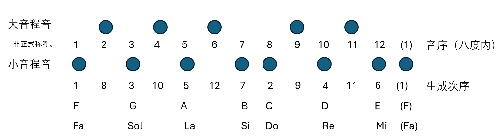

# 十二音音阶

> 找到了十二个音，并对他们排序（也即形成音阶）和初步地分类（即按照小音程/大音程，或者先生成/后生成，或者是否经过了连续两次乘0.75，分为7+5的两组）之后，我们在这里为他们命名和（正式）分类。

#### 调性音乐：音乐史课堂

**重要评论** 在继续之前需要明确一点。生成十二音的算法（即所谓的“律制”）多种多样，上文所介绍的“五度相生律”只是其中一种，甚至不是当今最为广泛使用的一种。但是，之所以选择其进行介绍，是因为音乐的发展史是这样的；我们从泛音列的前两个音得到了八度（周期性）与五度，并用后者生成了全部的12个音。根据五度相生律，（生成次序的）前七个音与后五个音是不平等的；这种不平等性深入音乐文化的根基，以至于即使我们能够设法消除表面上的不平等（例如，将每个音的距离变得相等），我们的文化和历史仍然使得我们对这些音进行差别对待。这种差别对待也就是所谓的“调性”（tonality）。我们将在下一章当中初步地涉及到调性的概念，但是这里必须先提到，这样的不平等产生的调性正是西方能发展出此种音乐文明的**根本原因**。调性体系在相当长一段时间内都是唯一的准则，直到十九世纪二十世纪交界的浪漫主义末期，调式音乐逐步瓦解，最终由勋伯格正式地创立了十二音体系，我们人类才第一次踏足十二个音完全平等的无调性音乐的境界。

由于调性音乐适用于不同的律制（事实上，虽然没有明确说明，但是下面的讲解中的确也使用了不同的律制），在本章剩下的部分，我们不再关注音与音之间的精确距离，而是用一种类似于拓扑距离的方式来描述音之间的关系。在这种描述体系当中，频率的比值不再那么重要，取而代之的是两个音之间有多少个由其他音组成的间隔。但是，如上述所说，七个音和五个音的不平等分类概念始终存在；所谓“小音程音”和“大音程音”的名字或许已不妥当，重要的是它们只是一种用来区分“主”和“次”的方式。

#### 音的距离

由于每两个音之间的距离差不多相同，在下面的定义中，我们暂且忽略两种距离。为了描述任意两个音之间的关系，我们定义半音和全音的概念。

**定义** 一个八度被分为十二个音。我们把相邻的音之间的距离（不论大小）称为**半音**（half step/half tone/semitone）。我们把隔了一个音的距离（不论大小音程）称为**全音**（whole step/whole tone/tone）。

以下使用五度相生律的音列展示了一些例子，可见全音和半音与实际的精确距离是无关的。

这样，相隔一个八度的两个音，$a$和$2a$，其距离为12个半音，或6个全音；相隔一个五度的两个音，$a$和$1.5a$，其距离为7个半音，或3个全音加上1个半音。

> “半音”是一个整体。1个半音不是“1个半”全音的意思，而是0.5个全音。

以下的所有讨论，都假设我们已经规定好了一个基音，频率为$a \in \mathbb{R}^+$。在序号方面，第一个音是基音，第二个音与第一个音的距离是1个半音，第八个音是五度音，等等。

我们用7个字母：A, B, C, D, E, F, G来按顺序表示7个小音程音。

出于传统，第1个小音程音表示为F；第二个小音程音，即第3个音，表示为G；第三个小音程音表示为A；依此类推。一个简便的记忆方法是 F(irst)对应第一个音。

**评论** 这些字母表记只是一套符号和习惯而已。事实上这一套系统（English system）主要用于英语。
**扩展** 另外还有两套主要表记系统（notation system），第二套或许读者更加熟悉：
1. 相似的基于字母的德国系统（German key notation），用于德语、东欧、北欧语言（这里暂不介绍）
2. 中东欧以外人们更熟知的“固定唱名法”（Fixed Do key notation），用于法语、意大利语等。在这套系统里，唱名Do, Re, Mi, Fa, Sol, La, Si 替换了字母 C, D, E, F, G, A, B 。对应关系的简单记忆方法是：F=Fa （或者熟知的Do=C)。

**评论** 现代常用A=440Hz作为标准音高。应该能够据此推算出其他音的音高。但是即使标准音高随着时代而改变，相对的音高和音程关系始终不会变化。

我们用最近的小音程音加上距离关系来命名大音程音。

在一个小音程音基础上升高半音，这个“升高”用符号♯（升号，sharp sign）表示。例如，第二个音（即第一个大音程音）可以表示为F♯ ，读作“升F”（F sharp)。
- 这里标出英文读法也有提示记忆的作用：英文的语序跟符号标记一致，都是“音名”+“变化”。
>在固定唱名法里读作“升Fa”。
（意大利语：Fa diesis）。

在一个小音程音基础上降低半音，这个“降低”用符号♭（降号，flat sign）表示。例如，第二个音（第一个大音程音）可以表示为G♭，读作“降G”（G flat）。
>固定唱名法：降Sol（意大利语：Sol bemolle）

是的，一个音高可能有多种表示方法：
- 每一个大音程音都可以表示为升一个小音程音，或降一个小音程音；
	- F♯=G♭；G♯=A♭；A♯=B♭；C♯=D♭；D♯=E♭
- B, C, E, F由于靠近另一个小音程音，所以可以互相表示。
	- B♯=C，C♭=B；E♯=F，F♭=E

如何选取恰当的表示方法，我们以后再谈论；目前的讨论中只需要对于小音程音采取最简便的表示方法就可以了：不带变化的字母A到G。

由于这些小音程音不带升降记号（在所有表记系统中都是这样），所以有一个更适合的名字来称呼它：**自然音** (natural note)。而相对的，带有升降记号的音都叫做**变化音**（accidental note）。

由于变化音的表记依赖于自然音存在，所以每个变化音都有一个对应的自然音。即使在同一个音高下，不同的表记也代表不同的音，而它们对应的自然音也不同。例如，G♯对应G，而“相同音高”的A♭则对应A。

**评论** 变化音是一个形式的概念：它不取决于音的音高，单纯取决于其表记有没有升降记号。例如C是自然音；但是同样音高的B#却是变化音。这是因为我们目前暂且笼统地把升降记号处理为”升高/降低半音“，而忽略了实际的距离。目前只需要了解，升降记号作为形式本身存在意义。
