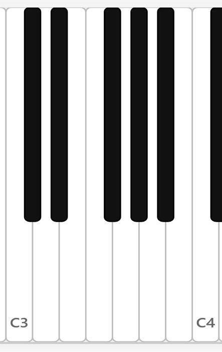
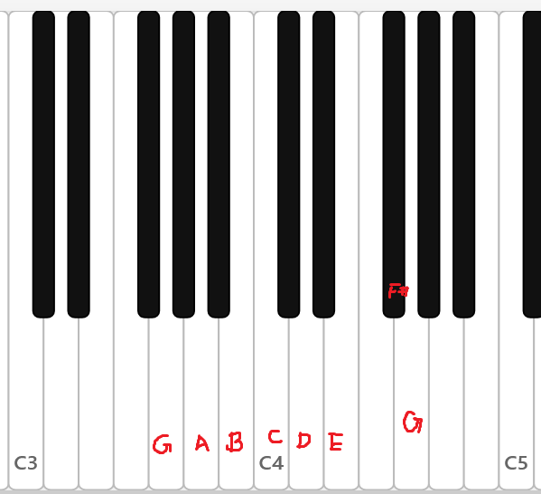

# 大调音阶

我们这一章主要讲述大调音阶，从C大调音阶开始。我们在此强调音阶，而不是直接说“C大调”，因为后者隐含了“调性”，这是在本章以后才阐述的概念。当然为了方便，“C大调”与其音阶的名称通常是混用的；提到“调”也差不多是说“调的音阶”。这些名词辨析并不是重点。

在本章之中，我们只关注（七声）音阶，即一系列（通常指七个）从低到高的音的排列。以全部的12个音进行考虑，这样的排列有许多种，其中的变化主要来源于两点：
1. 从哪个音开始？
2. 选择哪些（七个）音？

## C大调音阶

七个自然音从C开始排列组成的音阶就叫C大调音阶（C Major Scale）。C大调音阶几乎可以说是五度相生律的直接产物，也是音乐中最基本的音阶之一（如果还有其他音阶能与之相比的话）。

$$
C, D, E, F, G, A, B
$$

1. 从C开始
2. 涉及到的七个音：C, D, E, F, G, A, B

音频：可以从钢琴的C开始往上弹所有的白键。



考虑C与七个音的音程关系。

- C-C：一度。
- C-D：大二度。
- C-E：大三度。
- C-F：四度。
- C-G：五度。
- C-A：大六度。
- C-B：大七度。

## 一些定义

为了方便后续描述，这里定义几个简单的名词。

**定义**

1. **主音**(tonic; key note)指的是一个音阶的第一个音。例如，C大调的主音就是C。
2. **音级**(degree)指的是一个音位于音阶当中第几个音。例如C大调当中，主音C是一级音（1st degree）；G是五级音（5th degree）。常常简称为一级、五级。


## C大调的来历


C大调是人们对于C的泛音列的一种认识和抽象。

在前一章当中，我们说五度相生律的基音是F。五度相生律的前七个音就是自然音，而C大调音阶是由自然音组成的音阶。

明明F是五度相生律的起点，为什么这一个起始的、自然的音阶是从C，而不是F开始呢？

如果从泛音列的角度来思考，则更加匪夷所思。五度相生律的规则（即生成的下一个音为上一个音的五度音/第二泛音）决定了，生成顺序靠后的音必然是靠前的音的泛音。例如，F的第二泛音是C（即$3f_{F}=f_{C}$）。C的第二泛音是G，因此F的第八泛音是G。如果以这种方式来思考，那么越后面生成的音，在泛音列上面距离基音就越远；从F开始，最后一个生成的音是A#，这个音在12个音当中距离F最远。事实上，A#的下一个音就是F，因此在A#停止生成；或者说，离F最远的A#可以看作是F在生成序列上的前一个音。那么，如果我们考虑C的泛音列呢？则在生成序列上的前一个音F距离它是最远的。奇怪的是，如果我们以C为起点，那么又怎么会将这一个距离最远的音F纳入自然音的范畴呢？

对于怀有好奇心的读者，这里提供两种解释，一种是历史的演变，而另一种试图从心理角度加以分析。

从历史的角度来说，以任何一个自然音开始的自然音阶（可以简单理解为七个音都是自然音的音阶）都是实际存在的；事实上，它们甚至每个都有自己的名字（暂不在这里展开）。可是，大调音阶最终成为了其中最常用的一种之一（另一种是小调）；音乐家（和听众们）最终选择更多地使用C大调音阶，而非以F开始的七个音组成音阶。

本教程并非学术著作，因此不会严谨地考究认知与心理的科学；然而，历史演变的规律遵循了人的心理，而心理的偏好又通过历史的轨迹体现出来。从某种角度上来说，我们只是在试图解释这种心理产生的原因；但是这种心理本身导致了C大调音阶（比起F开头的自然音阶）获得更广泛的使用。

那么，C大调音阶究竟为何受到人们的偏好呢？

### 五度与“支配关系”

如果我将五度相生的关系，也即一个音同其五度音的关系，称为“隐含”，或者“支配”，读到这里的读者应该不会感到奇怪。从泛音列的角度来说，一个音的泛音列包含了其五度音的泛音列，甚至直接包含了其五度音；因此，一度音的存在“蕴含”着五度音的存在，在这个一度音和五度音的关系之中，前者“支配”了后者。

从听觉的角度来说，对于一个复音（也就是琴弦震动之类产生的可以分解为多个泛音的音），当听见C时，我们自然听见了G。这种感觉作为我们文明的一部分而存在：即使是听到一个正弦波的C，它本身并不含有G的频率成分，但是我们仍然“感觉”它蕴含着G。我们的耳朵，至于我们的文明，将一个泛音列抽象为了一个音，即其基音，因此在我们的文明中，这个基音负担起了整个泛音列的内涵。

**定义** 在C大调音阶当中，五级音G被称为“属音”（dominant）。

> “属音”这个中文名字本身是翻译的结果；我个人认为这个翻译并没有体现出到底是谁从属于谁。dominant一词（以及在其他多种语言中的对应词）有“被支配的对象”的含义；如果不考虑语言的简练性，或许“被支配音”更准确一些。注意，属音的概念同主音类似，都是依附于特定的调存在的：G被称为属音、C被称为主音，都是在C大调的环境当中。

那么，反过来，当听到一个音的泛音列或其一部分的时候，人的脑中将想象出一个基音。有时，这个基音就像上一章中所说的“拍音”那样，真实地能够被人听到；有时，这个音并不真实存在，但是人脑将会“期待”它的存在。这种期待造成了一种倾向性：当听到G的时候，人们就会期待C的出现，所以G具有向C的倾向性。

**断言** 属音具有向[主音](#一些定义)的倾向性。更广泛地说，任何一个音，都具有向其**下方五度**（也即四度）音的倾向性。

### 主音和下属音

反过来看，则C也具有向F的倾向性。

**定义** 在C大调当中，四级音F被称为**下属音**（subdominant）。

> 结合“属音”来看，这个翻译简直糟透了。它听起来就像是在说“F是C的下属”一样；作为对比，G好像就成了C的支配者。sub-dominant这个词的含义是“在下方的属音”，它和dominant的对比，就像是“上方五度”和“下方五度”的区别一样：C的上方五度是G，C的属音是G；C的下方五度是F，C的下属音是F。但是这个说法本身也很让人混乱。最好的办法是将其作为一个名字记住，而非有实义的词语。

也就是说，下属音F支配了主音C，或者说，主音C具有向下属音F的倾向性。

从倾向性的角度来说，或许这样能够解释，为什么将C作为C大调的主音。

C大调的主音，或者说C大调的第一个音，也就是C，是C大调的中心。尽管本章不介绍调性的概念，但是不妨在这里就认识到，如果要将C大调作为一段音乐的主要色彩，那么C将是其中最主要、最中心的一个音。

在此我们引用勋伯格在Theory of Harmony第四章当中的解释和图表。

对于主音C来说，存在两种力：一种朝向其属音G，一种则朝向其下属音F。


C具有向F的倾向性，这可以看作F对C施加一个向下的力，就像地球对人施加重力一样。

C并不具有向G的倾向性，而是与之相反。因此，C对G施加一个向下的力。相应地，其反作用力就是G对C施加的向上的力。

勋伯格对此的比喻是：可以将C看作一个拉在单杠上的人，G就是那根单杠；C对G施加向下的拉力，而G则对C施加向上的支持力。

我认为或许有更“准确”的比喻：G、C、F是三个相同的、纽扣状的磁铁，它们均是S极朝下、N极朝上的。

这个比喻能够形象地展示：如果C是我们的主角（主音），那么为了调性能够达到平衡，也即所有的音围绕着C达到平衡，这一对向上和向下的力也必须达到平衡。这就是为什么当G和F都出现在C大调当中时，C能够成为主音。


### 泛音列

让我们再回头来检查C大调当中最重要的三个音——C, F, G的泛音列，并且试图从此得到我们的C大调音阶，以此说明本节开头的结论——C大调音阶是人们对于C的泛音列的认识和抽象。注意倾向性本身也是泛音列的一种抽象，所以我们得以同时考察三个音的泛音列。

我将会直接列出泛音列当中的音；读者可以自行进行计算（基于第一章当中使用五度相生律算出的[频率](1%20音高.md#五度相生律的生成：较为概括的叙述)）。如同前一章当中所说，我们遵循“近似”准则：近似的音将会被认为是同一个音。

这里的排版同样引用了勋伯格的Theory of Harmony第四章，并且纠正了其中的一些泛音错误。其中标有"?"的部分指存在“易辨别的误差”。


```
F: f . . . c . . f . a . c . eb?  f g a    B? 
C:         c . . . g . . c .    e . g . Bb?   c d e   f#? g
G:                 g . . . d    . . g .    B  . d . f?    g a B c#? d

```


如果我们各自只取F、C、G的前四个泛音（不含基音），那么我们就能得到完整的C大调音阶的所有音。也就是说C大调上的音都存在于某个靠前（也即较强）的泛音列当中；这是一种对C、F、G泛音列的比较强的抽象。

以这种方式来讨论，我们可以将七个音按照“亲缘关系”，也就是属于哪一个泛音列，分为三组，当然其中主音和属音都可以被分入两组：
- 与主音相近：一级C，五级G，三级E
- 与属音相近：五级G，二级D，七级B
- 与下属音相近：四级F，一级C，六级A

但是，如果我们单纯地按照上表中的出现顺序来排列，那么情况就有所不同了：我们看到E♭出现在E之前，B♭出现在B之前，挑战了两个自然音在音阶中的地位。当然，在后续的泛音列当中，B出现的次数更多，E也在C的泛音列当中出现得更强、更频繁，所以这二者更受支持。不管怎样，E♭和B♭的出现都造成了某种歧义；这也将我们引入下一节的讨论。


## 特征音、稳定性和倾向性

我们注意到了在泛音列中E和B被其相邻的半音挑战。在C大调当中（或者说在自然音当中），E和B本身非常特殊：它们是仅有的两个与下一个自然音形成半音关系的自然音。这种半音关系相较于音阶当中其他音的全音关系，自然地形成了一种倾向性。E倾向于下属音F，而B倾向于主音C。因此，E和B有双重的意义：它们既是使得C大调不同于其它音阶的一种区分特征，又在音阶的内部带有倾向性。

> 在上一节我们“作弊”地使用E♭和B♭来表示两个变化音，而不是对应的升号音，且我们没有给出理由。这里，写成哪个音的变化音，就意味着这个音意图在音阶当中“挑战”或者“替代”对应的音。简要地说，这是与E和B本身的倾向性相关的。例如，B倾向于C，但是B♭就失去了这样的倾向性。所以，E♭和B♭作为两个音的“挑战者”，将会破坏C大调的倾向性特征；这是我们在意的。至于为什么不写成D#和A#呢？首先，D和A都比对应的音在整体的泛音列当中出现得更早，因此这两个音无法破坏它们在音阶当中的地位。其次，D和A本身都不具有倾向性，如果替换成D#和A#，音阶将出现四个有半音倾向性的音，甚至多于没有倾向性的音！这样形成的音阶决不稳定，所以人们也不会考虑这样的音阶。

下图（从C3以后）有两个位置都是两个白键相邻。其中的第一个音分别是E和B。


为什么说E到F的倾向性、B到C的倾向性，而非反过来？答案在于F和C在音阶当中的地位。C自然是音阶的中心；而F作为C的“重力”，不如说处于一个音阶当中引力最大的位置，因此只有可能是E去倾向F。

在C大调当中，E到F的倾向性比不上B到C的倾向性。这也不是说距离的大小；不如说这是因为“在C大调当中”这个限定条件。首先，从泛音列的角度来说，E是C的第四泛音，也是C除了C和G以外的第一个泛音。既然G有强烈的往C的倾向性，那么位于泛音列随后的E也具有一定的向C的倾向性。这相对减少了其往F的倾向性。其次，从稳定性的角度来说，C、G、E都是C的泛音列前端的音。如果要说C大调是C的泛音列的抽象，则C、G、E就构成了其中最主要的成分。也就是说，E在某种程度上是C大调当中仅次于C和G的最能够暗示主音的音，如果说C带来绝对的稳定，那么E也能够带来一定的稳定性。而B则无法起到稳定的作用，B到C的小二度非常不协和，它的存在不如说与C形成了强烈的对比，带来一种强烈的想要上行半个音回到稳定状态的感觉，而这种感觉就是其倾向性的来源。

出于同样的理由，如果E被E♭代替了，那么C大调的稳定性将会不复存在；而如果B被B♭代替，则C大调的稳定性不会被破坏，甚至由于B♭与C不那么具有倾向性，调的稳定性还得到了增加。

这里我们能够看到两种互相矛盾的特质的平衡：倾向性和稳定性。具有倾向性的音的稳定性就会差，其存在也会减少调的稳定性；相反，具有稳定性的音能够建立这个调的特征、带来安定的听感，但其倾向性就差。音乐是运动的艺术，所以我们当然不是要100%的稳定；具有倾向性的音和稳定性的音之间的变化提供了这样的从破坏稳定到建立稳定的动态，而产生了期待和解决的魅力。

为了直观地感受E提供的稳定性和B提供的倾向性，我们听一组例子。

首先是E的稳定性。下例首先弹了C，然后是E，最后是两个音一起。注意E如何让人感到稳定——它与C在一起时并不会破坏以C为主的感觉。


其次是E如何提供“特征”——通过E而不是Eb，让人确定这是C大调。下面会先弹C大调音阶，然后同时弹CE；接着再弹一遍C大调音阶，最后同时弹C-Eb。注意第一次C与E是如何与C大调音阶产生同样的色彩；第二次替换成Eb之后C大调的色彩如何被完全破坏。


然后是B的不稳定性。下例首先弹了C，然后是B，最后两个音一起。注意不和谐感如何影响了C本身带来的稳定性。


最后是B的倾向性。下例弹了C大调音阶，在第七个音B停留，最后回到C。注意在B出现时，以及C不出现时，我们的心理是如何期待C的出现，并为其不出现而感到焦虑。


**断言** E和B都提供了C大调的特征，并带有倾向性；E作为特征音和提供稳定性的角色更加显著，而B作为导向C的音的倾向性更加显著。

**定义** 七级音B被称为C大调音阶的“导音”（leading tone）。

我们到目前对C大调各个音级的命名和性质有如下了解：

C，一级——主音。音阶的中心。
D，二级，C的大二度。
E，三级，C的大三度。C大调音阶的特征音。提供稳定性。也存在向四级的倾向性。
F，四级，C的四度——下属音。为主音提供倾向性。
G，五级，C的五度——属音。被主音支配，倾向于主音。
A，六级，C的大六度。
B，七级，C的大七度（或下方小二度）——导音。强烈的不稳定性和导向主音的倾向性。

我们还没有提供二、三、六级的命名，尽管我们已经探究了三级音的性质。这些名称当然存在，但相较而言无足轻重。二、六级对于整个大调音阶的作用、性质我们也暂不在此探讨。


## 大调音阶

到现在，我们只讨论了C大调音阶。如果我们按照**与之相同的音程关系**，从某个音开始构造一个七音音阶，那么形成的音阶就是那个音上面的大调音阶。

我们自然选取C的属音G和下属音F进行举例。

### G大调音阶

G大调音阶所涉及到的七个音相当于从C开始进行六次五度相生所得到的七个音。一个显然的事实是：F被替换为了F#（因为B-F是减五度，所以B的下一个音是F#）。


$$
G, A, B, C, D, E, F\sharp(, G)
$$



练习：

主音——？
属音——？
下属音——？
三级音（特征音）——？
导音——？


### 属调与主调

G大调与C大调若说组成的音有何不同，那么就是C大调的下属音F被升高了半音，变成了G大调的导音F#。

把G大调，也即在C大调的属音——G上面建立的大调，叫做“属调”，而把C大调称为“主调”的话，那么属调和主调的区别就在于主调的下属音被升高半音。

我们很容易认识到，下属音是大调的另一个特征音——如果它被升高了半音，那么这个大调的组成音将变成其属调的组成音。

下属音与导音在这个概念上产生了关系。导音如果降半音，不就变成下属调的下属音了吗？

因此，从“改变一个音就会改变音阶”的角度来看，下属音、导音、三级音都是特征音；但是当然它们表现的特征不同。

### F大调音阶和下属调

类似地，如果要探究F大调的组成，我们可以这样考虑：

1. C大调是F大调的属调。
2. C大调和F大调唯一的组成音的区别，就是F大调的下属音在C大调中被提高半音变成了导音。
3. C大调的导音是B。
4. 因此，F大调的组成音可以通过将B降低半音，也即Bb，来得到。

以下的若干种考虑方式也是等价的。
1. F大调的下属音是其下方五度音，Bb。或者说，Bb做一次五度相生就可以得到F。
2. 在Bb上做六次五度相生，就可以得到F大调的全部音。

$$
F, G, A, B\flat, C, D, E(, F)
$$


前面我说E有向F的倾向性，但在C大调当中E提供的更多是稳定性。然而，在F大调当中，E马上就变成了导音，完全地成为了倾向F的音！同样的音在不同的调当中起到的作用是截然不同的，即使只是主调和下属调的关系。
### 升降音，以及五度相生律

到这里，或许有读者已经认识到，记住五度相生律的生成顺序是非常有必要的。（当然只要能理解五度相生律，就能够马上推导出十二个音生成的顺序）这是因为，如果我们把一个调变成其属调，那么就有一个音会被升半音。也就是说，如果某个音在某个调当中被升了半个音，那么在其属调、属调的属调、……当中，这个音必然都会被升半个音。同理，如果某个音在某个调当中被降了半个音，那么只要是在对应的下属调、下属调的下属调、……中，这个音必然会被降半音。

**引理** 如果在某个调当中，某个音$a$是以自然音升半音的形式存在的，而另一个音$b$是以自然音存在的，那么当在某个调中$a$为自然音时，$b$必不可能升半音；当某个调中$a$降半音时、$b$必降半音。

证明：当$b$升时，对应的调必须是条件所述的调的属调、属调的属调、……当中的调，这时必然升。因此$a$是自然音时，$b$不可能升。而当按照下属调的序列前进、$b$首次被降半音时，$a$必然是自然音。于是当$a$降时，$b$必然降。


于是，升和降音按照一定的序列出现。当某个音升时，序列前面的其他音也升：

升：

| 升音   | F#  | C#  | G#  | D#  | A#  | E#  | B#  |
| ---- | --- | --- | --- | --- | --- | --- | --- |
| 大调   | G   | D   | A   | E   | B   | F#  | C#  |
| 升号数量 | 1   | 2   | 3   | 4   | 5   | 6   | 7   |

降：

| 降音   | Bb  | Eb  | Ab  | Db  | Gb  | Cb  | Fb  |
| ---- | --- | --- | --- | --- | --- | --- | --- |
| 大调   | F   | Bb  | Eb  | Ab  | Db  | Gb  | Cb  |
| 降号数量 | 1   | 2   | 3   | 4   | 5   | 6   | 7   |


注意以下几个规律：

1. 升和降的顺序是相反的。
2. 只要记住五度相生的前七个音(F, C, G, D, A, E, B)，就可以对应得到升和降音的序列。
3. 对于升号调（有升号的调）来说，这个调的（特征）升音也就是其导音。记住这一点就可以确定某个升号调有多少个升号。例如，E大调的导音是D#，因此有四个升号。
4. 对于降号调来说，其特征降音就是其下属音，也即在该调的主音的降号序列的后一个音。根据这一点可以确定某个降号调有多少个降号。例如Eb大调的主音是Eb，这是降号序列的第二个音；因此Eb大调有2+1=3个降号。

**必须**通过练习熟练掌握以下问题：
1. xxx大调有几个升号/降号？
2. 写出xxx大调的组成音（从主音开始）。
3. xxx大调的属音、下属音、导音分别是什么？
4. 有xxx个升号/降号的大调是什么大调？

在正式进入下一章之前，我们需要引入五线谱的表记来记录音乐。目前已学习的知识足以让读者掌握五线谱的阅读。

### 等一下。

前面说“其它大调的构成音之间的音程关系与C大调相同”。这话固然正确，但是如果使用五度相生律的话，那么即使是半音也有“小间距”和“大间距”之分；就算音程相同，频率的精确比例也不会相同。这样的结果是，C大调和比如说B大调的每一级音的实际的频率比完全不同，如果把C大调作为基准，那B大调听起来会相当“跑调”（out of tune）。

一种直接的想法是：从主音开始，进行一次五度相生，来决定每个音的频率。但是这样的话，某一个音（例如A#）在某个调当中（C大调）的频率跟同一个音在另一个调（B大调）当中的频率或许会不同，甚至会非常不同。这带来两个坏处：首先，如果音乐转调了，那么同一个音的音高发生变化显然对于音乐的进行来说并不美妙；其次，虽然声乐和大部分管弦乐器能在一定程度上快速地微调频率，但是键盘乐器不可能在一场音乐会中，甚至一首曲子的中间进行调音。需要想一个折中的办法。

> 从早时的大键琴到现在的钢琴，键盘乐器始终是音乐实践中最重要的一类乐器（或者叫做实践的中心）。这既跟其与作曲家之间的深刻联系有关，也与其宽广的音域、易于演奏多声部所带来的泛用性有关。音乐（尤其是管弦乐）和键盘乐之间存在某种深刻联系。一个非常浅显的例子是，配器法是音乐创作（教学/实践）的基本组成部分之一，作曲学生将乐队总谱缩减成钢琴谱进行研究，而一些作曲家先创作在钢琴谱上，然后再用管弦乐配器；等等。

**平均律**（Well temperament）试图将每对半音之间的距离进行调和，从而让十二个大调听起来都比较准。我们知道最好的方式是把2（对数）平均分成12分，因此半音的频率比是$\sqrt[12]2$；事实上早在计算并应用这个值之前，各种“不精确的平均律”就已经在使用了，核心的原因仍然是人耳的不精确。

平均律是有代价的，因为在平均律下，两个音的频率之比是 $2^\frac{k}{12}$，只有$k$是12的倍数，也即两个音是同度或八度关系的时候，这个比值才不是一个无理数。也就是说，理论上，除了一度、八度以外的其它所有音程都不和谐！在某种程度上，早期的“不精确的平均律”反而更和谐。

当然，平均律带来的好处使得人们能够容忍这个最大的缺点：第一个好处自然是所有的调都有完全相同的音程关系；第二个好处是同音异名可以更加自由地使用（因为一个音离上方半音和下方半音的距离相等，至少在听觉上是完全一样的），因此在和声和调性变得越来越复杂的古典晚期到浪漫主义时期，作曲家的创作语言已经默认将平均律作为前提了。现代键盘乐器绝大多数情况下使用平均律调音（除非是演奏巴洛克风格等特殊场合），而大合奏时基本也遵循平均律。

当然，不使用（至少不完全使用）平均律的例子在现代也仍然广泛地存在，因为毕竟平均律是妥协的、“不和谐的”——至少比起泛音列更不和谐。大多数的声乐、管弦乐都使用某种调和的律制：在需要同音异名或者转调的时候使用平均律，而在调性比较稳定、或者突出和声时，则使用基于泛音列的更加纯正的律制。为乐器调音时，也不使用平均律，具体的律制根据乐器的机制而定，而在合奏当中，只要所有乐器把一个音（通常是A，标准音高为A4即某个八度的A=440 Hz；管乐团则常用B$\flat$）的音高对齐就可以了。尽管发声的机制不同，但有经验的声乐家和管弦乐器演奏家都能做到根据实际情况精细地调整音高，当然也能听出这些细微差距的不同。

一个更奇妙的事情是，由于平均律的广泛应用（键盘乐器，吉他等有品的弦乐器，到现代还有电子音乐，几乎都完全使用平均律），现代人的耳朵（甚至是音乐家的耳朵）早已习惯于平均律，以前的不和谐变成了现在的和谐，以前的和谐反而变成了现在的不和谐！从前其他音乐家笑话钢琴家说他们耳朵不好，因为他们只使用平均律而从不讲究精确的音高的不同；而如今这些精细的调整反而被人认为是不准，而钢琴的音高成了绝对正确的。这里再次说明了，和谐与不和谐的概念并不是固定的，甚至不是一直符合某种客观规律的。

一言以蔽之：这个世界是妥协的世界；律制也是如此。

### 思考：四大小提琴协奏曲的调性问题

小提琴通过琴弦的振动发声，在发声时可以按住琴弦（stopped）或者不按住（空弦；open）。琴弦两端固定在琴体上，所以空弦的音色比按弦时振动更充分。

小提琴有四根弦，根据五度定音：最低的四弦音高为G，三弦为比它高五度的D，二弦和一弦则都比前一根弦高五度，分别是A和E。

所谓的“四大小提琴协奏曲”有多种说法（即人们常说的“四大天王一般都有五位”）。按创作时间排列：
- 贝多芬D大调小提琴协奏曲（1806）
- 门德尔松E小调小提琴协奏曲（1844）
- 勃拉姆斯D大调小提琴协奏曲（1878）
- 柴可夫斯基D大调小提琴协奏曲（1878）
- 西贝柳斯D小调小提琴协奏曲（1905）
- 等。

为什么最为知名的小提琴协奏曲的其中三首都选择了D大调？如果考虑到D小调和D大调具有相同的属音和下属音，我们也能把西贝柳斯的“in D”算入同一类别。作曲家对调性的选择惊人地一致。这是巧合，还是有某种必然性？用这一章的知识，尝试从历史或个人原因（如致敬等）以外的其中一个视角来解释这一现象。

