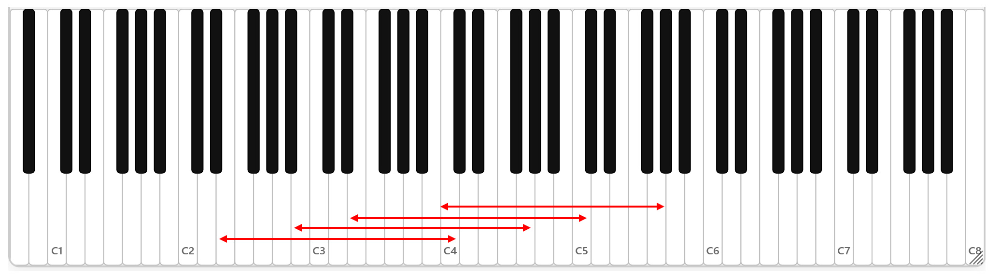

# 五线谱

音乐最常记录在五线谱（staff/stave）上。五线谱由五根线组成，其每一根线以及两根线中间的间隔用来记录不同的音高。

为了能够阅读和记录音乐，必须认识五线谱。

## 基本情况

这一节总述五线谱的记谱逻辑。总体上来说，五线谱的记谱方式符合一般人的直觉：以纵向空间记录音高，以横向空间记录时间；从左往右、从上往下的书写方向；等等。

本节的叙述较为繁琐；可以跳过本节，在感到疑惑时再回看。

五线谱的两个维度：纵向以及横向，分别表示了音乐的两个维度：音高和时间。从下往上（可以类比Y轴）的每一根线和间隔表示的音依次升高；从左往右（可以类比X轴）是音乐随着时间流动的方向。

在中文当中，“五线谱”一词既可以笼统地指五线谱的记谱法，也可以指其五根线。

### 音符

音以**音符**(note)的方式记录在五线谱上，这就如同将文字排列在稿纸上。

横向排列的音符之间的先后关系就是它们**发声**时刻的先后关系。一个音符演奏完毕以后，下一个音符开始发声。

### 一行与多行记谱

西方音乐的其中一个本质特征是多声部音乐；也即，同一时刻可能出现多个音。五线谱能够满足多声部的记谱需求。

在多声部音乐当中，为了表示在某一时刻发声的所有音，我们把对应的音符都记录于同一个横向（X轴）的位置上，形成纵向对齐（平行于Y轴）的排列。

多个声部有时会记录在同一行五线谱上，而有时则会记录在多行五线谱上。这时，多行谱形成一个整体（system）；横向的某个位置在每一个谱线上都表示同一个时刻。一般，为了表示是同一个整体，多行谱的左侧会用一根竖线连接所有的行，有时还会附加方括号/花括号。

下面谱例来源于贝多芬c小调弦乐四重奏，Op. 18 No. 4。这例当中使用了四行五线谱记谱；同一行五线谱上也出现了纵向排列的多个音符。注意不管是同一行还是不同行的音符之间的纵向对齐的关系。

### 记谱空间的延伸

如果五线谱超过了纸的宽度，就在下面另起一行。五线谱的书写和阅读顺序满足从左往右、从上往下。重申，多行记谱时，这许多行是被当做一个整体处理的。

如果一个音的音高超出了五根线（以及其间隔）的范围，那么就在上面或者下面增加更多的线。

以下是同一部作品当中的另一处记谱，注意上加和下加的线：

## 谱号

五线谱的某一根线，或者某一个间隔，并不固定表示某个音。某根线具体的音高，是由谱号来决定的。

谱号放置在五线谱上，说明了右侧谱线的每一个位置代表什么音。

最常见的两个谱号是：高音谱号（treble clef）和低音谱号（bass clef）。

### 高音谱号

高音谱号是最常用的谱号。

下图中的谱号是高音谱号：

> 为了方便说明，将带有谱号的（一行或多行）五线谱称为谱表，这样我们可以简称上图为“高音谱表”。
> 
> 这个称呼完全是为了沟通的方便，而不是为了严谨的定义；只要读者能够理解这个名字就可以了。

谱号并不完全是指符号本身；它同时也包括了符号在五线谱当中的高低位置。

高音谱号的中间有一个螺旋，这个螺旋的中心处在从下往上数第二条线的位置（简称第二线；从下往上数也符合音高从低往高的特点）。

为什么这个位置很重要呢？

高音谱号的形状其实是字母G的变形（所以这个符号本身又称G谱号）。一开始，人们为了规定五线谱上哪一条线是G，就在那条线上面写一个G。所以G谱号放在哪一条线，那条线就是G。

（下图演示G谱号的形状变化，来自[Wikipedia](https://en.wikipedia.org/wiki/Clef)）

> 高音谱号是G字母变形的说法不一定是精确的。一种说法认为，有时人们在标注G音时，会写作"G, Sol"，后来简化为G.S.；这两个字母最后才变成了G谱号。

自然，G谱号理论上放在任何地方都可以。不过人们逐渐固定把它放在第二线上面；所以现在，G谱号的位置就固定了下来。当然，只有放在第二线上的G谱号才叫做高音谱号；但是其它位置的G谱号已经几乎见不到了，所以完全可以将G谱号当作高音谱号的同义词。

高音谱号的含义就是：第二线为G。

> 我在第一章：音高当中，省略了一些东西。具体来说，每一个八度都有一个G；但是我们有不同的八度。我们事实上为每个八度都各自命名，这样就可以唯一地定位每一个音了。但是我认为这个命名系统对理解音高不会造成任何影响，也不会对后面的讲解有所帮助。
> 
> 在这里，高音谱号对应的“G”，不是任意一个G，而是“其中某一个八度的G”。我们在下面会提到具体是哪个G。现在只需要记住是“某一个G”就可以了；一个谱号完全地、唯一地定义了五线谱纵向空间上的每一个音高。

五线谱的**每一条线，以及每两条线之间的间隔**都表示一个**自然音**。如果说高音谱表的第二线是G，那么其上面的间隔，也就是从下往上数的第二个间隔（简称第二间），就表示A；第三线表示B；第三间表示C；等等。

往下走，则第一间表示F；第一线表示E；第一线下面的那个间隔（简称下加一间）表示D；下加一线表示C；等等。

在线或者间上画一个圆圈表示音符。高音谱号上一些位置的音高如下图：

![[the_treble_clef_pitches.png]]

这里读者已经注意到，由于每个线/间表示一个自然音，所以每个线/间之间的音高的距离是不一样的，有的是半音，有的是全音。在学习了第二章以后，读者**应当**非常熟悉这些距离关系。

之所以叫做“高音谱号”是因为它记录的音高比较高（详见下节“大谱表”）；绝大部分的高音乐器，如小提琴、长笛、双簧管、小号等均使用该谱号记谱。

### 低音谱号

低音谱号的形状和位置如下图。

低音谱号的形状是F的变形。与高音谱号类似，F谱号几乎总是被固定置于第四线上，形成现在的低音谱号。

低音谱号意味着谱表的第四线是F。读者可以作为练习，往上和下推导每一条线和每一个间的音高。

参考答案如下：

大部分的低音乐器的记谱使用低音谱号，比如大提琴、大管、长号等。

## 大谱表

像下面这样的、两行大括号括起来的谱表叫做“大谱表”（Grand staff），通常都是“高音谱号”和“低音谱号”的配置。

大谱表的优点是能够表示的音域非常宽广，钢琴、竖琴等一些音域横跨高低音区的乐器常用它来记谱。

我们也将利用大谱表进行下面的分析。
### 中央C

在第一章当中，我们并没有涉及到音区的概念，也就是说，虽然我们讨论了一个八度之内的音，但是我们没有考虑不同高低的八度。

所谓“中央C”（Middle C），是对于常用音域正中央的C的称呼；中央C唯一地指向了一个音。在现代的标准音高下，中央C的音高大约是262Hz（在某些物理或工程学的分析当中，也常用中央C=256Hz）。

中央C的名称可以直观地体现在其在键盘的位置上。在钢琴上，中央C位于大致中间的位置（略微偏左）。如下图中，中央C即C4。

> 这种音名+数字的标记法是所谓的科学音高标记法(scientific pitch notation)；其简要规则是，每个八度从C开始到B，同一个八度内音的数字标一样。也就是说从B到C要加一个数字；C5的前一个音是B4。不需要记忆这种标记法。

历史上，中央C一直位于大多数键盘乐器的正中间。例如，早期的大键琴和钢琴主流有61键，如下图中，从F1到F6。

> 随着技术的发展，现代钢琴已经拥有88个键；其音域包含了几乎所有其它主要乐器的音域，因此人们一般也只会使用这88个音。
> 
> 早期键盘乐器的音域（上图）相对缺乏高音，技术的限制是一个重要原因。大键琴、钢琴等键盘乐器通过敲击琴键，激发固定音高的琴弦。为了达到高音，琴弦需要更短、更细、张力更大，而琴板也需要足够的强度来固定琴弦；因此，更高的音要等到铁制框架和琴弦的应用才得以达到。
> 
> 相对地，低音的物理极限到达得更早：取C4=256Hz，则可以估算C1的频率已经只有32Hz。钢琴的最低音A0只有27.5Hz，接近人耳听力的极限，或者说，接近人对于“振动”（往复运动）和“音”的感知的分界线；事实上，人对低音的感知，更多是通过感觉到其振动，而非“听”到其音高。
> 
> 因此，今天，钢琴的高音部分拓宽得更多，因此中央C便不再处于正中央了。

在高音谱表上，中央C位于下加一线；在低音谱表上，中央C位于上加一线。下图中记录了中央C及其上下两个八度在大谱表上的位置。中间的音同时出现在了两行上，这只是说这两种记法表示的是同一个音。

大谱表的中央就是中央C；甚至可以说大谱表就是关于中央C对称的。

## 历史的巧合？

高音谱号是G谱号；低音谱号是F谱号；大谱表关于中央C对称。

如果我们从零开始来设计大谱表，将中央C位于最中间。而恰好，F是C大调的下属音（主音下方五度），而G是C大调的属音（主音上方五度）。那么自然F和G就会分别出现在低音谱表的四线和高音谱表的二线。

这种形式上的简洁与巧合，虽然的确是数学的必然，但似乎还蕴含着某种深层的信息。

### C, F, G谱号

事实上，除了G和F谱号以外，还有一种谱号：C谱号。C谱号的最常用形式是中音谱号(alto clef)，写在三线上，代表三线是中央C：

它还有一种常用的形式（不像G和F谱号只有一种常用形式！）是次中音谱号(tenor clef)，写在四线上，代表四线是中央C：

读者已经能够猜出该谱号的来历：由人们在某根线上标注的C变化而来。

> 中音谱号主要用于中提琴的记谱；次中音谱号常常在记录低音乐器（大提琴、大管、次中音长号等）的高音区时使用。C谱号在复调、合唱作品等当中也会使用，在稍早的音乐实践中还常常用到它的其它位置。

事实上，从前的人们使用C，F，G这三个字母来标记音高位置。如果我们仅仅根据历史的遗留——也即三个谱号在现代留存的位置，具体地说，C有两个，而F、G只有一个——进行推理，我们似乎得到这样的暗示：C谱号具有比F和G更大的（位置上的）灵活性，而这又可能说明，过去的时代使用C谱号远远比F和G谱号更多。

> 高音谱号是最常用的谱号。([高音谱号](#高音谱号))

即使我们仅从这一点遗迹来看，过去的情况似乎也并非如此。事实的确跟我们的推理一致（别忘了我们有大量真实的历史文献遗留）。这也符合一般的直觉：标记C的位置似乎更加自然。

### 为声乐设计的记谱法

西方音乐是与中世纪的教会圣咏一脉相承的。五线谱的前辈，或者说在可能的平行世界当中出现的任何一种记谱法，最早都是用于声乐。

人的音域当然并不像乐器那样多种多样；为了节约空间（少画加线）而产生的（位置可变的C谱号）音高标记，常用的位置也是有限的。

我们提到了早期键盘乐器的高音较为欠缺；事实上，人声更是如此。各种音域——女高音，女低音，男高音，男低音——大致关于中央C对称。

各个人声声部的音域大致如下：（来源：勋伯格：《对位法基本练习》）

当为男低音(**bass**)记谱的时候，假设使用C来标记，则有以下两种可能。
1. 用C来标记第五线。这样，男低音的最低音E3会位于下加二线上。
2. 如果不想要下加二线，那么需要用C标记上加一线；这非常麻烦和不自然。

因此，标记C的下方五度音，F（最后演变成低音谱号——**bass** clef），就成了非常自然的选择。此时最低音E3位于下加一线上。

相对地，G谱号的引入相对较晚，因为没有必要：女高音（soprano）最早所使用的谱号，是将C记录在一线上形成的（女高音谱号，soprano clef）。这样，最高音G5则位于上加二间上——只需要加一线。

![[Pasted image 20251014183345.png]]

所以从简便的程度来说，一般不需要引入G谱号；直到高音音域得到扩展（人声高音区的更多使用/乐器高音区），才需要偶尔使用C上方的G谱号来处理过高的音。随着高音音域的进一步扩展，G谱号的使用才愈发广泛，并最后替代了女高音谱号。

### 历史的自然选择

回顾历史的过程，人声和乐器（主要是键盘乐器）都基本上沿着中央C对称分布。或许有一个更恰当的说法：人声和乐器的音域并不是“恰好”沿着中央C对称；正好相反，**我们选择了人声音域的中点作为中央C**，并围绕之设计了谱号与乐器。

在主要为音域较窄的人声记谱的年代，C和F谱号基本能够满足需求；当涉及到高音区时，引入了G谱号。由于C谱号的灵活性，F和G谱号的（基本）固定的、对称的排列也就确定下来。

此后，当高音和低音的音域逐渐拓宽时，C谱号逐渐只适合记录中音区、音域相对（指相对键盘乐器）较窄的乐器。键盘乐器虽然位于中音区，但是音域宽广，加上（两手弹奏带来的）天然的多声部记谱需求，因此使用大谱表记谱更加方便。而更多的乐器或人声则要么是低音乐器，要么是高音乐器，使用低音/高音谱号的需求因此大大地超过了C谱号的需求。

最终，中音谱号几乎只有中提琴还在使用，次中音谱号也只在特定情况下使用；同时，作为历史的遗留和人工的选择，我们得到了非常优雅地关于中央C对称、以C大调的属音和下属音为锚点（anchor）的大谱表。

可以说，我们的一整套音乐系统，包括记谱法和乐器的发展，都是由于人声的音域限制以及教会音乐注重人声的历史而导致的自然的结果。

## 升降记号与调号

到目前为止的内容只能记录自然音。对于变化音，我们的做法是在自然音的**前面**使用升降记号（accidental）。

下图中的音分别是 F$\sharp$ ， B$\flat$ ，A$\flat$ 。

![[Pasted image 20251014184947.png]]

升降记号的惯例是：当某一线/间出现了升降记号之后，其作用于其以后的、这一线/间上的所有音，一直到下一个升降号为止。

为此引入另一个升降号：还原符号$\natural$。还原符号后的音就是自然音。

练习：下图表示的音依次是什么？

![[Pasted image 20251014185324.png]]

答案：C#, B, C#, B$\flat$, （还原）C, B$\flat$, B#。

重升、重降号的道理也是一样的。下图：C，重升C，重降C，还原C。

![[Pasted image 20251014190245.png]]
### 调号

在第二章我们提到了“升号调”和“降号调”。对于这些调来说，有一些音一定是升的或者降的。可以想象，如果对每一个变化音都去写升降号，将非常麻烦；更重要的是，这**并不直观**，不方便阅读，也不方便理解是哪个调。

因此把一个调所涉及到的升降记号集中写到谱号的右侧，这就是调号（key signature）了。谱号和升降号出现在每一行谱的最开始，因此非常清晰。

C大调没有调号，或者说它的调号是0个升降号。

下图是所有的升/降大调（sharp/flat major）的调号，在高音谱表中的样子。图来自于制谱软件Sibelius的操作界面截图。

![[Pasted image 20251014185829.png]]

注意，升降号的排列是满足先后顺序的，这个顺序已经在第二章介绍过，读者**应当熟背**了。

例如，E$\flat$大调的音阶，两个八度，在大谱表上记录如下：

![[Pasted image 20251014190752.png]]

注意我们没有在中途使用任何的升降号（临时升降号），但是里面的每一个B/E/A都被降了半音。

## 目标

本章学习之后，读者应当：
1. 记住高音谱号/低音谱号的概念；
2. 知道中音谱号；
3. 在键盘上找到中央C；
4. 把键盘上的任何一个音通过大谱表记录下来；
5. 在大谱表/高音谱号/低音谱号上面写出每一个大调的音阶（包括调号）。