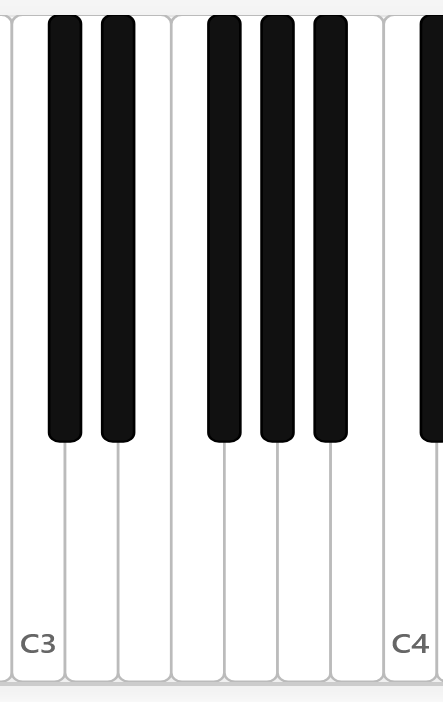

## C大调音阶

七个自然音从C开始排列组成的音阶就叫C大调音阶（C Major Scale）。C大调音阶几乎可以说是五度相生律的直接产物，也是音乐中最基本的音阶之一（如果还有其他音阶能与之相比的话）。

$$
C, D, E, F, G, A, B
$$

1. 从C开始
2. 涉及到的七个音：C, D, E, F, G, A, B

音频：可以从钢琴的C开始往上弹所有的白键。

考虑C与七个音的音程关系。

- C-C：一度。
- C-D：大二度。
- C-E：大三度。
- C-F：四度。
- C-G：五度。
- C-A：大六度。
- C-B：大七度。
