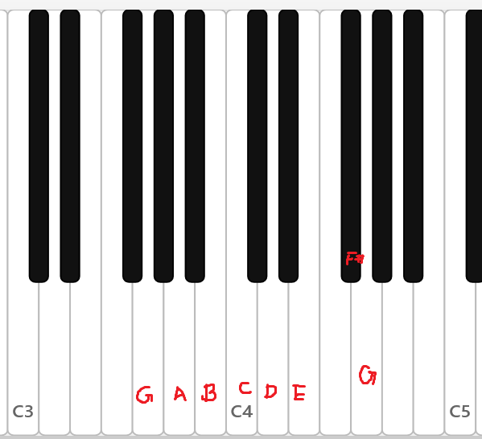
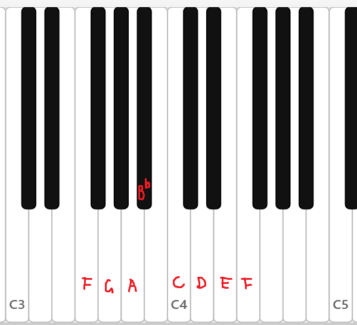

## 大调音阶

到现在，我们只讨论了C大调音阶。如果我们按照**与之相同的音程关系**，从某个音开始构造一个七音音阶，那么形成的音阶就是那个音上面的大调音阶。

我们自然选取C的属音G和下属音F进行举例。

### G大调音阶

G大调音阶所涉及到的七个音相当于从C开始进行六次五度相生所得到的七个音。一个显然的事实是：F被替换为了F#（因为B-F是减五度，所以B的下一个音是F#）。

$$
G, A, B, C, D, E, F\sharp(, G)
$$

练习：

主音——？
属音——？
下属音——？
三级音（特征音）——？
导音——？

### 属调与主调

G大调与C大调若说组成的音有何不同，那么就是C大调的下属音F被升高了半音，变成了G大调的导音F#。

把G大调，也即在C大调的属音——G上面建立的大调，叫做“属调”，而把C大调称为“主调”的话，那么属调和主调的区别就在于主调的下属音被升高半音。

我们很容易认识到，下属音是大调的另一个特征音——如果它被升高了半音，那么这个大调的组成音将变成其属调的组成音。

下属音与导音在这个概念上产生了关系。导音如果降半音，不就变成下属调的下属音了吗？

因此，从“改变一个音就会改变音阶”的角度来看，下属音、导音、三级音都是特征音；但是当然它们表现的特征不同。

### F大调音阶和下属调

类似地，如果要探究F大调的组成，我们可以这样考虑：

1. C大调是F大调的属调。
2. C大调和F大调唯一的组成音的区别，就是F大调的下属音在C大调中被提高半音变成了导音。
3. C大调的导音是B。
4. 因此，F大调的组成音可以通过将B降低半音，也即Bb，来得到。

以下的若干种考虑方式也是等价的。
1. F大调的下属音是其下方五度音，Bb。或者说，Bb做一次五度相生就可以得到F。
2. 在Bb上做六次五度相生，就可以得到F大调的全部音。

$$
F, G, A, B\flat, C, D, E(, F)
$$

前面我说E有向F的倾向性，但在C大调当中E提供的更多是稳定性。然而，在F大调当中，E马上就变成了导音，完全地成为了倾向F的音！同样的音在不同的调当中起到的作用是截然不同的，即使只是主调和下属调的关系。

总的来说，属/下属调关系与特征音是紧密相关的：

- 属调的三级是主调的导音（七级），如G大调的三级，B，就是C大调的导音。这使得属调进一步具有朝向主调的倾向性。
- 导音降半音就变成了下属调的下属音（B->Bb）；与这个过程反过来的是，下属音升高半音就变成了属调的导音（F->F#）。

### 升降音，以及五度相生律

到这里，或许有读者已经认识到，记住五度相生律的生成顺序是非常有必要的。（当然只要能理解五度相生律，就能够马上推导出十二个音生成的顺序）这是因为，如果我们把一个调变成其属调，那么就有一个音会被升半音。也就是说，如果某个音在某个调当中被升了半个音，那么在其属调、属调的属调、……当中，这个音必然都会被升半个音。同理，如果某个音在某个调当中被降了半个音，那么只要是在对应的下属调、下属调的下属调、……中，这个音必然会被降半音。

**引理** 如果在某个调当中，某个音$a$是以自然音升半音的形式存在的，而另一个音$b$是以自然音存在的，那么当在某个调中$a$为自然音时，$b$必不可能升半音；当某个调中$a$降半音时、$b$必降半音。

证明：当$b$升时，对应的调必须是条件所述的调的属调、属调的属调、……当中的调，这时必然升。因此$a$是自然音时，$b$不可能升。而当按照下属调的序列前进、$b$首次被降半音时，$a$必然是自然音。于是当$a$降时，$b$必然降。

于是，升和降音按照一定的序列出现。当某个音升时，序列前面的其他音也升：

升：

| 升音   | F#  | C#  | G#  | D#  | A#  | E#  | B#  |
| ---- | --- | --- | --- | --- | --- | --- | --- |
| 大调   | G   | D   | A   | E   | B   | F#  | C#  |
| 升号数量 | 1   | 2   | 3   | 4   | 5   | 6   | 7   |

降：

| 降音   | Bb  | Eb  | Ab  | Db  | Gb  | Cb  | Fb  |
| ---- | --- | --- | --- | --- | --- | --- | --- |
| 大调   | F   | Bb  | Eb  | Ab  | Db  | Gb  | Cb  |
| 降号数量 | 1   | 2   | 3   | 4   | 5   | 6   | 7   |

注意以下几个规律：

1. 升和降的顺序是相反的。
2. 只要记住五度相生的前七个音(F, C, G, D, A, E, B)，就可以对应得到升和降音的序列。
3. 对于升号调（有升号的调）来说，这个调的（特征）升音也就是其导音。记住这一点就可以确定某个升号调有多少个升号。例如，E大调的导音是D#，因此有四个升号。
4. 对于降号调来说，其特征降音就是其下属音，也即在该调的主音的降号序列的后一个音。根据这一点可以确定某个降号调有多少个降号。例如Eb大调的主音是Eb，这是降号序列的第二个音；因此Eb大调有2+1=3个降号。

**必须**通过练习熟练掌握以下问题：
1. xxx大调有几个升号/降号？
2. 写出xxx大调的组成音（从主音开始）。
3. xxx大调的属音、下属音、导音分别是什么？
4. 有xxx个升号/降号的大调是什么大调？

### 等一下。

前面说“其它大调的构成音之间的音程关系与C大调相同”。这话固然正确，但是如果使用五度相生律的话，那么即使是半音也有“小间距”和“大间距”之分；就算音程相同，频率的精确比例也不会相同。这样的结果是，C大调和比如说B大调的每一级音的实际的频率比完全不同，如果把C大调作为基准，那B大调听起来会相当“跑调”（out of tune）。

一种直接的想法是：从主音开始，进行一次五度相生，来决定每个音的频率。但是这样的话，某一个音（例如A#）在某个调当中（C大调）的频率跟同一个音在另一个调（B大调）当中的频率或许会不同，甚至会非常不同。这带来两个坏处：首先，如果音乐转调了，那么同一个音的音高发生变化显然对于音乐的进行来说并不美妙；其次，虽然声乐和大部分管弦乐器能在一定程度上快速地微调频率，但是键盘乐器不可能在一场音乐会中，甚至一首曲子的中间进行调音。需要想一个折中的办法。

> 从早时的大键琴到现在的钢琴，键盘乐器始终是音乐实践中最重要的一类乐器（或者叫做实践的中心）。这既跟其与作曲家之间的深刻联系有关，也与其宽广的音域、易于演奏多声部所带来的泛用性有关。音乐（尤其是管弦乐）和键盘乐之间存在某种深刻联系。一个非常浅显的例子是，配器法是音乐创作（教学/实践）的基本组成部分之一，作曲学生将乐队总谱缩减成钢琴谱进行研究，而一些作曲家先创作在钢琴谱上，然后再用管弦乐配器；等等。

**平均律**（Equal temperament）试图将每对半音之间的距离进行调和，从而让十二个大调听起来都比较准。我们知道最好的方式是把2（对数）平均分成12分，因此半音的频率比是$\sqrt[12]2$；事实上早在计算并应用这个值之前，各种“不精确的平均律”（如良律 well temperament）就已经在使用了，核心的原因仍然是人耳的不精确。

平均律是有代价的，因为在平均律下，两个音的频率之比是 $2^\frac{k}{12}$，只有$k$是12的倍数，也即两个音是同度或八度关系的时候，这个比值才不是一个无理数。也就是说，理论上，除了一度、八度以外的其它所有音程都不和谐！在某种程度上，早期的“不精确的平均律”反而更和谐。

当然，平均律带来的好处使得人们能够容忍这个最大的缺点：第一个好处自然是所有的调都有完全相同的音程关系；第二个好处是同音异名可以更加自由地使用（因为一个音离上方半音和下方半音的距离相等，至少在听觉上是完全一样的），因此在和声和调性变得越来越复杂的古典晚期到浪漫主义时期，作曲家的创作语言已经默认将平均律作为前提了。现代键盘乐器绝大多数情况下使用平均律调音（除非是演奏巴洛克风格等特殊场合），而大合奏时基本也遵循平均律。

当然，不使用（至少不完全使用）平均律的例子在现代也仍然广泛地存在，因为毕竟平均律是妥协的、“不和谐的”——至少比起泛音列更不和谐。大多数的声乐、管弦乐都使用某种调和的律制：在需要同音异名或者转调的时候使用平均律，而在调性比较稳定、或者突出和声时，则使用基于泛音列的更加纯正的律制。为乐器调音时，也不使用平均律，具体的律制根据乐器的机制而定，而在合奏当中，只要所有乐器把一个音（通常是A，标准音高为A4即某个八度的A=440 Hz；管乐团则常用B$\flat$）的音高对齐就可以了。尽管发声的机制不同，但有经验的声乐家和管弦乐器演奏家都能做到根据实际情况精细地调整音高，当然也能听出这些细微差距的不同。

一个更奇妙的事情是，由于平均律的广泛应用（键盘乐器，吉他等有品的弦乐器，到现代还有电子音乐，几乎都完全使用平均律），现代人的耳朵（甚至是音乐家的耳朵）早已习惯于平均律，以前的不和谐变成了现在的和谐，以前的和谐反而变成了现在的不和谐！从前其他音乐家笑话钢琴家说他们耳朵不好，因为他们只使用平均律而从不讲究精确的音高的不同；而如今这些精细的调整反而被人认为是不准，而钢琴的音高成了绝对正确的。这里再次说明了，和谐与不和谐的概念并不是固定的，甚至不是一直符合某种客观规律的。

一言以蔽之：这个世界是妥协的世界；律制也是如此。

### 思考：四大小提琴协奏曲的调性问题

小提琴通过琴弦的振动发声，在发声时可以按住琴弦（stopped）或者不按住（空弦；open）。琴弦两端固定在琴体上，所以空弦的音色比按弦时振动更充分。

小提琴有四根弦，根据五度定音：最低的四弦音高为G，三弦为比它高五度的D，二弦和一弦则都比前一根弦高五度，分别是A和E。

所谓的“四大小提琴协奏曲”有多种说法（即人们常说的“四大天王一般都有五位”）。按创作时间排列：
- 贝多芬D大调小提琴协奏曲（1806）
- 门德尔松E小调小提琴协奏曲（1844）
- 勃拉姆斯D大调小提琴协奏曲（1878）
- 柴可夫斯基D大调小提琴协奏曲（1878）
- 西贝柳斯D小调小提琴协奏曲（1905）
- 等。

为什么最为知名的小提琴协奏曲的其中三首都选择了D大调？如果考虑到D小调和D大调具有相同的属音和下属音，我们也能把西贝柳斯的“in D”算入同一类别。作曲家对调性的选择惊人地一致。这是巧合，还是有某种必然性？用这一章的知识，尝试从历史或个人原因（如致敬等）以外的其中一个视角来解释这一现象。