上一节介绍了一拍子,二拍子和三拍子这样的单拍子。在这些单拍子当中，第一拍是强拍，而其余拍是弱拍。当一个小节有更多的拍子的时候，形成的节拍就是复拍子了。

之所以叫做复拍子，是因为人们习惯于把这样复杂的节拍分解成多个单拍子。什么叫分解成多个单拍子？就是说，人们会把一个小节之内的这么多拍分成几组；每一组都只有2-3拍，这样每一组都形成一个单拍子。

这里我说的“人们”，指作曲家、演奏家和听众三者。也就是说，当作曲家在构思某种复拍子时，他们会以拆分的方式去思考；当演奏家在看到复拍子时，他们会将其拆分来演绎；当听众听到复拍子的节奏时，他们会自然地感知成多组节拍。

下面，首先会介绍一些常见的复拍子，以及它是如何分解成单拍子的。其中的一些分解方式可能会使读者产生疑问，还请读者先保持疑问继续阅读。在介绍这些拍子之后，将提及一些可能出现的疑问。接着介绍使用复拍子的一般逻辑。具体来说，我们想要回答这样的问题：

1. 当我看到作曲家用了复拍子，我应该怎么去理解他们的用意，音乐该如何表现？（谱面形式=>音乐内容）
	1. 更加具体地说，我应该如何分解这样的复拍子？哪些拍是强拍/弱拍？
2. 当我听到某种节拍，或者在创作中采取某种节拍，我应该如何去归类这种节拍，怎么把它记录下来呢？我应该用单拍子还是复拍子？我应该用哪种拍子？（音乐内容=>谱面形式）

## 四拍子/六拍子/九拍子


### 四拍子

如果一个小节有四拍，那么它就可以看作两个二拍子组合而成。

1 2 3 4 => (1 2) (3 4)

每一个二拍子都是“强-弱”的格局。因此，当两个二拍子组合在一起的时候，第一拍仍然是最强拍，但是第三拍也相对应地比第二拍和第四拍更强。这样的格局可以叫做“强-弱-次强-弱”。

我们可以先想象一个二拍子。这样，第一拍理应较强，第二拍理应较弱。

```
强-弱
```

我们把每一拍都拆分成一个二拍子的节奏。每一个二拍子的第二拍都是弱拍。

```
  强   -    弱
  / \     /   \
(强-弱)  (次强-弱)
```

也就是说，4/4拍可以这样去想：
“以四分音符为一拍，两拍为一组，每小节包含两组”；
或者甚至这样：
“以两个四分音符为一拍，每小节两拍”。
当然，字面上每小节仍然是四拍。上面的说法只是为了从实质上去理解这个拍号，也就是想成一个复杂的二拍子，每拍可以分成两份。

4/4拍是西方音乐，甚至各种流行音乐当中最常用的拍号。4/2拍和4/8拍有时也能见到。

### 六拍子

六拍子应当看作是两个三拍子组合而成，这样第一拍是强拍、第四拍是次强拍，而其余四拍是弱拍。

(1 2 3) (4 5 6)

同样地，我们应当先设想一个二拍子（强-弱）。之后，将每一拍的时值都拆分成一个三拍子（强-弱-弱）。

```
    强   -       弱
  / | \        / | \
(强-弱-弱)  (次强-弱-弱)
```

对于6/8拍，相应的（实质性的）理解方式就是：“以三个八分音符的拍为一组，每小节2组”，或“三个八分音符为一拍，每小节2拍”，也就是把它看成一个复杂的二拍子，每拍分成三份。

最常见的6拍子是6/8拍，而6/4拍在更早期的音乐当中也有出现。6/2拍和6/16拍比较少见。

### 九拍子

九拍子就是三个三拍子组合在一起。第一拍是强拍，第四拍、第七拍是次强拍，其余是弱拍。

九拍子没有四拍子和六拍子那么常见，不过在记录“3拍为一组、每小节3组”的意义上，用9拍子非常自然。9/8拍是最常见的九拍子，而9/16、9/4相对少见。

有一个很好的例子可以说明上面所说的、使用九拍子所表达的含义，那就是J.S. Bach的第一号小提琴无伴奏组曲（Partita for Solo Violin No. 1 in B minor, BWV 1002）中的[Sarabande舞曲](https://www.youtube.com/watch?v=UaMoPi9BOoQ&t=690s)和其[变奏Double](https://www.youtube.com/watch?v=UaMoPi9BOoQ&t=812s)。

> 巴赫的六首《小提琴无伴奏奏鸣曲与组曲》（Sonatas and Partitas for solo violin），编号BWV 1001 --- 1006，是为独奏小提琴所写的六部套曲，以奏鸣曲1——组曲1——奏鸣曲2——组曲2——奏鸣曲3——组曲3的形式出版。其中的组曲（Partitas）是巴洛克时期的古组曲形式，与后世作曲家的组曲有所区别。每首组曲由若干首舞曲组成。奏鸣曲一包含四首舞曲：德国舞曲（Allemanda）、库朗特舞曲（Corrente）、萨拉班德舞曲（Sarabande）、布列舞曲（Tempo di Borea）。每一首舞曲后面都附加一首变奏，用法语Double表示。变奏指的是在原来的舞曲的节奏、旋律、和声、句式结构等特征之上，加以变化产生的新的乐章。

上一节在三拍子的举例当中提到了[萨拉班德舞曲](https://www.youtube.com/watch?v=UaMoPi9BOoQ&t=690s)是一种三拍子舞曲。具体到这一首的拍号是3/4。因此很容易理解，这里它的变奏也是以三拍子为基础的。但是，在萨拉班德舞曲当中，有时出现八分音符，或者是16分音符，也就是说每拍被划分为两份。
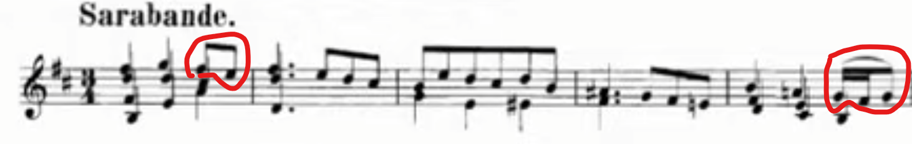
> 截取了视频中的谱例。当然可以只关注重点内容，也就是正文讲解的拍号相关的内容。不过也可以选择借此机会，复习一下学过的记谱法，另外顺便学习新遇到的记谱法。这些部分都放在引文里面，以便读者跳过。
> **新的记谱法**：在乐章开始的文字“Sarabande.”，提示乐章的名字。
> 复习1：谱号（高音谱号，也就是第二线是G）、调号（两个升号，升F和C；这是D大调或b小调的谱号，这里是b小调。这是怎么确定的？）、多声部（多个纵向叠加在一起的声部，代表其开始时刻是一致的）。虽然小调跟调号对应的规则还没有讲过，但是只要知道了谱号和调号，各条线和间的音高就是确定了的。作为练习可以读或写出前面五个小节最上面声部的音，注意升降记号（升号和还原号）。答案在本章最下面。可以跟着同步音频读谱。
> 复习2：3/4是拍号，说明音乐是3/4拍。3/4拍的意思是，以4分音符为一拍，每小节3拍。图里面有两根小节线，他们前面各有一个小节。
> 复习3：实心符头+符干，没有符尾，这是四分音符。第一组四个、第二组三个音符都是四分音符。
> 复习4：实心符头+符干+一个符尾是八分音符。
> **新的记谱法**：多个八分音符连续出现的时候，有时不画符尾，而是用到连接多个音符的线，也就是符杠（Beam）。因为八分音符都是一个符尾，所以符杠也是一条。使用符杠的时候，也有语义上的内涵：一根符杠连接的多个音符被看作“一组”。
> 红色的圆圈内就是两个八分音符连起来。所以第一个小节的最上面的声部，节奏应该是：第一拍（一个4分音符）+第二拍（一个4分音符）+第三拍（两个八分音符）。
> 复习5：附点是符头后面一个点，作用是将前面音符的时值延长一半。所以第二小节的第一组音是三个附点四分音符，时值是（四分音符+八分音符=1.5拍）。
> 第二小节后面三个八分音符用符杠连接起来。节奏是（1.5个四分音符）+（3个八分音符）。
> 复习6：实心符头+符干+两个符尾是十六分音符。第五小节的红圈里前两个音符就是十六分音符，在使用符杠的情况下，它们用到了两根符杠。后面一个八分音符还是用的一根符杠。
> 新的记谱法（了解）：红圈当中跨越两个或更多音符的圆滑线（slur）是一种演奏法，代表连贯地演奏（连奏/legato），弦乐中就是在持续的一弓之内演奏这些音。如果没有连线就代表分奏（每个音一弓）。钢琴的连奏是指在弹出后一个音之前不抬起前一个音。管乐的连奏则是指以一口气、不插入音头（“吐”地突然吐气）地演奏这些音。注意上一节提到过连音记号tie，也是一根连线，那个是只能连接两个相邻的、音高相同的音符，意思是把它们当作一个更长的音符来对待。这两者的意思是不一样的。乐谱上不仅有音乐本身的信息（音符、连音记号），还有演奏的信息（连线），这都是因为记谱法是实用的工具，是作曲家和演奏家沟通的语言。音乐是需要演奏的。
> 

而[变奏](https://www.youtube.com/watch?v=UaMoPi9BOoQ&t=812s)当中，可以看到每小节有9个八分音符，每3个八分音符为一组。如果仔细听两者的区别和共性，就能发现，原来的萨拉班德舞曲的四分音符的一拍，在变奏当中对应了三个八分音符。

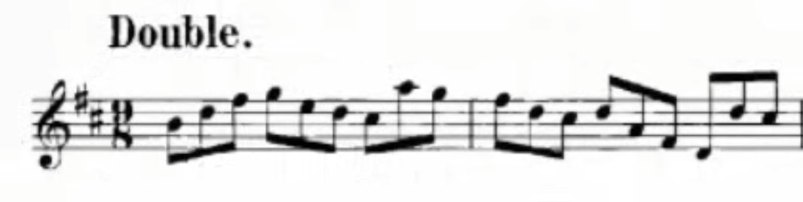

> 读谱提示：乐章名（Double. ，读作doo-bleh）、谱号（高音谱号）、调号（两个升号）、拍号（9/8）。截取部分两个小节，都是9个八分音符，每3个用符杠连成一组，说明了9/8的划分方式。试着读一读前两小节每一个音的音高吧，答案在最下面。


理论上，像上一节所提到的那样，如果要把一个四分音符等分成三分，就要用三个八分音符的三连音：（下图左）

但是因为整个乐章的基本节奏都是这种三连音，这样三个音上面都要标一个3，写起来的确很麻烦，所以干脆将拍号改成9/8（下图右）。这样记谱的话，一拍虽然变成了8分音符，但是三拍就能构成“一组”了，这一组三个音正好对应了原来的一拍。而且，强弱关系也没有发生任何变化：每一组的第一个音比其他音更强，而每小节的第一个音最强。因为记谱压倒性地方便，而且强弱关系也不变，所以作曲家使用了9/8拍而不是3/4拍。

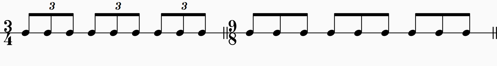


> 不涉及音高的某些情况下记谱可以只用一根线或者不用线。


## 十二拍子

十二拍子也是存在的。这可以理解为是四个三拍子组合在一起：可以先想一个四拍子，然后再把每一拍拆成一个三拍子。当然，也可以理解为三个四拍子组合在一起。也就是说根据情况不同可能有两种理解方式：“三拍为一组，每小节四组”的“复杂化的4拍子”，或“四拍为一组、每小节三组”的复杂化的三拍子。后者比较少见，原因后续会提到，但是并不是没有这样的例子，如下面贝多芬的第三十二号钢琴奏鸣曲。

12拍子较为少见，在早期或现代音乐当中运用更多一些。它的运用多是记录“3拍为一组、每小节4组”，或“4拍为一组、每小节3组”的节拍概念。12/8、12/16、12/32的例子有时能看到。

12/8：巴赫《第二号小提琴无伴奏组曲》BWV 1004，[吉格舞曲Gigue](https://www.youtube.com/watch?v=lpe7thXd69E&t=497s)

这里就可以理解为四个3/8拍组合在一起。但是更好的理解方式仍然是“四组，每组3个八分音符”；或者说，“以三个八分音符为1拍，每小节4拍”。听音频，感受音乐当中每小节四拍、每拍分成三份的律动。


12/32：贝多芬《第32号C小调钢琴奏鸣曲》Piano Sonata in C Minor, Op. 111，Mvt II 第二乐章，[第三变奏](https://www.youtube.com/watch?v=WGg9cE-ceso&t=956s)
以作曲家的意图，12/32是简化后的拍号。从意图（也就是符杠和听感）上来说，是4个32分音符为1拍，每小节3拍的记法；但是，如果要数时值的话，一拍的谱面时值是“一个32分音符+一个64分音符”。这就是“简化”的含义：32分音符+64分音符上面的三连音记号被省略了。实际上，如果要按照正常的写法，不写3连音的话，谱号应该是36/64。为什么用这么奇怪的谱号，而不是用3/8拍？这是为了在谱面上说明律动是以“32分音符”，也就是说实际上是32分音符+64分音符的三连音，为基础的一拍，每小节12拍。下面具体地来分析。

 这一个乐章是变奏曲式，[主题](https://www.youtube.com/watch?v=WGg9cE-ceso&t=560s)的拍号是9/16；也就是说“实质上”每小节3拍，每拍是3个16分音符。谱面上也能看到，一拍是以一个附点8分音符=3个16分音符的形式出现的。

> 读谱指示：乐章名“Arietta.”（小咏叹调）；下面的指示Adagio molto semplice e cantabile是速度和表情记号：慢板（Adagio: slowly，大约44-66BPM），非常纯真的（molto: very, semplice: simple）而且如歌的(e: and, cantabile: song-like) 。
> 大谱表：两行谱表，左侧花括号。上行是高音谱号（G），下行是低音谱号（F）。
> 调号：无调号。该乐章是C大调。
> 拍号：9/16。也就是“实质上的”附点八分音符（三个十六分音符）为一拍，每小节三拍。
> **新的记谱法**：“第一小节”并没有占满9/16的时值。这种叫做“弱起”（小节）（pick-up/anacrusis/upbeat \[bar\])，因为这音乐是从弱拍开始的。谱例里面就是从最后一个附点八分音符拍开始。**一般不把弱起小节计入小节数当中**，因此截取的部分有5个小节。
> 新的记谱法："p"是强弱记号，指弱（piano）。第五个小节里面拉长的"<"记号是“渐强”(crescendo)的意思。强弱记号将在介绍强弱的时候学习。
> 复习：弱起小节上声部当中，有一个八分音符和一个十六分音符通过符杠相连。这里是符杠数量不一致时的形态。其它声部中的附点八分音符的时值是八分音符+四分音符。第一小节（和第二小节、第五小节）的附点四分音符的时值是多少？
> **新的记谱法：** 第一小节当中，低音声部和次低音声部（低音谱号行，左手）共用了一套符干和符尾，这是出于简洁考虑的，一般只有当两个声部的节奏或者时值相同的时候才会这么写（低音的两个声部在后面也基本上采取同样的记谱法）。第二小节里面，第三拍（附点八分音符拍）上，最上声部和第二声部（高音谱号行，右手）分别是哪两个音？它们相隔很近，一个在第一间，一个在第二线，所以为了美观，符头要错开一点；需要知道的就是它们实际上仍然是同时发声的。第四小节的第一拍，低音声部上面可以看到一个符头有两个符干。这个符头的音高是？这其实是低音声部和次低音声部都落在同一个音上面，实际上是两个音符共用了同一个符头，仍然是出于美观的考虑。不仅是符头，它们还共用了一个附点。因此，低音是一个附点四分音符G，而次低音是一个附点八分音符G。附点的时值当然还是跟对应音符的时值相关。这三例各不相同，但是都是出于排版美观的考虑。等一下，钢琴不是一个音高对应一个键吗，为什么两个声部同时发出同一个音高，怎么演奏呢？实际上当然只是演奏一个音，这样记谱是为了表达有两个声部，写明其走向。次低音声部随后变到了高八度的G，但是低音声部保持低八度的G，所以这个键并没有松开。
> **新的记谱法**：同样是第四小节的低音。有一根连线到第三拍的低音G。接下来左手有两根连线，上面一根、下面一根，都是从第三拍的G延伸到下一小节的E（低音两个声部形成八度）。这是什么意思？首先，第一根从低音G到低音G的连线是连音线tie，说明这两个音符应该被视为同一个音。这一个音的长度是附点四分音符+八分音符=二分音符（或者说8个16分音符）。接下来的连线就是圆滑线slur了，习惯上它是从tie的第二个音开始向后连接的（当然也可以从第一个音开始），说明后面三个音应该连贯地演奏。那么在最后这两个小节，左手一共触发了几次槌子击弦？低声部是4次，次低音声部是5次（第一个音只算低声部击弦），一共是9次。这里的新的记谱法其实是说tie+slur的时候后者从前者第二个音开始连接的记谱法。需要注意的是，这里slur上下都有，说明上下都是连奏，但是在共用符干符尾的时候（比如这里），有时只写一个slur，也是表达上下都是连奏。这里写两个大概是因为前面有个tie，想要减少歧义。顺带一提，如果想表示上面连奏而下面不连奏，就不能共用符干了，必须写两套。就像第三小节的右手那样，因为有两套而只有上声部用了slur，所以上声部连奏而二声部不连奏。基本上第一、二、三、五小节的右手都是这样。

第三变奏的开始标注了“L'istesso tempo” （the same time），这是说如果按照每小节三拍的实质拍数来算的话，每拍的速度不变。对比主题的9/16，也就是“附点八分音符为1拍、每小节3拍”，这里则是“4个32分音符为1拍，每小节3拍”——不过这里的每个32分音符其实是“32分音符+64分音符”的三连音，只是没有写三连音记号而已。如果不作简化，那么拍号应当是36/64，每小节的总时值跟主题是一样的。由于标注了L'istesso tempo，所以仍然应当把一个32分音符+64分音符的时值看作一个32分音符来演奏。

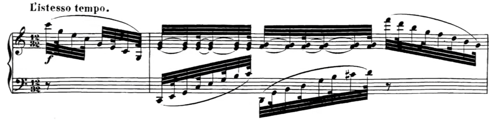
> 读谱指示：f是forte，“强”，表情记号。 𝄾是八分休止符。以三个符杠相连的四组32分音符+64分音符三连音（省略了三连音记号）的总时值为一个八分音符。右手第一小节（这里在计数的时候仍然跳过弱起小节）出现了连续的三个音符被两个连音线tie连接，这是说这三个音符应当看作同一个音。
> 这个变奏是史无前例的，是贝多芬在晚期创作当中到达的、仅属于他一人、前无古人后无来者的“音乐孤岛”的例证之一。32分音符+64分音符的节奏型让人想到要等到七八十年后才出现的爵士、Ragtime、Boogie-Woogie等音乐风格；从主题的平静、单纯发展到第三变奏热情激烈的音乐氛围承载着巨大的张力，发出仿佛不属于那个时代的声音。

我们再回过头看目前提到的两个变奏的例子。第一个例子是Bach的BWV 1002的Sarabande和变奏。Sarabande（实质上）是三拍子，它本身的每一拍可以继续二等分下去，所以采用了3/4。其Double的每一拍是三等分的，所以采用了9/8的形式，将每一拍表示为3个八分音符。第二个例子，Beethoven Op. 111 Mvt. II的主题与第三变奏，则正好相反。主题（实质上）是三拍子，但是每一拍需要分成三份，所以采用了9/16拍。第三变奏里面，每一拍需要强调分成四份，所以写成了12/32；至于每一拍实际上都是三连音，显然作曲家在此的考虑是强调律动的“单位”是32分音符+64分音符，强调每小节有12个这样的律动。

## 五拍子

五拍子比前面的拍子更加复杂，这是因为它的分解方式可能有多种。五这个数作为节拍的周期并不自然。因此，在引入和分析五拍子时，经常是按照“四拍子多了一拍”或者“六拍子少了一拍”的思考方式处理。如果是“四拍子多一拍”，那多的那一拍就会放在第二个二拍子那里，形成“2+3”的格局；如果是“六拍子少一拍”，那就是说后面那个三拍子少了一拍，形成“3+2”的格局（当然，如果说前面的三拍子少一拍，也是有可能的）。也可能有2+2+1、2+1+2等等拆分的方式。举例来说，如果把5/4拍理解为3/2拍少了一个四分音符，那么对应的拆分方式就是2+2+1。

同样地，这些不同的拆分方式体现在强拍，或者说重音上面。例如，如果是2+3，那么第一拍是强拍、第三拍是次强拍；如果是2+2+1，则第一、三、五拍更强，等等。

当然，如果要把“五拍子”当作一种单拍子处理，也是有可能的，音乐家可能会结合其他的音乐元素，达到让人将五拍子听成单拍子的效果。但是这样毕竟不是最自然的理解方式（也就是说，如果需要这样的话，会增大表现、演绎、理解的成本），因此也相对少见。

使用五拍子的一个经典曲例是柴可夫斯基《第六交响曲》的第二乐章。读者可以思考，这里的五拍子在听感上是如何分解的？五拍子的不稳定性是如何通过这样的听感表达出来的？作曲家如何利用五拍子的特性，包括分解的多种可能性，来创造出特定的效果？提示：可以结合谱面，例如音的分组方式，来帮助理解分解的方式，但是最终的结论还是需要通过音乐的内容本身得出。
https://www.youtube.com/watch?v=jqq31QZU7sg&t=1065s

## 七拍子

七拍子也是有各种各样的分解方式，例如2+2+3，3+2+2等等。跟五拍子一样，理解为六拍子多一拍，或者八拍子少一拍的方式比较容易。

## 疑问1：八拍子？

七拍子那里虽然提到八拍子，但是实际上几乎没有八拍子的音乐。这是因为八拍子的效果完全可以用四拍子达到。

事实上，4拍子已经是比较复杂的节拍，包含了强-次强-弱三个层次。如果在节拍上还要再增加一个强弱层次，则这样精细的强弱层次并不是人能够分辨的，即使分辨得出来，也起不到什么音乐的表达效果。例如，midi当中对强弱的控制是一个0-127之间的整数。但是如果要精细地指定“从32增强到34”，这样的强弱真的有意义吗？

举例来说，如果写8/8拍，想要的效果是分解成4个2/8拍，那么就可以使用4/4拍。因为4/4拍当中，每一拍是一个四分音符，而如果把这一拍拆分成两个八分音符，那第二个八分音符自然是弱的。

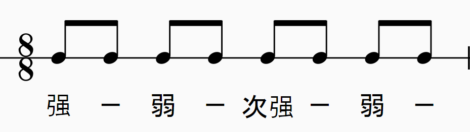


> 假设使用了8/8拍，它可以分解为四个2/8拍，每拍是一个八分音符。每个二拍子的第一拍按强-弱-次强-弱的格局处理，而第二拍都是比第一拍上的“弱”还要弱的弱拍。

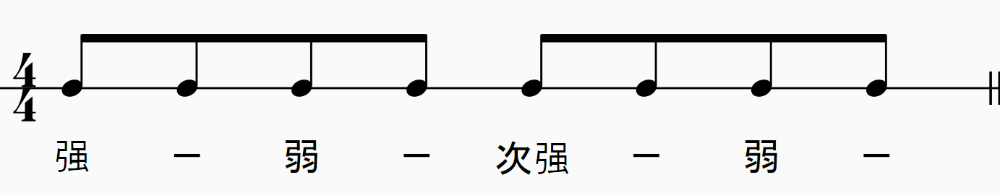

> 可是，如果用4/4拍，也就是每拍一个四分音符的方式记谱，那么拆分成八分音符的话，反拍上的八分音符，也就是偶数的音符，也都是极弱的。

也就是说，这种“嵌套”意义上的8拍子完全可以用四拍子代替。因为，虽然每小节想要用八拍，但是实际上，所有的偶数拍都非常弱，弱到完全可以被理解为次要节拍，或者说一拍里面的小拍。既然是这样，还不如使用四拍子，用反拍来表示这些非常弱的拍。

那么如果8/8拍想要的效果是分成2个4/8拍呢？事实上这种情况直接使用4/8拍就好了。前面已经说了四拍子的节拍强弱足够复杂。因此，两个4拍子之间如果存在强弱关系，并不容易被理解为是节拍的强弱关系，而更像是句法层面的强弱关系。而那是由节拍以外的因素决定的。

## 疑问2：六拍子？

或许有人会思考，为什么六拍子不能拆成3个二拍子，而是必须拆成2个三拍子。这是因为，如果我们想要使用“三个二拍子”这样的拆分方式，就会用3拍子来表示。这里的逻辑跟上面为什么不用八拍子的第一种情况是一致的。

例如，6/8拍是一个六拍子，它由两个3/8拍组合而成。六个八分音符三三一组。

(音频1：六拍子，也就是强-弱-弱-次强-弱-弱的“两个三拍子”)

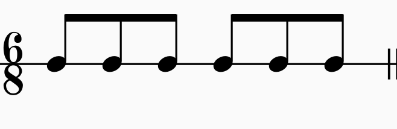


但是如果要表示六个八分音符两两一组，我们就会使用3/4拍，在这里，反拍上的八分音符都自然更弱；反过来，听到这样的节拍，我们不会认为反拍上的八分音符是独立的一拍，因为它的立场很低下。

(音频2：三个二拍子，也就是强-弱-次强-弱-次强-弱)

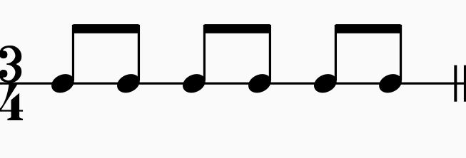

同样地，十二拍子（在没有任何其它的语境下）更多地表示“四拍子，每拍分成三份”的原因也是如果要表示“三拍子，每拍分成四分”可以直接使用单三拍子。当然凡事都有例外，重要的是表达作曲家的意图，这在前面贝多芬Op.111的例子中已经详细说明了。


## 疑问3：四拍子？

或许上面的解答让人产生下一个疑问：那为什么不用二拍子代替四拍子？例如，4/4拍为什么不能用2/2拍来表示？毕竟如果是一小节的四个四分音符，那么不管是2/2拍和4/4拍，其中的强弱关系都是强-弱-次强-弱。

对于这个问题，可以思考，为什么需要二拍子，而不是用一拍子？为什么不用1/1而要用2/2？

我想，如果这样思考，读者或许就能猜到大概的原因。用二拍子而不是一拍子，是“拍子”的意义的问题。

二拍子的每小节有两拍，而一拍子的每小节只有一拍。这有什么问题呢？如果一小节都是两个二分音符，那么不管1/1拍还是2/2拍，不都是强-弱吗？

的确是这样的。但是，如果是4个四分音符呢？情况就不同了。

## 再次思考拍子的意义

“一拍”，从名称和感觉上来说，都是一个时刻上面的一个脉冲。也就是说，在某一个时间点，产生了一个音。这个音的产生很重要，比音的持续或许更重要。

例如，钢琴按下琴键的那一瞬间，琴槌击弦突然产生了一个声音。虽然在此之后，这个音可以保留很久，但是音产生一瞬间的颗粒感是不持续的。任何乐器都存在这一现象，例如拨弦乐器拨的一刻，弓弦乐器改变运弓方向的一刻，管乐器吐音时气流从阻塞到开始流动的一刻，人的声带被气流激励开始振动的一刻，打击乐器敲击的那一刻。声波最开始的形状，或者叫做“音头”（attack），决定音的开始的那一刻，偏微分方程的特解从初始态开始的那一小段时间，是与更长久的、音持续的部分截然不同的。这一刻同样被我们感知到，因此一“拍”就是这一个概念在节奏层面的描述：当音头正好落在正拍上，这个音就被认为是从这一拍开始的，“拍”的概念直观地被这个音头、被这个音代表了。如果音头和音本身存在相互指代的可能性，那么拍的强弱的持续时间就跟这个音的持续时间相关。

一个音可能持续一段时间。但是这个音是从“正拍”开始的，也就是说在那一刻，这个音正好发出。这种情况下，这个音的音头，连带着这一个音在一段时间之内的全部时值，就成为了这一拍的声音印象。说这个的意思是，由于音可长可短，所以一拍的强度所持续的时长也是有变化的。举例来说，以四分音符为一拍，那么：

1. 如果正拍上的音正好是一个四分音符，那么给人的感觉是这一拍是正好由这一个音填充的。也就是，“正拍上的音”正好是四分音符。这一拍是强拍，那么这个音结束以后就变成了弱拍。
2. 如果正拍上的音长于一个四分音符，那么这一拍上面的音给人的感觉就是挤占了下一拍。如果这一拍是强拍而下一拍是弱拍，那么这个正拍上的长音使得原本属于下一拍的部分也变强了。
3. 如果正拍上只有一个十六分音符，之后变成了下一个十六分音符，那么这一拍的正拍上的音就只持续了十六分音符。下一个十六分音符就不在正拍上了，因此就更弱。

在一小节里面有4个4分音符的情况下，2/2拍有两拍，分别落在第一个和第三个四分音符上面。第一个四分音符自然是强音。第三个四分音符固然较弱，但是它落在正拍上，因此也比第二、第四个四分音符更强。也就是形成“强-弱-次强-弱”的格局。

而1/1拍只有一拍，因此只有第一个音符落在正拍上，形成强音，其他三个音都是弱音，形成“强-弱-弱-弱”的格局。

这就是1/1拍和2/2拍的不同。同样的事情可以推广到4/4拍上。如果一小节有八个八分音符，那么2/2拍形成“强-弱-弱-弱-次强-弱-弱-弱”的格局；而4/4拍下，奇数音都比偶数音更强，形成“强-极弱-弱-极弱-次强-极弱-弱-极弱”的格局，这与2/2拍是截然不同的。需要说明，虽然这里有4个层次，但是反拍上的“极弱”的层次不是节拍上的层次，而是在节拍的内部（音的持续部分自然比音头更弱）。

## 如何选择拍子

作曲家使用特定拍子的用意有两方面。首先是字面上的意思：一小节需要有多少拍，或者说，一小节需要含有多少个“单位律动”。例如采用7/8拍子，首要的原因可能是需要在一小节内放入7个八分音符。这很多时候比起音乐的内容，更多是要让记谱的形式方便。例如，某首曲子是三拍子，可是每一拍里面都是三个音，而非两个音。比起使用3/4，并且每一拍使用三连音的形式，作曲家更有可能选择使用9/8，这样就不用使用三连音了。前面提到的巴赫BWV 1001当中的萨拉班德舞曲的变奏的拍号使用9/8，就是基于这样的考虑。


（尽管左边的表现形式更符合乐曲的实际节奏，但是更可能用右边的形式来记谱，因为更简单。）

上一节所举的谐谑曲的例子也是同样的目的。尽管采用3/4记谱，但是实际上每小节是1拍。如果要使用符合实际的形式记谱，那么或许该写成1/2，然后使用四分音符的三连音。

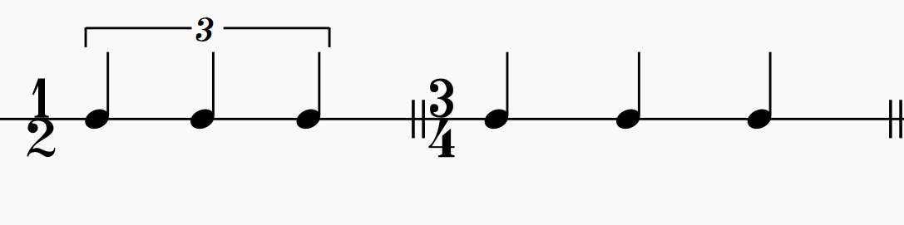

（某些谐谑曲的实际节奏如左，而记谱方式如右。）

贝多芬Op. 111第二乐章各变奏的拍号选取方式看似是反过来（宁愿用三连音也要简化拍号），但是仍然是为了强调每小节的律动的数量。

其次就是内容的考量，这些在上述的各小节当中已有提及，例如同样是6个8分音符，使用3/4和6/8的意义就有明确的不同。这里可以使用一个甚至不能称为“规律”的模型来总结一般情况：
1. 节拍层次的强弱，最多只有三档：强-次强-弱。单拍子只有第一拍强而其余都弱，而复拍子分解为多个单拍子时，除了第一拍是强拍之外，其余的每个单拍子的第一拍都是次强。
2. 同一拍内部的强弱为，只有正拍上的音是强的，其余都是弱的。
3. 采用复拍子的时候，当复拍子的分子含有因数2而不含有3，那么平分成2或4个更简单的拍子；如果不含2而含有3，则平分成3个更简单的拍子。如果是六拍子，那么就先按2分，再按3分。
4. 对于5或者7拍子，有多种可能的方法拆分成2拍子和3拍子，应根据其他信息判断。
5. 如果复拍子被平分为x个复拍子，那么使用这种拍子多半是为了记谱的方便。这种情况下，可能有多种理解方式，例如12拍子可能是3个4拍子或4个3拍子。

总之，常见的拍号鲜有歧义；如果导致歧义，需要从记谱方便的角度，结合音乐内容来分析。这并不构成什么问题。


## Common Time

有的时候会看到这样的拍号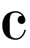。这个其实就是4/4拍，读作“common time”。而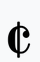其实就是2/2拍，读作“cut time”。

这两个符号并不是字母缩写，而是与早期的记谱法相关。该小节剩余的部分是扩展内容，涉及到早期的音乐与记谱法，可以跳过，有兴趣的读者可以进一步了解。

> 本节有关Menstrual notation相关的说明见Thomas Morley的著作 *A Plain and Easy Introduction to Practical Music*。可以在[imslp](imslp.org)上查找相关资料。imslp是全球最大的开放在线乐谱库，可以查阅各种无版权乐谱和音乐书籍。绝大部分的到20世纪为止的音乐都是无版权状态，因此imslp可以满足相当的需求。

一个清晰的中文讲解视频：[王乐游——学个毛节奏【2】C和₵拍号的历史（番外篇）](https://www.bilibili.com/video/BV1wh4y1d7VA/)

在早期使用的计量记谱法（Mensural notation）当中，倍全音符（Breve，见下图左三，空心方形符头）、全音符（Semibreve，下图左四，菱形符头）、二分音符（Minim，下图左五，菱形符头+符干）的时值关系是不固定的。

> 顺带一提，虽然计量记谱法的音符时值与现代的时值有同样的名字和相似的外观，但是在实际使用上，计量记谱法的倍全音符Breve更加类似于今天的全音符Semibreve。在许多早期作品的现代记谱版本当中，都是采用这种“时值减半”的方式来对应翻译的。

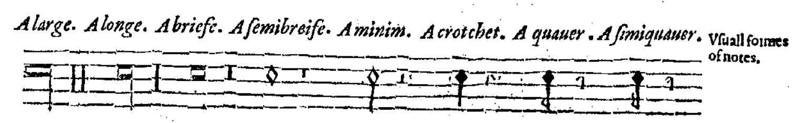
这需要使用计量符（Mensuration sign）来确定。有四种计量符：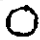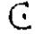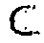

外圈的圆和半圆代表了Breve和Semibreve的时值关系，圆代表3:1，半圆代表2:1；内部的点代表Semibreve和Minim的时值关系，有点代表3:1，无点代表2:1。

当时还没有小节和拍号的概念。如果把Breve看作一个小节，把Semibreve看作一个小节里面有几组，把Minim看作（谱面上的）一拍，那么可以类比今天的拍号。顺带一提，在如今的实践当中，一小节的时值常常接近一个全音符。不必说，今天的全音符和过去的Semibreve的地位是不一样的，过去Breve的地位更接近今天全音符的地位。不管怎样，我们可以用类似的关系，试着把计量符和今天的拍号联系起来。

圆圈+点：1 Breve: 3 Semibreve: 9 Minim。这相当于一小节3组、每组3拍，类似于9/8的拍号。
半圆+点：1 Breve: 2 Semibreve: 6 Minim。这相当于一小节两组、每组3拍，类似于6/8的拍号。

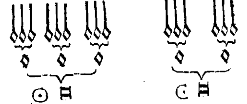

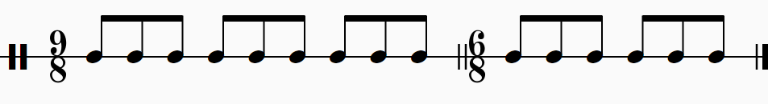

圆圈：1 Breve: 3 Semibreve: 6 Minim。这相当于一小节3组、每组2拍。类似3/4拍。
半圆：1 Breve: 2 Semibreve: 4 Minim。这相当于一小节2组、每组2拍，类似4/4拍。

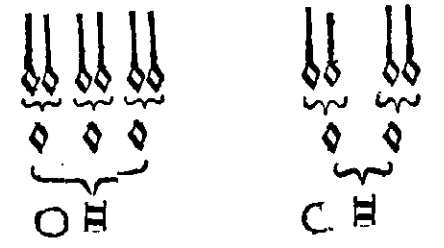
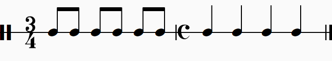

所以到了后面，C就变成指代4/4拍了。

至于₵的由来，是这样的：在上面四种计量符上面加一个斜杠，可以表示“实际时值为记谱的一半”。也就是说，假设原来使用C计量符，并且写了四个Crotchet，那么换成使用₵计量符的话，就应该改成写四个Minim。

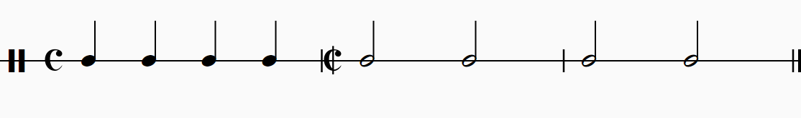
像这样，前后虽然记谱的时值变了，但是实际的演奏时长是不变的。演变到今天的记谱法，就变成了“单位拍是四分音符”->“单位拍是二分音符”，而每小节的谱面时值仍然是一个全音符，所以实际的拍号是2/2。从这个来历也可以理解，今天的2/2一般意味着快节奏，因为这个二分音符的“实际时长”本来应该比谱面短。


## 指挥手势

仍然是了解内容。

如上一节所述，指挥手势是“弹性”的，拍点在最低点处。4拍子的手势如下。回忆三拍子的第二拍往右；而四拍子的第三拍往右，第二拍往左。


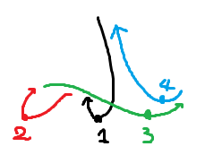

注意四拍子是一个复拍子：第三拍是次强拍。在打复拍子的时候，次强拍很重要。从手势就能看出来，次强拍的动作幅度明显比弱拍大很多。总结起来，这些拍比较重要：

- 第一拍（下拍）：往下，如果不是二拍子就往左。
- 次强拍：幅度较大的改变方向。
- 最后一拍（上拍）：往上。

下面是六拍子的手势。
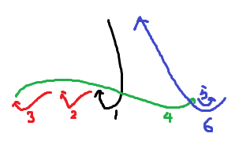


五拍子、七拍子因为有不同的理解方式，所以手势也不固定。五拍子一般是一个次强拍的模式，那么就像上面的四拍子和六拍子那样，在次强拍改变方向往右挥拍。

如果七拍子是分为两个次强拍，如3+3+2，那么就要改变两次方向。
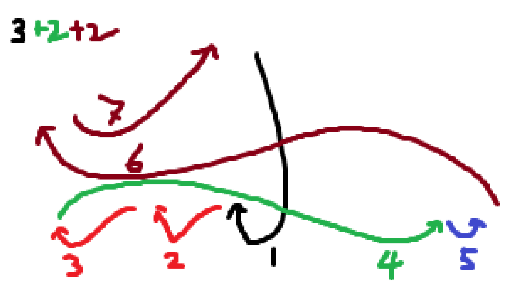
打超多拍的拍子时就比较随意了。只需要注意关键的次强拍和上拍就可以。

例如九拍子可以这么打：

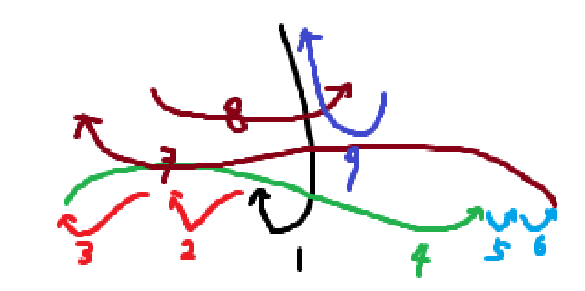

十二拍子可以这么打：
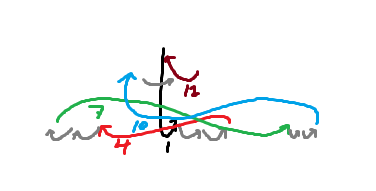
这都是理论上的情形。实际上，指挥很可能只打关键拍（也就是所谓的“打合拍”），如12拍打成4拍子，9拍打成3拍子；或者在非关键拍只是有非常小的指挥棒的上下移动。指挥手势是用来与乐队成员沟通的，因此实用性远大于仪式性，在此意义上，不存在所谓的唯一标准手势。


## 总结

最重要的复拍子是4拍子和6拍子，它们分别是由两个2拍子和两个3拍子构成的。

五拍子、七拍子可以有多种理解（拆分成2和3拍子）的方式。

九拍子、十二拍子之类超多拍的拍子的意义主要是为了记谱，也就是表示一个小节之内的拍数。

可以用“实际的拍数”，或者“组数”来理解复拍子，把复拍子理解为更简单的拍子，这样更符合音乐家的思维。

这次加入了两个变奏的例子，都是在变奏当中变换节奏型，进而变换了拍号，但是只要明确基本的拍数保持不变，就能够理解作曲家为何使用这样的拍号。


## 答案

前面提到的BWV 1004 Sarabande的前五个小节的最上声部的音：

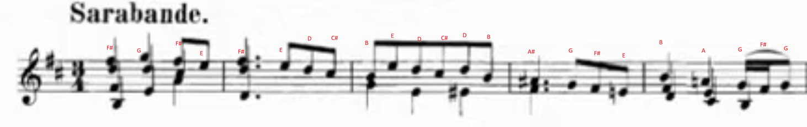

Sarabande - Double前两小节：

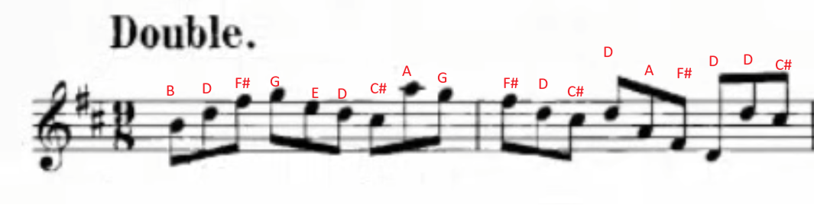