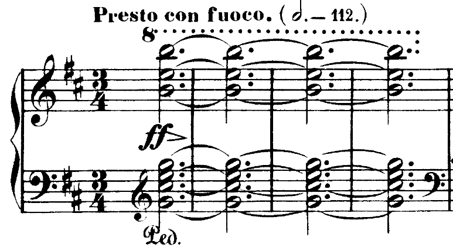
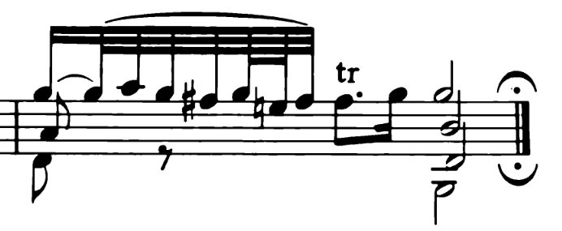

# 速度 Tempo

3.1节当中提到，如果要定量地描述乐曲进行的速度，一般用拍速，单位是拍每分钟（BPM）。在第一章当中也提到过音高不过是高频振动的拍，1 Hz=60 BPM 。也就是说 1200 BPM 以上的速度会被认知为音高。

拍速的记谱法（节拍器记号，metronome mark）是（音符时值=拍速）。例如𝅘𝅥=120表示每分钟演奏120个四分音符。按惯例来说，节拍器记号与拍号的音符时值会保持一致。同样是表示“每分钟演奏120个四分音符”，4/4拍会使用𝅘𝅥=120，而2/2拍通常使用𝅗𝅥=60。当然，也有为了方便采用时值不一致的记号。例如，此前提到过多次的谐谑曲（Scherzo）是“实质上的”一拍子乐曲，但是记谱可能采用3/8 ，此时可能使用的记号就是𝅘𝅥.=80；这代表一分钟演奏80个附点四分音符，或者说一分钟演奏80个小节，或者就是“实质上”的一分钟演奏80拍。举一个实际的例子，肖邦的B小调谐谑曲，Op.20的乐谱开头是：

3/4拍，但是拍速是𝅗𝅥.=112，这也说明了作曲家是以每小节为一单位来思考的。

## 速度记号 Tempo marking

如此前多次提到过，节拍器是在1814年之后才投入实用的。在贝多芬晚期以前的作品，以及之后的许多作品当中，都没有精确的节拍器记号。作曲家用来表示速度的术语就叫做速度记号。即使是节拍器发明以后，大部分的作品也持续使用速度记号，这是为了定性地说明作品的速度与风格。使用节拍器记号的时候，在速度记号后面用括号标注，就像上面肖邦B小调谐谑曲的例子那样。

音乐的速度与情感通常并不是独立的。有一些速度记号同时也表示了作品风格和情感。下面列举一些常见的意大利语速度记号。可以使用其他的不同语言来表示速度，例如贝多芬和舒曼使用过德语，德彪西、拉威尔使用过法语，爵士与流行常使用英语等；但是这些意大利语的基本速度记号是通用的。

Grave 庄严地 24-40
Largo 广板（=慢且宽广）40-60
Lento 缓板 40-44
Adagio 慢板 44-66
Andante 行板（=步行速度）56-108
Moderato 中板 108-120
Allegretto 小快板 112-120
Allegro 快板 120-160
Vivace 活泼地 140-180
Presto 急板 160-200
Prestissimo 极快地 200-

这些词语本身通常是副词。因此，字面上的翻译是“……地”，例如Lento字面上就是“缓慢地”。对应的中文翻译常使用“板”，这是借用了中国传统音乐里对应节拍和速度的概念。作为速度记号成为一种定规以后，这些词语也相应地名词化了，翻译成名词短语的“XX板”也说得通。

下面是对速度记号的一些说明。
1. 速度记号对应的BPM极度宽泛和模糊，实际演奏速度取决于作曲家、作品风格及演奏处理。对不同的演奏者，同一首曲子可能2分钟内演奏完，也可能需要4分钟的演奏时间。即使是附加了节拍器记号，在绝大多数情况下也完全没有必要严格遵守，除非根据作者或作品性质需要精确控制速度，例如John Cage的名曲《4'33''》的演奏时长**通常**需要正好4分33秒时间。
2. 有些记号可以用最高级和小称词来修饰。例如Largo-Larghissimo（极其宽广地）-Larghetto（小广板）。小称词后缀“-etto”，“-ino”等常翻译为前缀“小”，表示程度更浅：对于慢速来说，“小”代表没那么慢；对于快速来说，“小”代表没那么快；对于相应的情感也是如此。最高级后缀-issimo正好相反。
3. Grave，Largo，Vivace等记号都带有感情特征。例如，Largo和Adagio都表示慢，但是Largo指示音乐带有”宽广“的情感。尽管Andante通常单纯地指示速度，但它也可以解释为“需要演奏得像步行一样”。例如Brahms的间奏曲，Op. 116 No.6([曲谱同步](https://www.youtube.com/watch?v=BJXwlHTzKsE&t=1156s))的速度记号为Andantino（小行板）。这首曲子虽然有多个声部，但是每一拍，每个声部都整齐地落下一个四分音符。这就像是每一拍迈出一步一样，给人一种漫步的感觉。这就是速度记号配合音乐内容表达风格情感的典范。（顺带一提，谱中Andantino后的表情记号teneramente表示轻柔地）
4. 上面这些记号所表示的速度大致是从慢到快的关系，也就是说在同一个语境内，靠上的速度记号比靠下的速度记号更慢。但是，需要注意两点：
	1. 速度记号所代表的速度与作品时代的关系密切。例如，如今Largo比Adagio略慢，但是巴洛克时期的Largo快于Adagio。Allegretto曾经表示比Andante略快的速度，而如今则表示比Allegro略慢的速度。
	2. 最高级和小称词修饰后的记号，最好理解为跟原来的记号相比较。在19世纪后的语境当中，小称词一般表示“比原来的记号略微更浅”，如Andantino比Andante略快从而慢于而Moderato，而Adagietto比Andante慢；但是这并不是绝对的。因此加上修饰词之后最好不要相互比较。
5. 这里的BPM一般指的是“实际”的拍。例如，Scherzo的Presto当然指的是一小节为一拍的拍速。如果弄错这一点，而机械地将拍号所定义的“名义拍”套入对应的BPM，则可能会闹出笑话。要正确确定拍速并不容易，甚至指挥都可能犯错。柏辽兹在《指挥艺术理论》(Theory of the Art of Conducting) 中举例说：某个剧院演出Gluck的歌剧《在陶里斯的伊菲格涅亚》（Iphigenie en Tauride）时，将4/4拍的Allegro演成2/2的，也就是快了一倍；而Largo这类慢速的记号则让人更难摸清作曲家的意图。

## 其他的速度记号

通用的音乐术语大量地由意大利语、法语、德语、拉丁语组成，稍有不慎就会变成语言学习。比起列举各种不同的音乐术语，这里的主要目的是介绍指示速度的一般方法。

## 风格特征

可以通过指示作品风格来表示速度。例如圆舞曲速度：Tempo di valse，表示大约𝅘𝅥=120或𝅘𝅥.=60；进行曲速度：Tempo di marcia，大约𝅘𝅥=80-120。

## 速度变化

上面的这些速度记号通常标注在音乐段落的开始部分，指示整段的演奏速度。另一些速度记号在段落中间使用，表达速度的变化。

Accelerando，缩写为accel. ，表示渐快。
Ritardando/ritenuto，缩写为rit.；或者rallentando，缩写为rall.，表示渐慢。

渐快和渐慢的指示并没有说明速度改变的具体方式。实际演奏中一般尽量避免匀速渐快/匀速渐慢，而是更符合听众感知、贴合情感表达，例如在渐慢的一开始速度变化明显但轻微，而最后结束时程度夸张。

ad libitum = ad lib.，自由速度。

本章开始时提到西方音乐通用的演奏传统，即自由速度（Rubato），那是指在乐句的节奏框架之内，进行时间的借与还；乐句整体的框架是受控的。Rubato根据演奏者的品味几乎可以随处使用。而在乐谱上标注ad libitum时，演奏方式更为自由，演奏者可以根据自己的喜好极大地改变实际演奏时值。这通常出现在独奏/华彩乐段等节奏相对不重要，而需要充分展现繁复的技巧/极大的表现力等的时候。

A tempo，表示回到原速。这也时常放在段落开始部分。

𝄐 （读作fermata，字面意思是停止/停留），延音，可以放在音符或休止符上，表示这个音要演奏得更长。具体多长并不做规定，不过一般演奏成原来的至少两倍。

> 顺带一提，延长记号也可以放在小节线上，表示乐段结束；毕竟fermata字面上是stop的意思。下图是巴赫BWV 1001 Fuga的最后一小节：
> 
> tr=trill 颤音，F#和其上方的音，即G，快速交替演奏。

## 强弱/力度

在节奏这个大话题下面，强弱也有一席之地。节奏本身就是以强弱拍的不同形状定义的。除此之外，通过改变重音而改变节奏型的情况，以及反过来由于改变了节奏或速度而影响到音的强弱的情况，都属于节奏这个话题的范畴。

虽然前面提到，但是不管反复强调几次都不为过：节拍当中的强弱拍（strong/weak beat），并不一定有演奏的力度（dynamics）上面的区别。“强弱”的概念首先是逻辑上的概念，在实际表现中，强拍，或者重音，可能通过略微拖长的时间、更硬的音色、更强的力度等多种方法来实现，也有可能根本不表现出来。力度，又叫动态，就是响度的表征。名词辨析的部分是，在中文当中，“强弱”一词有时也会被用来表示力度，这里我们也不作使用上的区分。

除了重音和强拍以外，力度的另一种可能的变化是与句法和结构相关的，例如，在许多作品当中，如果一个句子重复两遍，那么第二遍会演奏得更弱。

不管是句法当中的力度，还是节奏当中的强弱、重音，它们都是与音乐内容紧密联系为一个整体的。早期的音乐当中，不太经常标注强弱，许多时候要根据句法、节奏、旋律的自然特征来推断实际的强弱：例如上面所说的第二遍演奏得更弱，或者一个旋律的最高点最强，等等。 

当然，作曲家标注强弱的状况也是很正常的。以下的强弱记号最为常见：

***f***: forte，强
***p***: piano，弱
***ff***: fortissimo，极强
***pp***: pianissimo，极弱
（***fff***: fortississimo, ***ppp***: pianississimo）也可以读作“triple ...”
***mf***: mezzo forte，中强
***mp***: mezzo piano，中弱

这些记号并不代表力度的绝对值，甚至在同一首曲子、同一个乐章里的这些记号的实际演奏力度都不一样。必须当作乐谱的有机部分，根据上下文来确定。

> midi当中通过velocity的概念来表示强弱。velocity是一个0到127之间的整数；绝大多数情况下，velocity都与绝对的响度直接相关。在一些音乐制作软件当中，上述的强弱记号也被赋予了特定的velocity值。但是必须要注意强弱记号在**传统的意义下**并不表示绝对力度（现代作品除外）。

其他的常用记号：
*più*：更加，例如*più* ***p*** = 更轻
***sf***: sforzando，突强，标在一个音上面。不等于实际的力度，这更类似于演奏法的改变，而要根据当前段落的整体强弱来决定力度：p的段落的sf可能仍然是弱的，只是要突然地演奏；当然根据上下文也可能是强的。
***rf***: rinforzando，加强，指的是某一个片段的突然增强。
***fp***: fortepiano，突强然后突弱，这里与sf不同的是有了具体的演奏力度指示。

*crescendo* / *cresc.* 渐强
*dimimuendo / dim.* 或 *decresc.* 渐弱。类似于渐快和渐慢，渐强和渐弱的具体实现是需要演奏家斟酌的。横向拉长的"<"和">"（发卡hairpin）也表示渐强和渐弱，不过许多人倾向于用其表示规模更小的力度变化，比如几个音、几个小节以内；cresc. 和dim. 则更多用来表示句法规模的力度变化。

巴洛克时期到古典主义早期的渐强渐弱（阶梯式）；早期力度记号f和p较少使用，使用时表示的意图很强烈；f和p的极端用法（四个及以上，例如柴可夫斯基《第六交响曲》的pppppp），这种情况下基本上起到的是情感和演奏法的提示作用，而与实际力度无关了。

“>”标在音符上：重音记号，就像其形状那样，音头响亮而迅速减弱。

## 表情记号

有许许多多的用文字表示的表情记号，这里不作一一列举，遇到的时候查询即可。