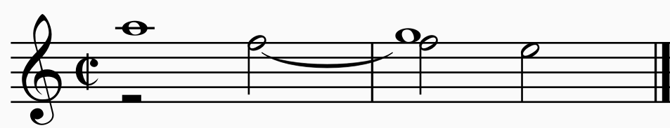
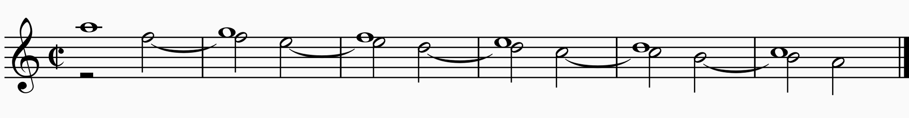
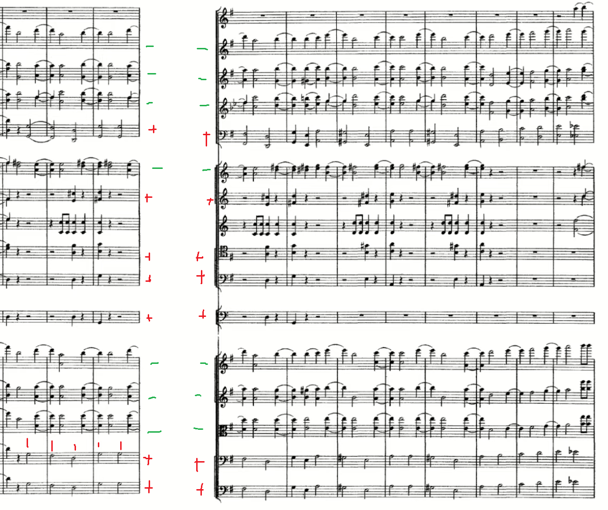
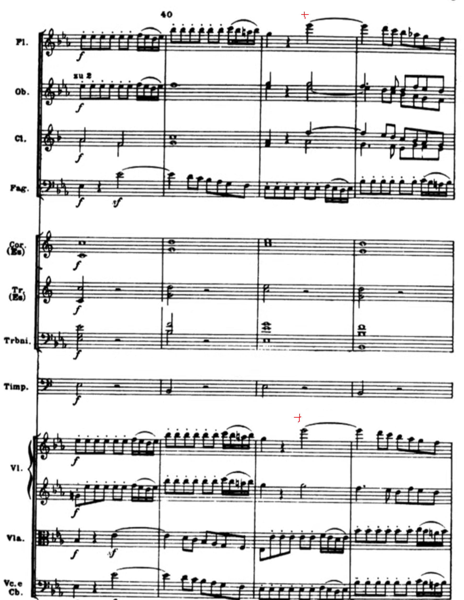
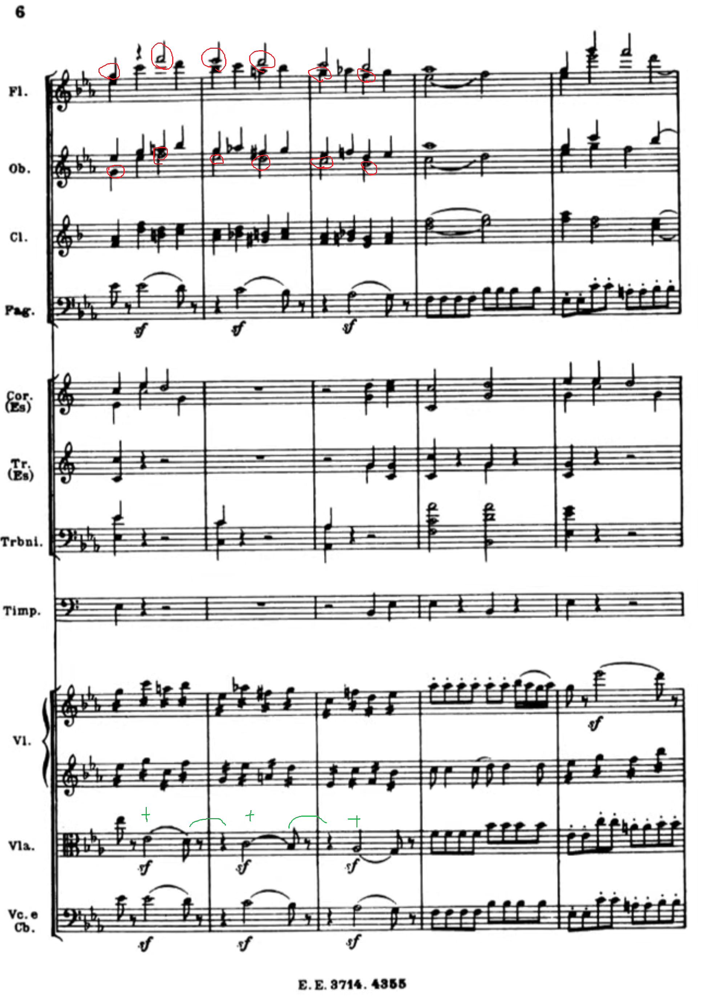
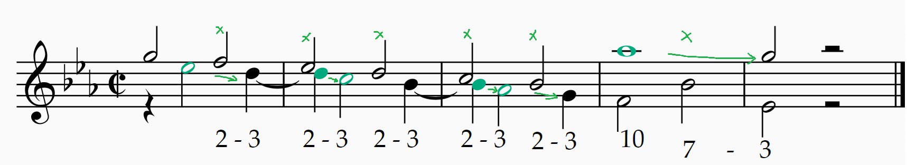
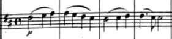
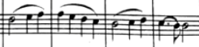
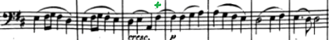

西方音乐的多声部特征不仅体现在音高上，也同时体现在节奏上。当每个声部演奏不同的节奏型，整体的节奏将变得更加复杂。多声部之间的进行关系是对位的内容。

从另一个角度出发，音乐是建立期望和打破期望的艺术。不同的节奏本质上是不同的重音规律。当引入新的节奏时，不管是通过新的声部在老的节奏上同时叠加新的节奏，还是通过改变老的节奏，目的都是打破听众对老节奏的期望。可以说，这一节要讨论的就是这种打破固有重音的艺术。

节奏的学问是高深的。这一节只是简单地讲述两种典型的节奏作为了解这种艺术的第一步。

## 延留音和切分节奏，以及节奏的错位

先看第一个例子。由两支双簧管作演奏示范。

首先读谱：
- 高音谱号，没有升降调号，拍号为alla breve（2/2）。
- 有两个声部。
- 上声部的第一小节是一个全音符的A，第二小节向下移动一个全音，到全音符的G。
- 下声部的第一拍是休止符。从第二拍开始是二分音符F，有一个延音线，连接到第二小节的第一拍。第二拍向下移动半音到二分音符E。

2/2拍的强弱特征是：强-弱。从音程的角度，第一小节的弱拍上出现了F和A的三度，这是个和谐音程。而第二小节，下声部不动，随着上声部移动到E，音程变为不和谐的二度，这种紧张感落在强拍上。最后，在弱拍上，F下行到E，形成E-G的三度，紧张感得到了解决。

> 这样从弱拍的协和音开始、延续到强拍形成不协和音的延音，就叫做延留音（suspension）。第一章提到过，人类对于不协和音是从完全禁止到逐步使用的。延留音就是人类引入不协和音的最早的形式之一，从弱拍协和音开始“准备”，延留到不协和音，最后再向下移动“解决”到协和音。这样的形式很有序地控制了张力的产生和释放。在对位的章节当中将更进一步地学习这样的对位关系。

而从节奏的角度，音头（音开始时的脉冲，见3.14节）的位置形成了一种复杂的感觉：下声部跟上声部正好错开了一拍。由于谱例当中（除了E以外）每个音都是全音符，持续两拍，所以下声部和上声部正好错开“半步”。而下声部的F音跨越了小节线，也就是从弱拍跨越到强拍。

> 这样从弱拍开始延续到强拍的音就叫做切分音（syncopation）。究竟是从哪个弱拍开始，到哪个强拍结束，没有规定；不过最常见的形式是弱拍部分要跟强拍部分（也就是延音前后的部分）一样长。就像例子中都是二分音符。
> 当然，从一拍的后半拍开始，到下一拍的正拍结束，也是切分音，人们也称其为“反拍”。

之所以要说音程关系的事情，举出延留音的例子，是因为延留音正是切分节奏在音乐当中的一个主要来源。

切分节奏可以持续下去形成很长的片段。例如使用延留音：

切分节奏在想象不到的地方（弱拍）进入，反而漏过强拍，给人以独特的听感。它使得切分音变成了强拍，打破了原有的强弱关系。

> 单声部当中，出现切分节奏时也是这样的感觉。可以理解为，人们脑海中已经有一个“想象中”的节拍器，而切分节奏跟这个想象出来的声部错开了。

音乐文献中有数不清的例子使用了切分节奏。流行音乐当中定式的“强调二、四拍”（4/4拍的情况下）就是一种切分。

柴可夫斯基《第一交响曲》Op.13，第四乐章：
从视频34:20开始到34:29左右，低音声部和定音鼓演奏正拍（+）、高音弦乐和木管演奏反拍（-）。注意听切分节奏带来的张力。
> 这似乎是第一次放总谱的谱例。管弦乐团的总谱中，声部一般来说分为四个大组（每个组由方括号括起来），从上至下依次是：木管、铜管、打击乐、弦乐。总谱的一开始会标注声部。这里的声部从上至下分别是：
> 1. 木管：短笛、长笛、双簧管、单簧管（A调）、大管
> 2. 铜管：圆号I/II、圆号III/IV、小号（D调）、长号、（低音长号和大号）
> 3. 打击乐：定音鼓
> 4. 弦乐：第一小提琴、第二小提琴、中提琴、大提琴、贝斯
> 读总谱比较麻烦，尤其是阅读移调乐器（例如单簧管、圆号等）的记谱，这在配器法的章节当中介绍。此处只需单纯地读节奏。在阅读时可以从较易阅读的非移调乐器（如弦乐、长笛、双簧管、大管、长号）入手。

[莫扎特《魔笛》K.620，序曲](https://youtu.be/c2TGbfzTx2A)：切分节奏无处不在，例如在引子当中，第二小提琴一直演奏切分节奏。顺带一提，第二小提琴的切分伴奏是一种经典织体。

2:02处，第41小节，旋律最高点Eb（+）是一个切分音。这是非常优雅的旋律形态：本来旋律最高点落在弱拍（alla breve的第二拍），但是因为使用了切分音，它变成了旋律当中最强的音。
- 当然，这个音也是个延留音：第一小提琴的Eb和第二小提琴弱拍上的G形成六度；到了42小节，G下行到F，与延留的Eb形成了七度，于是Eb接下来下行到D解决。

> 上方的40标注的是第40小节。Eb大调，alla breve（2/2）。
> 不同声部的表记：
> Fl. (Flute, 长笛) Ob. (Oboe, 双簧管) Cl. (Clarinet, 单簧管) Fag. (Fagot, Bassoon, 大管)
> Cor. (Corno, horn, 圆号)  Tr. (Trumpet, 小号) Trbn (trombone, 长号) 
> Timp. (Timpani, 定音鼓)
> Vl. (violin, 小提琴)  Vla. (viola, 中提琴) Vc. (Violoncello, 大提琴) Cb. (Contrabass, 低音提琴)
> （以上标在谱中时均为复数，如corni, tromboni, contrabassi，因为不止一把乐器）
> 圆号和长号后面的(Es)指两者是移调乐器，Es是德式音名的E$\flat$ .
> Vc. e. Cb. 低音提琴和大提琴采用同一行谱。低音提琴与大提琴同为低音声部，演奏同样的低音线条是常见的事情（柴可夫斯基上例也是如此）。尤其是在早期（到贝多芬为止）的音乐当中，两者常常写在同一行上。（不管是否与大提琴合谱，低音提琴的实际演奏音高要比谱面更低一个八度。）

第43小节（[2:04](https://youtu.be/c2TGbfzTx2A?t=124)），经典的延留音切分。这里用绿色表示延留音，红色表示正拍上的音（并没有标注所有的声部）。

可以简化为下面这样（只保留两个声部的对位），其中符头绿色的音表示延留音，(x)表示张力，箭头表示张力的解决方向。下面的数字提示了两声部之间的音程关系，2-3这样的表示张力的解决：

> 前面也说了，延留音是对位当中引入不协和音的一个基础手法。因此在复调成分高的作品当中，会出现相当多的延留音。莫扎特晚期歌剧《魔笛》采用大量的对位，在这首序曲当中就体现得淋漓尽致。例如，引子后面紧接着就是以赋格（不同声部在主调和属调上演奏同一个主题）的方式引入的主题（[1:25](https://youtu.be/c2TGbfzTx2A?t=85)）。首先是第二小提琴在Eb大调上演奏主题。然后在20小节第一小提琴进入，在属调Bb大调上演奏对题（主题在属调上的版本叫做对题）。27小节中提琴、大提琴、大管进入，在Eb大调上演奏主题。33小节贝斯进入，和大管在Bb大调演奏对题。接着乐队全体进入40小节的真正的呈式部。

像魔笛序曲那样使用切分音来强调旋律某个音的手法很常见。[贝多芬《第九交响曲》Op. 125 第四乐章（《欢乐颂》）](https://youtu.be/ixpfgm_xxSE?t=2713)当中也是如此。链接对应的位置是欢乐颂旋律第一次出现，由大提琴和低音提琴单独奏出。这个旋律有四句话，第一、第二句话都以一个二分音符结尾，非常规整：

而第三到第四句话之间，却好像有“抢了一下”的感觉。导致那种感觉原因是，第四句除了第一个音以外都跟第二句相同，唯独那第一个音F#就是切分音，它本来“应该”在下一小节第一拍出现，但是却抢了一拍从前一个小节的后拍就进了。在谱面上它也被标注为了整个旋律当中最强的音（前面有cresc.，后面是p）。这个切分音可以说就是为欢乐颂这个本来简单质朴的旋律带来不平凡张力的点睛之笔。

切分是一种节奏的错位。更加广义地来说，切分节奏就是重音从弱拍开始、占据强拍，以此来打破原有的强弱规律的节奏型——打破固有的强弱规律（也就是那种节拍器规整的律动）是其特征，也是其目的；当节奏的错位有这样的特征时，广义上就能理解为切分。

[巴拉基列夫M. Balakirev《第二钢琴奏鸣曲》Op. 102，第三乐章结尾处](https://youtu.be/R-ATLXEcaV0?t=948)有下图中第四小节起这样打破小节线的音组。所谓的音组，也就是说组里的第一个音为重音；在这里符杠的配置已经说明了音的分组。这里的节奏错位也可以看作一种切分节奏。

注：1. 重音并不代表要演奏得更重，而更像一种逻辑上的正拍的感觉。2. 也有很多情况符杠不会反映音的实际分组；最后还是要以音响效果为准。
![[Pasted image 20260305171051.png]]
> attacca il finale = go immediately to finale. finale指末乐章/终曲，这里也就是第四乐章。

同曲第四乐章从一开始，左手的伴奏型就是经典的切分节奏：
![[Pasted image 20260305171504.png]]

## 复合节奏（Polyrhythm）

读者是否还记得复拍子一节中提到的3/4和6/8拍在含义上的不同？虽然每小节的时值都是3/4个全音符，但是3/4拍将一小节平分为3份，而6/8拍将一小节平分为2份。

那么如果两个声部分别按照这两种方式来划分小节，产生的效果如下：

![[Pasted image 20260302213754.png]]
> 这种形式的打击乐谱，谱号是两条竖线，下起第一间的位置表示大鼓bass drum，第三间表示小军鼓snare drum。

这种节奏型叫做三对二（hemiola，3:2），是最常见的一种复合节奏。虽然只有3和2两种划分，但是却造成了6等分的复杂效果。

下面这样的八分音符对三连音也是三对二，比例是一样的，只是基础时值不同罢了，听感也一样：

![[Pasted image 20260302214702.png]]

可以试试用两只手来敲击这个节奏，或者手脚并用来敲击这个节奏。一个诀窍是使用口诀“爸爸的爸”（也就是那首亲戚童谣的前四个字）。

或许稍难一点的是下面这种变体。两个声部都演奏最小公倍数的八分音符，但是重音分别是每2个音和每3个音：

![[Pasted image 20260302214930.png]]

因为把一个音二等分（四分音符->八分音符）和三等分（四分音符->八分音符三连音）是非常惯用的织体，所以三对二在较复杂的织体当中也常常出现。

从作曲的角度来说，人的注意力是有限的，因此如果没有任何铺垫地出现复杂的对位节奏，会导致注意力涣散。在实践当中，可以认为复合节奏中有一个老的节奏和一个新的节奏，其中老的节奏是已经在前面出现、因此人脑惯性期望听到的节奏，而新的节奏则是新的材料，它是用来打破期望、创造出新声音的。例如上例如果在实际的音乐当中，则“老的节奏”就应当是拍号所示的3/4的节奏，而“新的节奏”则是6/8的节奏。对位节奏实际上也是打破了原来的重音，所以或许从广义上也能称其为一种切分。当然，如果并不是出现新声部，而是旧的节奏型突然变成了新的节奏型，达到的效果是一样的，或许也能称之为复合节奏。

[勃拉姆斯 Op.118 No. 2](https://youtu.be/20Gb0JcviRA?t=117)：中段，左手是三连音，右手是八分音符的旋律，形成三对二。勃拉姆斯的音乐中，复节奏是必不可少的特色。![[Pasted image 20260302215811.png]]
> ![[Pasted image 20260302220234.png]]带有冒号的粗细双竖线是反复记号。这一对记号中间的部分要演奏两遍。
> 
> 作为音乐鉴赏的一部分，此例体现了勃拉姆斯高超的对位技巧。观察谱面可以发现左手有两个声部，而上声部，也就是每个三连音的最高音，实际上与右手形成了卡农(Canon)。卡农即第二个声部模仿第一个声部形成的对位，这里左手跟在右手后面重复简化了的旋律：C-F-E-D-C-B。实际演奏当中，在反复第二遍时，演奏家通常会选择突出这个中声部旋律，非常值得品鉴。
> 
> 此外，中声部音符上方的点是顿音（staccato），即在音的后面停顿，而非连到下一个音；这里是因为这个音是三连音的一部分，作曲家或许不希望演奏者保持这个音。连线看起来跟顿音矛盾，但是这里的连线实际上更多表示句法。虽然不在谱例范围内，但是48小节开头的竖直波浪线是琶音记号（arpeggio），指像竖琴(arpa)那样从低到高逐音地快速演奏整个和弦，而不是同时奏响和弦的所有音。

只要把三对二的“二”对半分，就能得到三对四（“我，买了，一、只鸡”）：

![[Pasted image 20260302222200.png]]

前面提到过，西方传统音乐基本上是以2或3来划分时值的。因此更复杂的五连音、七连音以上，在记谱和演奏的惯例当中并不需要“精确”，即只是表示“把单位时值划分成对应份数”，不一定需要“精准”。在这样的前提下，诸如11:17之类的复节奏或许存在，但是没有实际意义，在实际演奏中，不过是一个声部需要在例如一个小节内演奏完11个音，而另一个声部演奏17个音罢了；中间的精确对应关系并不重要，最重要的是开头和结尾。

受到非洲音乐和南亚音乐等“非西方音乐”影响的现代音乐，包括爵士和流行音乐当中，更加复杂的复节奏也非常常见，在这些音乐当中就要求精准性，掌握这些节奏甚至是优秀鼓手的基本功。

一个例子是7:5：

![[Pasted image 20260302225137.png]]

这里比如果写作5/4拍，则需要使用一个新的记号：（7:5）

![[Pasted image 20260302225957.png]]
这种比值记录法，x:y 精确地描述了范围内每个音的时值：x个这样的音加起来的实际时值是y。事实上，三连音的精确记法是3:2，二连音是2:3，五连音是5:4，只是我们把后面的部分省掉了而已。

总之，如果要实际演奏这种节奏，有两种办法：其一是整体划分，其二是单位组合。
整体划分：先分开练习，左手敲七连音，右手敲五连音。然后试着两手独立地合在一起。这种方法只需要考虑把整体划分成不同的等分就行，不过对独立性要求比较高。
单位组合：先按照最小公倍数来划分，然后标上不同的重音。例如上面提到三对二的

![[Pasted image 20260302214930.png]]

那么第一步是左右手都敲六连音；第二步是左右手加上不同的重音；第三步是去掉非重音。
说起来容易做起来难，如果能够结合音频体会复节奏的听感，然后按照上面的方法练习，至少能够培养出复节奏的“感觉”。

最后是一个简单的记谱法思考题：如果我有一个7:5的节奏，按照5/4拍、5连音的基础时值是四分音符来记谱，现在我想把“7”的每个音再分成4份，我应该怎么记谱呢？

## 更多的例子

[贝多芬《第四弦乐三重奏》 Op.9 No.3，第三乐章](https://youtu.be/s_ebJav--1g?t=7778)的谐谑曲[结尾处](https://youtu.be/s_ebJav--1g?t=7814)出现了这个非常标志性的切分+三对二的组合。这里的拍号是6/8=3+3，但是显然每一个Ab-G（动机）都是两个八分音符，形成2+2+2。在此之上又用切分把每个动机与正拍错开，相当于每一个动机都是重音（贝多芬也通过每个动机下面的sf来强调了这一点）。
![[Pasted image 20260305165520.png]]
> 弦乐三重奏的配置是小提琴、中提琴、大提琴各一。“谐谑曲”这个曲式的名字已经在教程当中出现多次了。谐谑曲的结构是A-B-A的三段式，其中B段叫做“三声中部”（trio），谐谑曲这个名字本来是单指A段。
> 贝多芬的弦乐三重奏都是早期作品，受到海顿和莫扎特的诸多影响；不过像本例这样的极具个人特色的部分也已经展现出来。

[勃拉姆斯《第二交响曲》 Op. 73 第四乐章](https://youtu.be/2rl-XPb77HE?t=1894)
第110、111、112、113小节（31:40），木管和低音在正拍，中高音弦乐在反拍：

![[Pasted image 20260302223701.png]]
> Klar.=Clarinet, Hr. =Horn., Br.=Bratsche=Viola. K.B.=Contrabass.

[32:03](https://youtu.be/2rl-XPb77HE?t=1923) 130小节开始到134小节为止是一个五对四：木管的旋律是上行六个+下行四个八分音符（弦乐的渐强渐弱记号也体现最高音是最强音），破坏了原有的四个八分音符一组的节奏。135到138（标号F）同一个动机来到了弦乐，但是只剩下上行六个八分音符，因此变成了三对二。标号F突然停了一个四分音符（alla breve的半拍），然后整个乐队好像往后移了半拍一样，全体开始切分，直到142小节（不在图中）回归正常，感觉像赶了半拍。这种把玩节奏的品味非常值得反复分析。
![[Pasted image 20260305171947.png]]
![[Pasted image 20260302223853.png]]

[Bach Chromatic Fantasia and Fugue in d minor, BWV 903](https://youtu.be/lHTMq-5B9Co?t=28)第12小节，节奏型突然变化，从原本贯穿始终的六个音一组重音变成三个音一组。这种固有节奏的突然变化当然也可以认为是一种复节奏（或许可以叫做二对一？），因为虽然并没有实际演奏六个音一组的节奏型，但是人脑已经对此有所期待，而三个音一组的节奏型与其发生了冲突。
![[Pasted image 20260305181144.png]]

[第17小节](https://youtu.be/lHTMq-5B9Co?t=54)，变成了错位的三音组。这种通过旋律操作节奏型的技巧相当常见。
![[Pasted image 20260305181551.png]]

下面这个选自[李斯特《西班牙幻想曲》S. 253](https://youtu.be/79XmMnCS_S4?t=94)的例子，可以说明在传统音乐的演奏惯例上，所谓的“很多音对很多音”的复杂情况并不需要精确处理。左手是3/4的正常节奏，而右手是不知道多少连音，如果要求谱例第二小节的左手十六分音符和右手十六分音符的时值的精确比例，恐怕会让人望而却步。实际演奏中则只需要对齐第一个八分音符/休止符，保证后面的一串音在一小节内完成即可：这里的逻辑是，右手不过是“一串音”，是装饰段落，正确的演奏方式就是在规定框架（一小节）内流畅地完成。

![[Pasted image 20260305181907.png]]

[贝多芬《第九小提琴奏鸣曲》，第三乐章](https://youtu.be/Wz15rrpzsgw?t=1767)的第二主题后面部分，节奏突然从6/8变成2/4，随后在两个拍号之间切换。这就是把固有的“三”的律动（一拍有三个八分音符）变成了新的“二”（一拍有两个八分音符）的律动，因此即使没有任何速度记号，但是根据作曲家的意图，演奏的时候，6/8小节的时值跟2/4小节的时值理应是一样长的。如果要明确写成速度记号应该是(𝅘𝅥.=𝅗𝅥)或者L'istesso tempo。

![[Pasted image 20260305184041.png]]

> Brahms, String Quartet No. 1: Hemiola in Subj. 1
> 

## 练习

将本节当中提到的所有谱例从头到尾听一遍或多遍（多乐章作品只用听那一乐章）。尽力尝试去找切分节奏和复节奏。最好是先不看谱、只用耳朵去听；然后看谱听，检查是否有错漏；最后还可以不看谱再听一次。注意不是所有的反拍都是切分音；那些反拍上出现的短音，有的只是单纯的反拍，而有的是本来延留到下一个强拍，只是后半部分变成休止符而已。