这一节将概述和声学的基础——功能和声。这里的所有内容都将在后面章节当中更详细地介绍，这一节的主要目的是为了让读者大概地了解功能和声和调性都有哪些基本内容。如果读者有觉得难以理解的部分，可以先跳过。

和弦一般由至少三个不同音组成。和弦是表现调性的最主要元素。“功能”（function）或者说“和声功能”就是指某个和弦在调式当中起到的作用。

## 三和弦

以一个音为基础，向上叠加三度音和五度音，就得到一个三和弦（triad）。

![[Pasted image 20260306220606.png]]

三和弦的三个音分别叫做“根音”、“三音”和“五音”。不管和弦由几个音组成，也不管具体的排列情况、八度，只要含有根音、三音、五音，而且根音在和弦的最低音，那么在和声上就视作同一个和弦。下图当中都是以C为根音构成的同一个三和弦，三音为E，五音为G。

![[Pasted image 20260306221305.png]]

### 大三和弦/泛音列/大调

C-E-G这个三和弦，由于C-E是大三度，所以叫做“C大三和弦”。C大三和弦的组成音，正好是C的泛音列上的前三个音：C, G, E。因此大三和弦可以说是泛音列的一种抽象。三和弦的根音在最低音，与不在最低音的情况并不等价，很大程度上与泛音列相关。显然，根音在最低音的时候是最和谐的，而如果根音不在最低音，则不那么和谐：例如当E在低音时，C和G并不在E的最低三个泛音当中。

> 话虽如此，作为简化，本节当中暂时不区分和弦最低音的不同情况，只是在短句的初始和最后一定使用根音位置的和弦。

C大调与C大三和弦都是C的泛音列的抽象。E作为大三级音，既是C大调的特征音，又是C大三和弦的特征音：如果E变成Eb，那就变成了C小三和弦和C小调。所以说C大三和弦就是C大调的特征和弦。

### 顺阶和弦

一个音阶当中有七个音，以其中的某个音为基础，构造三和弦。如果三和弦的每个组成音都在调内，那么就叫做顺阶和弦。C大调有七个顺阶和弦：

![[Pasted image 20260306223947.png]]

上图中标注了每个和弦的大小（M/m）以及级数（罗马数字）。除了VII级以外，其它和弦都是大或小三和弦，其中恰好I、IV、V级，也就是主、下属、属和弦是大三和弦（major triad），其它都是小三和弦（minor triad）。VII级的根音与五音是减五度，所以叫做减三和弦（diminished triad）。这里“减”是修饰“三和弦”这个整体，并不是说存在减三度的音程。小调由于人工六七音的关系有更多可能的顺阶和弦，不在此讨论。大三和弦的表记中M可以省略。

> 本教程同时采用基于和弦根音的和弦表记（例如C,Dm）和基于级数的功能表记（如I）。前者独立于调式，能准确表达和弦的组成音；后者则表达在特定调式内的级数和功能。

## 主/属和弦

C大调属和弦的根音G由于向下五度的引力有移动到主音C的倾向。属和弦的三音是导音B，有移动到主音C的倾向。所以属和弦有强烈的移动到主和弦的倾向。

![[Pasted image 20260306225310.png]]

主和弦是一个调的特征和弦，也是中心和弦，主和弦能够直接地表示调性（这就是它的“主功能”）。属和弦在调内则是给人不稳定的张力，强烈地想要回到（解决到）主和弦（这就是它的“属功能”）。
小调的属和弦也是大三和弦，因为为了产生导音到主音的倾向性，VII级要升半个音。G大三和弦同时是C小调与C大调的属和弦。

![[Pasted image 20260606154453.png]]

> C小调的VII级是B♭，但是为了构造倾向主音的导音，VII级要升半音变成B$\natural$。因此V级属和弦仍然是G大三和弦。

## 调性的建立

孤立地看和弦构成，大调的主和弦和属和弦都是大三和弦，没什么不同；主功能和属功能是靠彼此来改变张力、建立调性：正因出现了主和弦，所以偏离主和弦的属和弦才会产生调性中的张力；正因有属和弦，回归到主和弦的时候才能感受到张力的释放。调性正是通过张力的产生和释放来建立的。从属到主的和声进行的这个过程，正是建立调性的过程。

## 终止式

在乐曲的结尾，通常要强烈地建立调性，这里使用的V->I的进行就叫做终止式（cadence），它就是建立调性的最有效手段，也是调性和声的核心，即使在调性体系即将崩坏的浪漫主义末期，在表示明确的调性时仍然需要终止式。相反地，故意延迟终止式则能够模糊调性。

## 和声进行的节奏

和声进行脱胎于声部进行，但是不同于随时变化的声部，和声是功能性的、结构性的。和声的进行速度比声部进行的速度慢，两者不在同一层次。许多情况下，一小节内只会有一到两个和弦。在同一个和弦下，不同的声部可能会有比较快速的进行，其中常常包含不在和弦当中的音（和弦外音）。

## 属七和弦

如果在属和弦上面加上七音，也就是属七和弦（dominant seventh），则属和弦本身会变得更不稳定。这主要是因为七音F与三音B组成了大调自然音当中唯一的一组减五度（三全音/Tritone）。事实上，属七和弦的三、五、七音正好构成了VII级和弦。换句话说，VII级和弦可以看作是没有根音的属七和弦。下面是三全音、VII级和弦和属七和弦（简写为V7）的组成关系。

![[Pasted image 20260306232723.png]]

属七和弦具有更强烈的解决到主和弦的倾向，因为减五度这个不和谐音程需要“解决”，而F有下行半音解决到E的倾向，B上行半音到C，这就可以使得减五度解决到和谐的大三度。

![[Pasted image 20260306232224.png]]

> 这个例子的主和弦重复了根音C，却没有五音G。在钢琴上弹这个和弦的话实际上只会发出一个C；如果用四个乐器/人声表示四个声部，那就有两个声部重复同一个中央C。就像这个例子当中一样，如果要追求平顺的声部进行，那么四部和声中属七和弦解决到的主和弦并不完整，不过这里足够体现主和弦的功能，所以不会产生歧义。

属七和弦因此比属三和弦具有更强烈的属功能，以至于它比属三和弦更常用在终止式当中。

对于小调来说，导音是升高了七级的和弦，因此属和弦也是大三和弦。c小调与C大调共享属和弦G，属七和弦G7（下例是c小调上G7-Cm的终止式）：

![[Pasted image 20260307004747.png]]

> 属七和弦的和弦表示是直接在根音后面加一个7，如G7。属七和弦是最常用的七和弦，即使在古典主义时期，对不和谐的七音的处理也不像一般的不和谐音那样严格。

## 下行五度，和声进行的动力

根音下行五度（左侧）所带来的引力造成了和声进行的一种自然的动力。相反，根音上行五度（或者下行四度，右侧）则不具有这样的动力，这就像是从一个更强的源转移到其产生的一个更弱的源（基音C->泛音G），所以后者就像是前者的延续那样。

![[Pasted image 20260306233054.png]]

类似地，下行三度的进行也具有稍弱于下行五度的动力，但是上行三度比上行五度还弱。

![[Pasted image 20260306233615.png]]

下行二度的进行可以认为是从两次下行五度的固定短语（cliche）缩略而来，而上行二度则可以认为是下行三度与下行五度的cliche。

(Dm7-G7-C=>Dm7-C。在本节里可以简单地把七和弦看作加了七音的三和弦，功能不变。)

![[Pasted image 20260307001042.png]]

（F-Dm7-G7=>F-G7）

![[Pasted image 20260307001701.png]]

在和声学当中，下行五度、下行三度、上下行二度这样的一类强进行创造了和声前进的动力，而上行五度、上行三度的弱进行可以认为不具有和声上的意义（因为后者是前者泛音列的延续）。当然这不意味着这种进行不好、无效或更劣——它至少具有声部进行的作用，而且能够提供独特细腻的色彩变化。不管怎样，习惯上在功能和声当中往往需要依靠强进行来发展，而弱进行通常是为了引出其后的强进行。

所谓的“五度圈进行”是指按照下行五度的次序进行，例如III-VI-II-V

![[Pasted image 20260307014916.png]]

(| = 小节线)
[Mozart Op. 620, Overture](https://youtu.be/c2TGbfzTx2A?t=104): mm. 29-30, E-Flat Major, I-VI-II-V | I-V-II-V

[Brahms Op. 116 No. 5](https://www.youtube.com/watch?v=0-vv6HqB_kg): mm. 1-2, E Major, I | IV-II-V | I

[Beethoven Op. 18, No. 4, Mvt I](): mm. 39-41, E-Flat Major, III | VI-II | V | I

## 下属功能

主和弦到属和弦是一个上行五度的弱进行。但是，如果插入一个下属和弦（IV），则I->IV->V就是一个下行五度的强进行+一个上行二度的强进行。

（蓝色音符没有特殊意义）

![[Pasted image 20260307002609.png]]

下属和弦既是I的下方五度，又可以顺畅地强进行到属和弦，因此提高了主到属的推进力。II级和弦也是一个下属功能的和弦，I->II->V是上行二度+下行五度的强进行。II级和弦与IV级和弦常常可以互换。II级和弦与IV级和弦只差了一个音（D-F-A/F-A-C），II级上面的七和弦正好补全了那个音（D-F-A-C），所以IIm7也是非常常用的下属功能和弦。

对于小调来说，下属IV级是小三和弦，而II级是减三和弦。

## 伪终止

在调内，V级到I级是惯用的终止式，也就是大家期盼的调性的建立和强化。与之相对的是打破期待，也就是从V开始，但是不进行到期待的I。按照强进行，可能的选项是：V->III， V->IV，V->VI。特别是III和VI级，由于与I级有两个共同音，更常作为伪终止的目标。下图对比终止式与三种伪终止：

![[G7-C+G7-Em+G7-F+G7-Am.png]]

## 转调

对于顺阶和弦来说，我们可以根据强进行或者弱-强进行的组合得到和声连接的多种可能性。对于**任何一个和弦**来说，只要它可以看作某个调的顺阶和弦，那么理论上它就能够按照它在那个调上的功能，连接自或连接到那个调上面的另一个和弦。这就是调性体系的和声进行极其丰富的原因：许多和弦可以同时看作多个调的顺阶和弦。例如，C大三和弦既是C大调的主和弦，又是F大调的属和弦，还是G大调的下属和弦，A小调的三级和弦，E小调的六级和弦，等等。

转调指的是通过和弦进行，从一个已经建立好的调移动到另一个调。转调完成的标志就在于新调调性的建立。因此，转调需要：(1) 转调的起点，也就是旧调与新调的共同和弦；(2) 转调的过程，也就是独属于新调的和弦；(3) 转调的终点，也就是新调上的终止式。

举例来说，从C大调转调到属调G大调。G大调独有的音是F#，因此含有F#的和弦都可以作为转调的和弦，也即G大调的III（Bm），V（D），VII（F#dim）。而其他的四个和弦是共有和弦：G大调的I, II, IV, VI。

我们尝试用VII作为转调和弦。可以做 II-VII 的强进行，而II级Am同时也是C大调的VI。最后的终止式使用V7-I。VII到V之间再以I64来连接，I64是以五音为低音的I级（G/D，“/D”指以D为低音）。

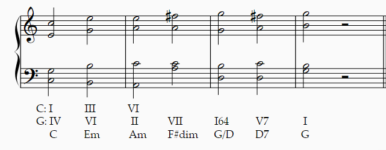

> 第一行：C大调视角的级数。从F#dim开始就不在C大调上（转调）了。
> 第二行：G大调视角的级数。64表示第二转位，即以五音为低音，称为六四和弦（低音即五音D到三音B是六度，到根音G是四度）。
> 第三行：和弦表示。C是大三和弦，Em是小三和弦，dim是减三和弦，G/D表示G大三和弦以D为低音。这里Em和F#dim的和弦表示没有写低音。我特意把G/D的低音写出来是因为I64-V7-I是一个成句，I64也被叫做终止六四和弦。

上例中，(1)转调的起点就是C大三和弦，因为从这里开始都是两个调的共同和弦；(2)转调和弦是F#dim，也就是G大调的VII级；(3)终止式是D7-G即G大调的V7-I（也可以把I64-V7-I这个成句当作终止式）。

## 副属和弦

大调除了VII级以外，I到VI级顺阶和弦都是大三或小三和弦。相当于它们每一个和弦都可以成为某一个调的主和弦。例如C大调的I级就是C大调的主和弦；II级（Dm）就是D小调的主和弦；III级（Em）就是E小调的主和弦，IV级F是F大调的主和弦，V级G是G大调的主和弦，VI级Am是A小调的主和弦。

如果把这些顺阶和弦都当作某个调的主和弦，那么它们都有一个对应的属和弦（属-主）：G-C；A-Dm；B-Em；C-F；D-G；E-Am。注意到这些和弦的根音都是C大调内的音，但是它们的组成音可能有调外音。属七和弦当然也常用，事实上绝大多数情况下都会加上七音。下面列出所有的这些“相对”的属七和弦。

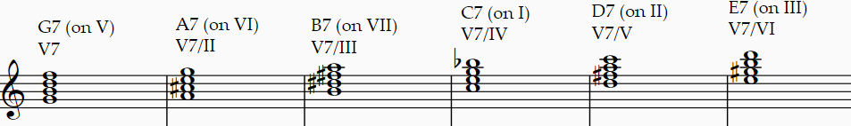

> 第一行是和弦表记与根音在C大调的级数。第二行是功能。V7/V可以读作dominant seventh of fifth，即“属和弦的属和弦”。

这些属七和弦中除了G7是C大调的属和弦以外，其他的被称为“副属和弦”（secondary dominant）。它们常用在C大调当中，解决到各自对应的主和弦。其中又以II上的副属和弦（即V的副属和弦，V7/V）最为常用。由于这些副属和弦的根音都是调内音，它们使用起来非常轻松，基本上只要副属和弦及其后续和弦能在对应的调上构成合理的终止式/伪终止就可以使用，例如可以在II-V-I中把II替换成V7/V。甚至可以把它们当作是C大调的调内和弦。由于引入了变化音，这些和弦能在不转调的情况下极大地丰富调性的色彩。

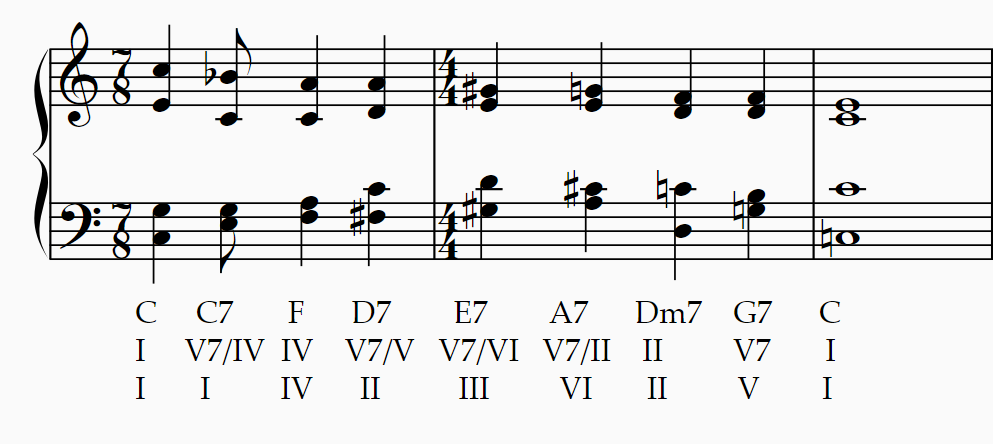

## 属九和弦、减七和弦

属九和弦是在属七和弦的基础上增加一个九音。在大调中这个九音是大九度（下图m.1，写作G9）。在小调中是小九度（下图m.2，写作G7♭9）。大调也可以借用同名小调的这个小属九和弦（m.3），因为这个降六级（A♭）具有强烈的倾向性（到G）。

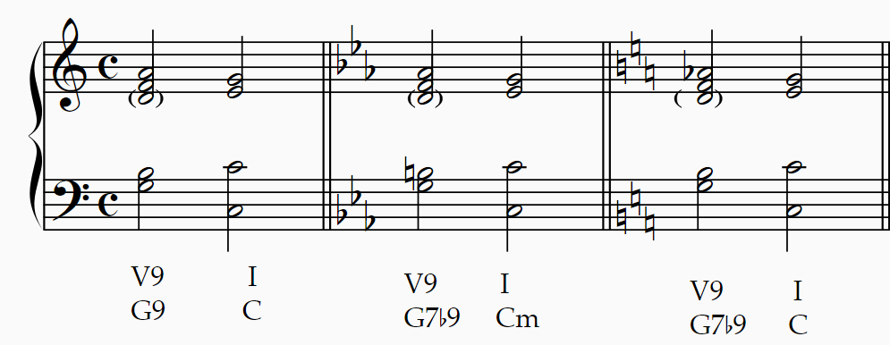

> 属九和弦有五个音；在四部和声当中，相对不重要的五音常被省略。

介绍属九和弦是为了引出（导）减七和弦。首先讨论VII级顺阶三和弦。这是一个减三和弦，它相当于属七和弦省略根音。虽然没有了V-I的倾向性，但是减五度解决的倾向性仍然很强。VII减三和弦与V7和弦的功能因此基本上相同。
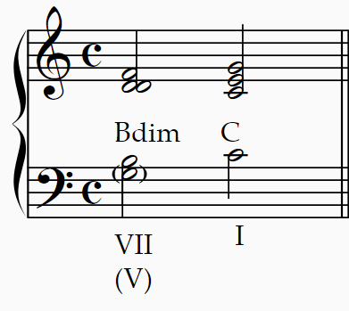

> G7省略G就是Bdim。因此VII级和弦可以理解为省略根音的属（V级）和弦。换句话说，VII级和弦的实际根音是V。本教程中提到“V级上的减三和弦”或者“G上的减三和弦”或者“以G为根音的减三和弦”时说的是VII级减和弦或者Bdim。

（导）减七和弦就是在小属九和弦的基础上省略根音，也就是减三和弦加上一个减七音。写作Bdim7。
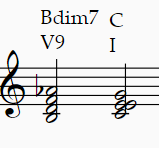

因为同样的原因，导减七和弦的根音是属音。G上的减七和弦/以G为根音的减七和弦指的是Bdim7。
减七和弦把一个八度分为四份，每份都是一个小三度。因此，不管低音是哪个音，减七和弦的低音与上方音的音程关系都是一样的。出于这个原因，只存在三个组成音不同的减七和弦。注意到，将减七和弦的九音（Ab）降低小二度就得到了根音（G）。由于任何一个音都可以被看作是九音，所以一个减七和弦一共可能有四个不同的根音，其中一些需要通过等音关系获得（也就是说，将九音降低半音（增一度）而非小二度，以得到根音）。

| 和弦     | 组成音            | 实际根音      | 其他表示方式              | 谱例                             | 音响                                  |
| ------ | -------------- | --------- | ------------------- | ------------------------------ | ----------------------------------- |
| Bdim7  | B, D, F, A     | G/B♭/D♭/E | Ddim7/Fdim7/G#dim7  |                |         |
| Cdim7  | C, E♭, G♭, B𝄫 | A♭/B/D/F  | E♭dim7/F#dim7/Adim7 | 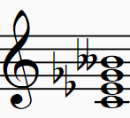        |         |
| C#dim7 | C#, E, G, B♭   | A/C/E♭/F# | Edim7/Gdim7/B♭dim7  | 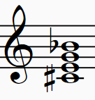 |  |

> 上表中“实际根音”的第一项对应第一列“和弦”，第二至四项分别对应“其他表示方式”的三项。没有列出所有等音的可能性。

半减七和弦是大属九和弦省略根音的结果。写作Bm7♭5.
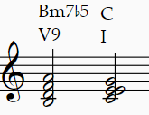
大调的顺阶VII级七和弦就是半减七和弦。小调的顺阶II级七和弦也是半减七和弦。因此这个和弦既可以在某个调体现属功能，又可以在另外的调体现下属功能。我们已经说了II级七和弦是极常用的；因为有双重功能的性质，小调的II级七和弦尤其好用。

副属和弦也可以使用属九/减三/减七/半减七和弦，例如II-V-I中的II，既可以是属七的D7，又可以是属九的D9或D7♭9，还可以是减和弦的F#dim或F#dim7或F#m7♭5。

## 减七和弦作为共同和弦的转调

由于减七和弦同时对应四个属和弦（副属和弦），所以可以利用它作为**共同和弦**进行极为自由的转调。我们举两个例子，第一个例子利用减七和弦作为目标调的属和弦转调，第二个例子利用其作为目标调的副属和弦转调（前面提到了可以将副属和弦看作调内和弦）。

首先是C大调——B小调。分析：B小调的属和弦是F#，这对应的减七和弦是A#dim7或B♭dim7。这个减七和弦可以写作C#dim7，对应的属九和弦是C9，这是C大调内IV级的副属和弦。可以简单地用IV-V/IV的弱进行到达C#dim7，只要后面接一个强进行即可，这里直接连接到I64-V-I的终止式。

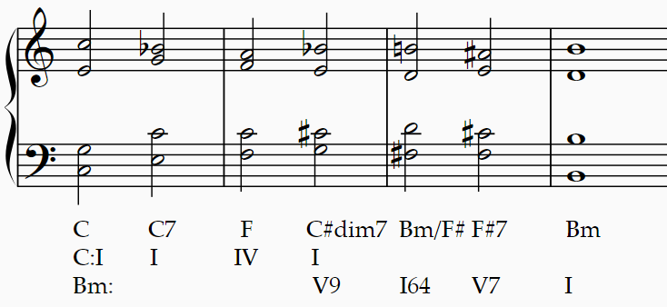

> (I) 共同和弦：减七和弦C#dim7，它是原调一级上的减七和弦即IV级的副导减七和弦，同时是新调的导减七和弦。(II) 转调和弦：Bm/F#，是I64。(III)终止式：I64-V7-I。

第二个例子我们选用A小调——D大调。D大调III级F#m的副属和弦是C#，对应减七和弦是G#dim7，这也是A小调的导减七和弦。我们可以从A小调的下属到属（导），然后到D大调的III，再连接终止式。

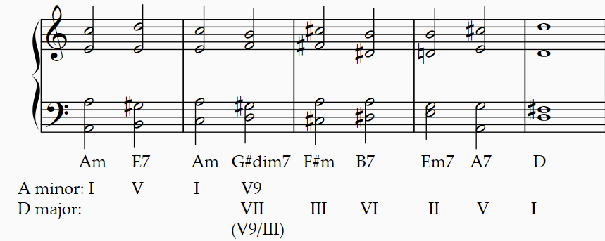

## 增三和弦

增三和弦是大三度叠加大三度。与减七和弦类似，增三和弦把一个八度等分成三份，因此只存在四个增三和弦。增三和弦可以通过大三和弦提高五音，或小三和弦降低根音得到。增三和弦的用法也跟减七和弦极其类似。增三和弦的不和谐来源于根音和五音的增五度，虽然增五度与小六度是等音程，但是三音的存在使得这个增五度产生了扩张的听感，这与减七和弦的双重三全音通过不同的方式带来了氛围不同的紧张感。
## 小下属领域的和弦

小调的下属和弦是一个小三和弦。大调可以借用这个小三和弦，也就是在原先的IV和弦的基础上降VI级（三音）。
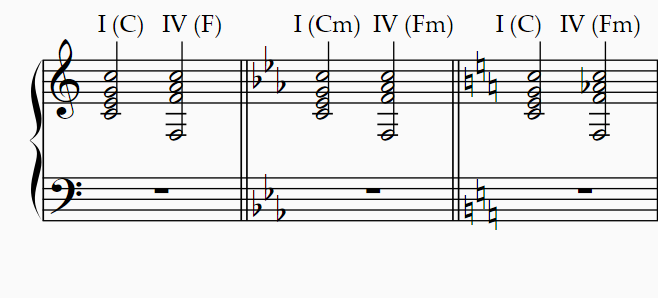
小调相比于同名大调降了VI级、III级、VII级。可以借用这些小调的降音。同时，下属调F大调和小下属调F小调的和弦也可以借用。这一系列和弦通常统称为“小下属领域的和弦”。它们遵循一般的规律，即一个和弦只要在某个调内存在合适的和声进行，就可以这样进行到下一个和弦。这些和弦能够极大地丰富大调调式的色彩。

其中一个习语是降II级上的大三和弦。这个和弦几乎总以第一转位（三音作为低音，或称六和弦，因为三音跟上方根音是六度关系）、有时以第二转位（五音作低音，六四和弦）出现，被称为“拿坡里六和弦”（Neapolitan sixth）。

这个和弦常常出现在终止式当中，代替下属和弦出现，并且进行到I64或者V。

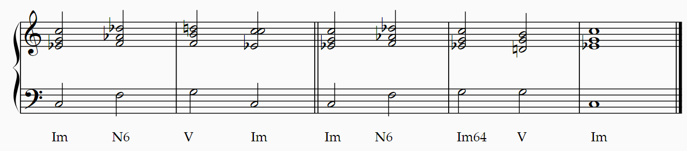

> C小调的终止式中的应用。N6连接到V时很难保证声部进行平顺（F,A♭,D♭中的任何一个进行到B都涉及到不和谐的增/减音程，不方便演唱），因此更常连接到I64，不过这样的不平顺随时间变化也逐渐被接受了。

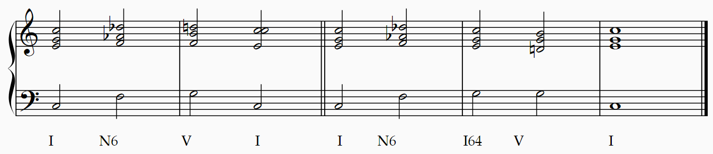

> C大调。同上。

(Beethoven Sonata No. 14 Mvt I Opening)

拿坡里和弦也很容易通过其他的小下属和弦引入。这就意味着小下属和弦可以方便地通过拿坡里和弦回到调内。

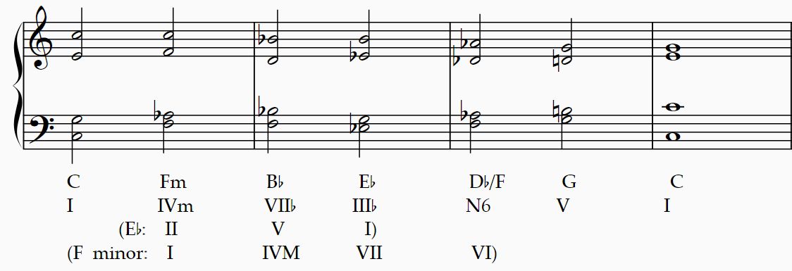

> Fm, B, E♭, D♭/F都是小下属领域的和弦。第二排文字表示了和弦在C大调的级数。下面两排括号内使用其他调来说明和声进行的合理性，其中最后一排表示这些和弦在小下属调F小调中的级数。IV级大和弦可以看作VII级的副属和弦。

大调借用小调和弦的这个特性也意味着小下属和弦，包括拿坡里和弦，非常适合用在同名大小调的转调上。
(Beethoven Symphony No.5 Mvt I Coda C major -> C minor)

## 增六和弦

可以用多种思路来得到增六和弦。

**第一种思路**：降六级上的属七和弦是增六和弦
大调的降六级和弦是一个小下属领域的和弦。这个和弦是一个大三和弦，可以进行到V，这是类比属调的拿坡里和弦进行到I64，两者组成音都是一样的。如果把这个大三和弦变成一个属七和弦，再进行同音替换（小七度=增六），那么就得到了一个增六和弦。小调的六级则直接变成属七和弦即得到增六和弦。

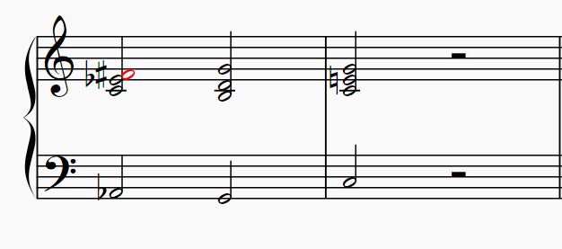

> Ab7的七音是Gb，进行同音替换会得到F#（标红），Ab和F#就是增六度。按照惯例，增六度需要反向半音解决到八度，这里F#向上解决到G，Ab向下解决到G。
> 或许有人会对上面的声部进行产生疑问，但这个进行没有问题。没有疑问是好事。

增六和弦进行到I64也常见，事实上出于某些原因，尤其在早期音乐中，增六和弦更常到I64。

**第二种思路**：三全音替代得到增六和弦
II级上的副导减七和弦V9/V可以进行到属和弦V。这个减七和弦降低任何一个音都能得到一个属七和弦，其中如果降低大调的VI级到降VI级，或者小调的VI#级到VI级，就可以得到增六和弦。在流行当中这种思路叫做“三全音替代”：副属七和弦有一个三全音，利用这个三全音的等音变换，再调整另两个音，可以得到另一个副属七和弦，这就是增六和弦。
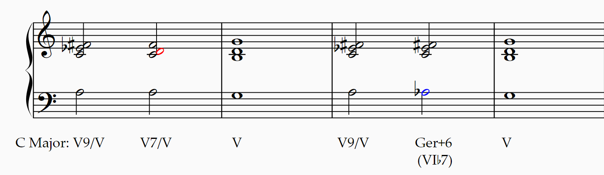
> 第一小节：从减七和弦降低降III级到II级（红色的D）就能得到副属和弦。第三小节：从减七和弦降低VI级到降VI级（蓝色的A♭）就能得到增六和弦。Ger+6：这个与属七和弦等音的增六和弦叫德国增六和弦。

**第三种思路**：增六度反向解决到同一个音
增六和弦的目的是平顺地进行到目标和弦例如I64或V。只要构造一个增六度，然后根据下一个和弦的目标音，就可以通过倒推构造出增六和弦的另外两个音。

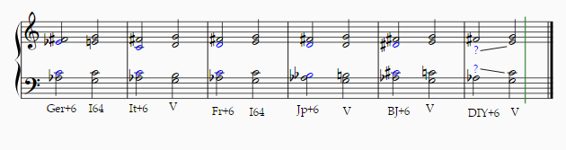
>蓝色的两个声部就是已知到达音，通过平顺进行倒推构造出来的。传统音乐中常用的除了德国增六还有意大利和法国增六。以田中秀和为代表的JPop作曲家喜欢在低音上方大二度上构造一个增三和弦，这已经成为了JPop的一个标志性和弦，称其为日本增六大概也没有问题。通过反向构造甚至能在五声音阶上构造出[北京增六](https://www.bilibili.com/video/BV1BU4y1L7EY/)。通过这个方法，每个人都可以构造出独属于自己的增六和弦！

## 调性的模糊化

瓦格纳《特里斯坦与伊索尔德》开头的特里斯坦和弦只是一个最出名的例子。事实上，只要满足下列条件之一：
- 在某个调内形成合理的调内和声进行；
- 可以通过半音替代，代替减七和弦/增三和弦，乃至任何一个和弦的“替代和弦”的进行；
- 平顺的声部进行，例如大小二度进行，等音替换；
那么对应的和声进行就可能成立。当然，实际效果必须要考虑到音乐情景或风格。甚至可以说，任何一个满足上述条件的和声进行都能找到适用的场景；没有“错误”的进行，只有“不合适”的进行。

这近乎无尽的和弦进行可能性，已经可以让人无法预测下一个和弦在哪个调上；这种情况下，再生硬地讨论调性已经近于愚蠢了，不如说这些和弦都是游离、漂浮的状态，这正是《特里斯坦与伊索尔德》想要表现的艺术效果。这样，我们就到达了调性的边缘，距离调性的毁灭只有一步之遥。不过，勋伯格的十二音技法并不属于传统的和声学，所以我们的故事也就到这里为止。
