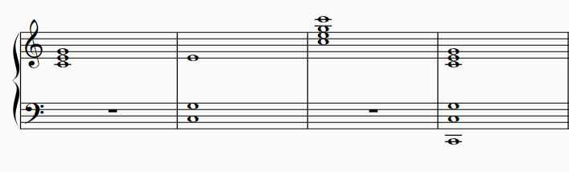
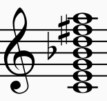
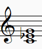

# 三和弦

西方音乐的起点是单声部。随着音乐的发展，当多个声部的不同音高组合出现时，就产生了和声。怎样的音高组合起来才是悦耳/合理的？这一讲介绍西方传统音乐中和声的基本组成单位——三和弦。

## C大三和弦

如果我们想要在单音C之上加入其他的声部，组成和谐的声音，我们应该怎么做？
首先，我们可以叠加任意多个C，毕竟一度/八度是最和谐的。但是这不会改变什么，现在仍然是“一个音”的状态。
然后我们考虑纯五度音G，因为纯五度是八度以外最和谐的音程。但是这仍然“太和谐”而缺乏色彩。
接下来我们考虑第三和谐的音程——大三度，对应的音是E。E与G之间是小三度关系，这也是和谐的。C与E的大三度给这个声响带来了色彩，这就产生了一个大三和弦。

**定义** C, G, E这三个音组成的、低音是C的和弦叫做C大三和弦（C major triad）。其中“三和弦”（Triad）指的是由三个音组成、组成音从低音开始按三度堆叠的和弦。“大”指的是低音C到E的大三度的音程。



>这些都是C大三和弦。跟具体的排列无关，只要有C,E,G三个音而且C在低音就行。

## 泛音列与和弦

我们来观察C的泛音列：

```
c  g  c  e  g  Bb  c  d  e  f#  g
```

前三个不同的音正是：c, g, e。这三个音中，c与e是大三度，c与g是五度关系。
就像C大调是C的泛音列的一种抽象一样，C大三和弦也可以看作是C的泛音列的一种抽象。具体到组成音，C是C大调的主音，也是C大三和弦的**根音**（root）。G是C大调的属音，自然地从属于C，它也与C构成除了八度以外最和谐的五度音程，是C大三和弦的**五音**（fifth）。E是C大调的特征音程，它C与E的大三度定义了C大调的调性色彩；这个大三度同时也定义了C大三和弦的明亮开放的色彩，因此作为三度音（**三音**，third），E也是C大三和弦的特征音。

在C的后续的泛音列中，音的出现次序依次是Bb, D, F#。这些音都与前面的音成三度叠置（stack of thirds）关系：G-Bb，Bb-D，D-F#。

本教程讨论的对象就是这样的“三度叠置”和弦，即从根音开始，组成音依次相隔三度。这里所谓的“三度”只是讨论音的组成，而不是具体的排列，就像上图的C大三和弦那样，怎样排列都是可以的。我们不关心具体排列方式的原因是，对于我们的耳朵来说，和弦的色彩基本上只与**根音到各个组成音的音程**有关。因此按照到根音的音程，这些音分别叫做“根音”、“三音”（三度音）、“五音”、“七音”(seventh)、“九音”(ninth)、“十一音”(eleventh)、“十三音”(thirteenth)。



“泛音列的抽象”只是用来引入三度叠置和弦的一种说法。事实上，和弦中的这些音程不需要符合泛音列的规律。例如，**小三和弦**（minor triad）的组成音就是小三度音和纯五度音：



## 大调的顺阶三和弦

前面提到了，三和弦就是由三个音组成的三度堆叠和弦，其中的组成音分别为根音、三音和五音。三度和五度音程都可以是和谐音程，在此基础上构成的三和弦可以是和谐的和弦。如果加入更多的组成音，例如七音，那么必然会产生不和谐音程（七度）。对于把和谐音作为基础色彩的西方传统音乐，三和弦是和声的“底色”。

现在考虑大调上的音。完全以调内的音组成的和弦就叫做“顺阶和弦”（diatonic chord）。以C大调上每个音为根音组成的七个顺阶三和弦分别为


![[Pasted image 20260306223947.png]]

C大调的顺阶和弦当中，有三个大三和弦（大三度+纯五度），分别以C、F、G为根音。另外有三个小三和弦（小三度+纯五度），分别以D, E, A为根音。以B为根音的顺阶和弦是一个**减三和弦**（diminished triad）：B-F是一个减五度音程，故而得名。


### 和弦表记

我们现在给这些和弦命名。这是必要之恶，是为了叙述的方便。

我们用CM, FM, GM表示大（Major）三和弦，M可以省略（写作C, F, G）。用Dm，Em，Am来表示小（minor）三和弦，用Bdim来表示减（diminished）三和弦。

上图的最下面一排罗马数字标注了和弦的**级数**。此前我们已经见到过调内的每一个音按照距离主音的音程进行标号，例如C大调当中F是IV级音，A是VI级音。现在顺阶和弦也按照根音的级数来编号。例如，Em是C大调的III级和弦。

和弦表记的体系有很多。在本教程当中，主要会使用这两种和弦表记，它们各有侧重点：基于根音音名的和弦表记能够准确地表示和弦的组成音。相对地，基于级数的表记能够反映和弦在特定调式当中的位置。

## 四部和声

本教程和声部分的绝大多数情况会使用**四部和声**（four-part harmony）进行讲解。这指的是和声当中同时有四个声部，这是脱胎于合唱的四个声部Soprano, Alto, Tenor, Bass（女高，女中，男中，男低）。在实际创作中，和声进行不会局限于四个声部，但是四个声部是呈现最清晰、进行最简单的，因此也是最易于讲解的。


## 总结·预告

我们讨论了大调当中的三和弦并给它们命名。这七个和弦将在最初一段时间作为我们和声学教程的积木。我们将使用它们讨论：
- 和弦的色彩。这与和弦本身的性质（大/小/减三和弦）有关系，但是我们更关心的是，它在特定的调内，为调的色彩起到了怎样的作用。
- 和弦的排列和连接。和弦是由具体的音组成的，所以和弦进行是由具体的音的进行实现的。C到Dm的进行怎样才有比较好的音响效果？平行八度、平行五度为什么不好？这些规则不是教程的重点，但是我们会讨论它们为什么存在以及我们该如何看待它们。
- 调性的建立与破坏。我们曾在第二章模糊地讨论过调性，而“调性”的明确含义正是通过和声体现的。利用每个和弦在调内的特性，我们可以巩固调性，或者让调性模糊，从而转向其他的调式。调性的逻辑正是西方传统的调性音乐（以至于今天的流行音乐）的根基。