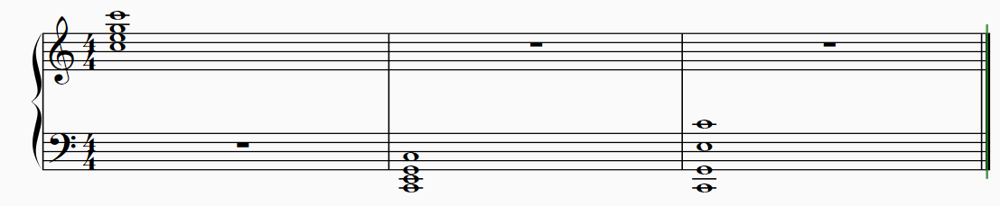
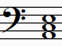
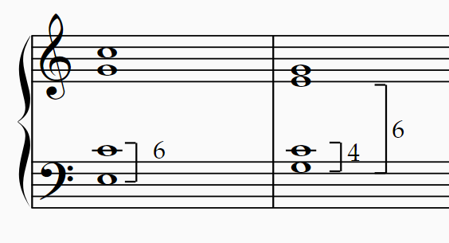
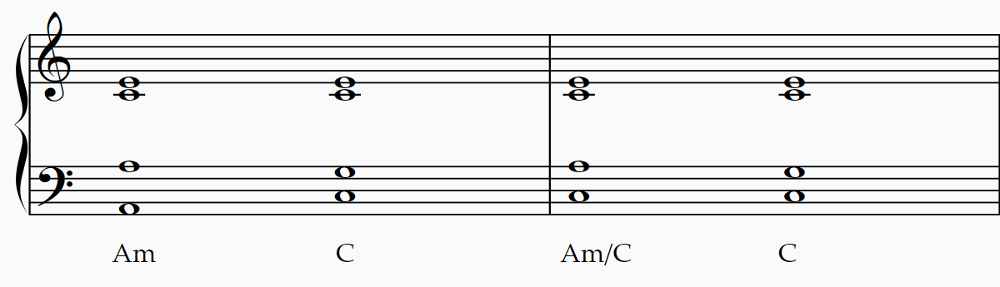
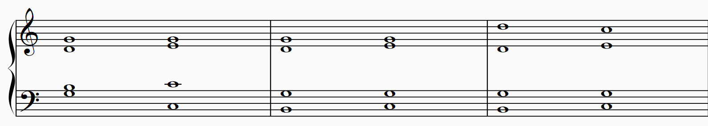
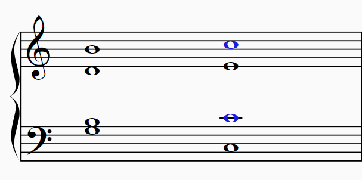
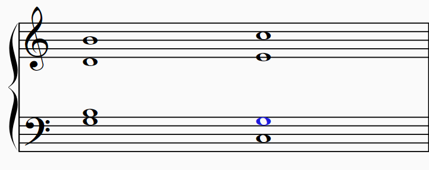
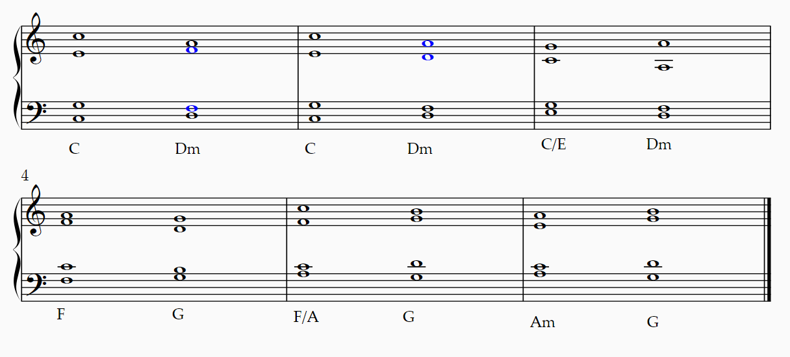
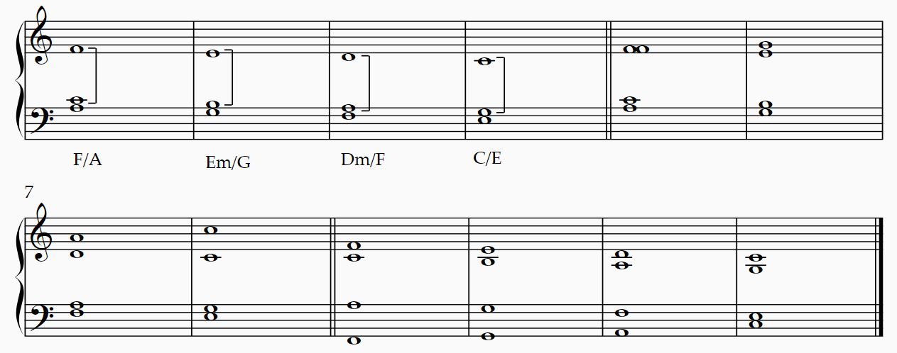
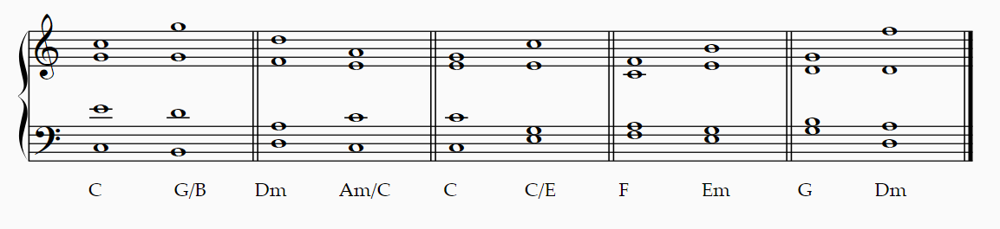

# 声部进行

从历史来说，和声进行的规律是从声部进行的规律发展来的，毕竟正是多个声部的互相干涉产生了和声。不过，和声学逐渐形成了独立于声部进行的功能、规律和思考模式。历史发展印证了这条规律：随着和声语言不断丰富，声部进行的限制被逐渐放宽。现代的流行音乐更是几乎只考虑整体的和声进行而不考虑具体的组成音进行。

出于这个原因，这一部分“和声学”教程的重点是讨论和声特有的逻辑，而声部进行的逻辑将放在“对位法”当中讨论。然而，我们也无法完全跳过这些声部进行的限制。这不是为了让本教程更加严谨或完整，而是基于如下原因：
- 首先，这些规律最初的产生是为了“良好的音响效果”，因此即使它们有时过于拘束，但是在许多情况下对初学者是有力的提醒：“如果这样写，可能会产生不好的音响效果！”当作曲者逐渐变得成熟、对美学的好坏形成了自己的标准，他们就能自行判断这些规律什么时候适用、什么时候可以忽视。
- 其次，这些规律在几百年间被广泛地接受、使用，只在特定的时刻被破坏。这意味着它们已经成为了西方传统音乐的**风格**，或者**文化**。不管这是否过时、对特定的人来说是好还是坏，这些广泛存在的风格都是对音乐感兴趣的人必须了解的内容。因此适度的讲解这些规律符合本教程的目的，即普及已存在的音乐实践。

因此，这些规律在另一些风格当中是可以无视，甚至故意违反的。例如，在流行音乐吉他或尤克里里的伴奏中，声部进行的好坏几乎完全不重要，和弦一般也有固定的排列方式（和弦图谱）。这种情况下，再要求遵循和弦进行的规范就是纯粹的多余，甚至会伤害到音乐的呈现。

最后，本教程并不是音乐创作的指引。读者有权选择在多大程度上重视或忽略这些规则相关的内容。但是，对于有志于为**传统风格创作**积累经验的读者，一般性的建议是在一开始时遵循最严格的规则，而随着经验和和声语言的丰富逐渐地放开限制。遵循规则并标注错误的唯一作用是，这些经验能帮助读者理解风格、避免最显而易见的“不好”的进行。错误有时是无可避免的，为了遵守某个规则必须违反另一条规则。此时建议的做法是标注所有的“错误”，而不能因为某条和声进行无法避免“错误”而放弃把它写出来。

**对具体的声部进行规范不感兴趣的读者可以跳过本讲及此后任何相关的介绍。**

## 和弦的排列方式

除了低音跟次低音声部以外，两个相邻声部之间的距离一般不超过十度，要不然中间会形成频域的空档。在“和谐”一讲中提到，如果两个音相隔太远，人耳难以将它们联系起来，不要提和谐或者不和谐的概念了。因此这样的空档一般是需要避免的。在这个限度内，“密集排列”是说和弦相邻的音之间排列紧密，而“开放排列”是说和弦相邻音之间距离较大。

如果音区太低，那么低音部分的排列不能太密集。人耳对低音部分的感知比较迟钝。如果低音密集排列，那么音响效果会比较浑浊。

> 同样的排列方式，高音区（小节1）较为清晰，而低音区（小节2）就较为浑浊。在这种情况下，开放式的声部排列会有更好的音响效果（小节3）。

低音区密集排列的音响效果与乐器有决定性的关系。例如，贝多芬时代的钢琴音响没有现在这样厚重，因此那时的作品会出现 这样的和弦；在今天的钢琴上这个和弦就容易弹得比较浑浊了。

两个声部可以演奏同一个音。不过，在和声学练习的范围内，我们一般会限制声部交叉：上方声部（如女高音）不能低于下方声部（如女中音），除非无法避免。

## 重复音

三和弦有三个组成音，但是四部和声有四个声部。这意味着有一个音会被重复。首先考虑重复的是根音，其次是五音；三音是最不常被重复的。这首先是因为，在和弦所代表的泛音列上，根音出现得最多而三音出现得最少；其次是处于和弦连接的考虑，有时重复三音会导致声部进行不那么顺利。然而，在和声进行必要的情况下，重复三音也完全没有问题。

## 转位

前面提到三和弦的具体排列不重要，只要根音在最低音就行。如果根音以外的音是最低音，那么这种排列叫做“转位”（inversion）。低音的不同对于和弦的音响效果会产生较大的影响。对于三和弦来说，除了根音位置（root position，或者“原位”）以外，还有两种转位：
- 第一转位（first inversion）：三音是低音。这种位置又被叫做“六和弦”（sixth chord），因为低音（三音）到上方根音形成了六度关系。
- 第二转位（second inversion）：五音是低音。这种位置被叫做“六四和弦”（six-four chord）因为低音（五音）与上方的三音形成六度、与上方根音形成四度。

> 六和弦（小节1）和六四和弦（小节2）。
> 转位的和弦表记是，在和弦符号后面加一个斜杠记录低音。例如小节1中的六和弦可以记为C/E，小节2中的六四和弦可以记为C/G。如果考虑C大调中的级数，那么可以在级数后面用6和64记录。

六和弦没有三和弦那么稳定，因为和弦所模拟的泛音列的基音并不在低音。六四和弦则更不稳定，低音到根音的四度被认为是不和谐音程，所以六四和弦被认为是不和谐和弦。

> 在“和谐”一讲中提到过，低音到上方音的四度被认为是不和谐音程，而非低音声部形成的四度被认为是和谐音程。前者是因为四度并不在泛音列当中，而后者是因为纯四度可以用较小的比值表示，且没有低频拍音。

因为稳定性（和谐度）的原因，我们在学习的初期限定，一个句子（phrase）当中的第一个和最后一个和弦必须使用三和弦。除去因为低音声部进行而必须使用的情况，我们一般不使用六四和弦。

## 实践

和声学并不是纸上谈兵的学科，需要大量的实际听觉训练。如果读者有乐器方面的技能，这是最自然、最好的选择。对于想要实践而手中没有乐器的读者，[Musescore](https://musescore.org)是开源免费的制谱软件，可以用来进行和声学的实践（写和声、试听）。需要注意的是电子合成音色仅供参考，不是真实的乐器音色，在合成音色上音响效果好的进行不一定在真实乐器上效果好，而反之亦然。在条件允许的情况下，真实乐器或付费音乐制作软件及音源是培养和声感觉的更好的选择。最后，对于作曲家而言，内听觉是无价之宝。为了练习内听觉，可以想象每一个单独的声部用不同的乐器演奏（例如：从高至低依次用小号、单簧管、竖琴、低音提琴），然后组合任意两个声部、想象不同乐器组合的声音，最后组合三到四个声部。在想象完一个和弦之后，再连接到下一个和弦。最后从头到尾想象整体的声音。
## 有共同音和弦的连接：最小移动法则

本讲考虑除了Bdim以外的其余六个顺阶大/小三和弦。Bdim由于有减五度是一个不和谐和弦；这一讲不考虑不和谐音的处理。

我们首先考虑“平顺的和弦连接”，也就是每个声部移动不超过三度。这是最简单的移动方法。

对于有共同音的和弦，最简单的和弦连接规则是“最小移动法则”，即采取每个音移动距离最小的方式来进行和弦连接。这样的连接一般是最有效的，因为每个声部都移动得最少，所以声部进行非常平顺。

和弦连接的含义是：我们有第一个已经写出了四个声部的和弦，它要连接到一个已知组成音（和/或部分声部）的和弦。我们需要完整地写出后面的这个和弦。当然，也可能是，后面的和弦是完整的，而我们要写出前一个和弦。

第一个例子是Am到C，这两个和弦有两个共同音（A-C-E vs. C-E-G）：

我们展示两种情况。第一种情况是原位连接。低声部被限定了必须从A到C。另外三个声部当中，C和E都是共同音不变。A需要移动到G，这是一个向下二度的**级进**（step）。

第二种情况是使用六和弦使得低音声部更加顺滑的连接，这里Am/C用了六和弦，这样低音就不用移动。另外三个声部也只需要A级进到G即可。

第二个例子是G到C，这两个和弦有一个共同音（G-B-D vs. C-E-G）：

同样展示原位和转位的两种情况。原位时（小节1）低音必须G-C；其他三个声部当中G作为共同音可以保持。非共同音B-C，D-E即可。使用第一转位（小节2）的G/B连接到C就更加顺滑；如果G重复根音，那么因为两个音都保持，所以连接到的C重复了五音。如果G/B重复五音D（小节3），那么一个D可以向下到C，另一个D则向上到E，连接到的C重复根音。

### QA：平行八/五度

Q：为什么上例的小节3当中两个D进行到不同的音？
A：如果进行到同一个音，就产生了“平行八度”（parallel octave）的声部进行错误。“平行八度”指两个声部之间间隔八度，并且同向进行到八度。在更加严格的规则当中，不论开始时的音程，只要同向进行到八度/一度，就构成声部进行的错误。
Q：为什么这是一个错误？
A：通常的解释是，每个声部都需要独立性。独立性就是说两个声部各做各的、互相无关。如果两个声部形成不和谐音程，独立性就很强。如果两个声部反向运动（contrary motion）或者一个动一个不动（斜向运动，oblique motion），那也有很强的独立性。如果是同向运动（similar motion），那么独立性就较弱了；当两个声部进行到不完全和谐的音程（三六度/非低音声部的四度）时，尚且没有问题，但是到完全和谐音程（五度/八度），独立性就弱到可能被视为同一个声部：考虑单一声部的移动，第一泛音就相当于一个“平行八度”声部，而第二泛音就相当于一个“平行五度”声部。既然四部和声里面本来就是不同的声部，所以两声部变成同一个声部是一个错误：缺了一个声部以后，和声进行听起来空洞笨拙了。下面的表总结了这个规律：

| 和谐度              | 反向/斜向 | 同向             |
| ---------------- | ----- | -------------- |
| **不和谐**（2/4/7）   | 独立    | 独立             |
| **不完全和谐**（3/4/6） | 独立    | 独立性较强          |
| **完全和谐**（1/5/8）  | 独立    | 独立性弱（同向五/八度禁止） |

Q：为什么有的时候能见到平行八/五度，例如中世纪圣咏，例如钢琴左手的平行八度？
A：因为这些时候不需要两个独立声部。中世纪圣咏的五度平行本质上是在单声部上方添加了五度的装饰性色彩。器乐作品常见的平行八度本质上也是单一声部，只是使用八度来在不同音区上加强旋律。
Q：平行五度不行，但是转个位的四度为什么就可以平行？我是说不在低音的情况下。
A：因为四度的色彩听起来不像五度那样完全和谐。是的，平行四度可以，平行五度不行。这是所谓的音乐理论当中的又一个令人费解之处。但是，如果不要追求强行使用理论去囊括这些事情，那么你就不会纠结于此。我们的耳朵会将平行五度听作具有”笨拙的特殊色彩“而不会对平行四度产生什么特殊感受，或许有一部分就是由于这个禁令带来的长久的影响。
Q：同向八五度也会被认为是同一个声部吗？
A：严格说来并不是，只是独立性非常弱而已。所以同向八五度在许多规则中没有那么严格地禁止。事实上很多情况下是没有办法避免同向八五度的。但是毕竟有让音响效果变坏的可能性，所以如果条件允许，可以尽量避免，尤其是避免出现在两个外声部（即低音+高音声部的同向八五度）。
Q：我尝试做G-C的进行，让G重复三音，但是怎样都无法避免平行八度。

> 不良的G-C进行，出现了平行八度（蓝色）

A：因为根据最小移动原则，B只能移动到C。这就是重复三音的情况较为少见的其中一个原因。要想避免平行八度，其中一个B必须移动到C以外的音（G或E），最好、也是移动最少的就是G了。一般这个B-G是在内声部。

> 上例的改进。内声部的B进行到G以规避平行八度。

Q：为什么外声部的B不常去G？
A：这涉及到调性的问题。G-C这个进行有特殊的功能，因为C是C大调的主音而G是C大调的属音。在C大调当中，属音G和导音B都有很强烈的去往C的倾向。因此，同时含有G和B的GM和弦进行到C，就强烈地表示了C大调的调性。在这个前提下，我们对B的预期是自然地去到C，如果B不进行到C，就显得不自然。这种不自然在内声部还能被“藏住”，如果出现在外声部就很清晰了，所以外声部的B一般是去C的。当然凡事都有例外。如果B-G正是你想要的旋律的一部分，那么出现在外声部反而是风格化的体现。
顺带一提，这并不是在推荐这样的和弦进行。这个进行下面两个声部还形成了同向五度。说到底，重复三音就可能会出现此类问题，更何况重复的是G的三音，也就是导音B。如果可能的话尽量避免才更好。

## 无共同音和弦的连接：反向进行

如果是两个无共同音和弦的连接，那么在最小移动距离的基础上，为了避免平行八度/五度，还需要注意反向进行：至少一个声部要与其他声部反向才容易形成好的进行。

> 前面提到了同向进行的独立性较反向进行和斜向进行要差。在“有共同音和弦的连接”中，共同音保持不动就是斜向进行，可以说正是因为最大限度地利用这些斜向进行，所以才能有良好的声部进行。这对应到没有共同音的情况下就是反向进行了。

以下是一些例子：

> 前一个和弦重复根音、低音上行时，进行到的和弦有时会重复三音（小节1）或出现同向五度（小节2），这些情况都很正常。常会出现三度的跳进（1/2/3/4/6小节）。使用六和弦（小节3/5）可能让进行变得更顺利，尤其是重复五音可能利用平行四度规避平行五度（小节5）。

如果只有三个声部，那么当根音在五音上方时，可以形成平行的六和弦进行（下例1-4小节）。可以在这个模型的基础上增加第四个声部，它形成反向进行就能规避平行八/五度。

> 1-4小节：平行六和弦的模型。5-8小节：新增了高声部，与其余声部反向进行。9-12小节：新增的低声部与其他声部反向进行。

### 练习

#### 两两连接

在全部的12个大调上，使用平顺的声部进行，练习I-VI级和弦两两之间的连接。
- 各种转位：原位-原位，原位-六和弦，六和弦-原位，六和弦-六和弦。
- 重复音：第一个和弦重复根音/三音/五音；或第二个和弦重复根音/三音/五音。

如上面的例子所示，第一个和弦重复三音时，声部进行有时会遇到一些困难。在做完连接之后，进行检查，将所有的平行五/八度，同向五/八度，声部交叉都标注出来。试图避免这些可能导致不良音响效果的声部进行。如果不能全部避免，按照平行五/八度，声部交叉，同向五/八度的优先级来避免。不要因为可能出现错误就不写出来某个进行。需要写出来才能弄明白问题出现在哪里、如何避免，以及什么不可避免。

## 跳进

跳进（jump）是三度以上的声部运动。涉及到跳进的和声进行总体上来说比上面所介绍的平顺的和声进行更加困难。一般需要能够熟练地进行平顺的和声进行，再练习带有跳进的和声进行。
为什么要做三度以上的跳进：
- 旋律要求：当特定的声部进行（例如旋律）包含了跳进，那么对应的和声进行当然就无法避免。
- 音区平衡：跳进能迅速地改变音区的平衡，也就是说和弦的排列方式会发生变化。例如小节1跳进后从密集变成了开放；小节2为了向内跳进，第一个和弦需要形成开放排列。
- 调整排列：为了音区平衡，可以通过跳进来调整同一个和弦的排列，就像小节3那样。这是同一个和弦，只是排列方式变了。
包含跳进的和声进行除了音区平衡，还需要考虑这些事项：
- 最小距离和反向进行：跳进声部并不满足最小距离移动，并且由于旋律和音区平衡的要求，可能不止一个声部需要跳进。作为避免声部进行错误（平行八五度）的诀窍，在其他非跳进声部仍然需要尽量满足最小距离；反向进行也是良好的手段。注意，两个声部从五度反向跳进到五度或从八度（同度）反向跳进到八度（同度）可能也被认为是不良的进行。
- 跳进的音程：在严格的规则当中，跳进如果是增/减音程（小节4），不和谐音程（小节5）或者超过一个八度，通常是需要避免的。其现实考量是，这种跳进一般难以演唱（演奏），而且容易导致声部进行的困难。作曲者只有在知道如何避免这种跳进和其他声部进行错误的前提下，才能够使用这样的跳进来达到特定的目的。